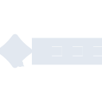

# ieee

[← Back to main README](../../README.md)

<table><tr>
  <td></td>
  <td></td>
  <td></td>
</tr></table>

## 16 px

### black
```
https://georgegach.github.io/compatible-icons/simple-icons/compat/ieee/16/black.png
```

### slate
```
https://georgegach.github.io/compatible-icons/simple-icons/compat/ieee/16/slate.png
```

### white
```
https://georgegach.github.io/compatible-icons/simple-icons/compat/ieee/16/white.png
```

## 64 px

### black
```
https://georgegach.github.io/compatible-icons/simple-icons/compat/ieee/64/black.png
```

### slate
```
https://georgegach.github.io/compatible-icons/simple-icons/compat/ieee/64/slate.png
```

### white
```
https://georgegach.github.io/compatible-icons/simple-icons/compat/ieee/64/white.png
```

## 128 px

### black
```
https://georgegach.github.io/compatible-icons/simple-icons/compat/ieee/128/black.png
```

### slate
```
https://georgegach.github.io/compatible-icons/simple-icons/compat/ieee/128/slate.png
```

### white
```
https://georgegach.github.io/compatible-icons/simple-icons/compat/ieee/128/white.png
```

## 512 px

### black
```
https://georgegach.github.io/compatible-icons/simple-icons/compat/ieee/512/black.png
```

### slate
```
https://georgegach.github.io/compatible-icons/simple-icons/compat/ieee/512/slate.png
```

### white
```
https://georgegach.github.io/compatible-icons/simple-icons/compat/ieee/512/white.png
```

## 1024 px

### black
```
https://georgegach.github.io/compatible-icons/simple-icons/compat/ieee/1024/black.png
```

### slate
```
https://georgegach.github.io/compatible-icons/simple-icons/compat/ieee/1024/slate.png
```

### white
```
https://georgegach.github.io/compatible-icons/simple-icons/compat/ieee/1024/white.png
```

## 16 px in base64

### black
```
data:image/png;base64,iVBORw0KGgoAAAANSUhEUgAAABAAAAAQCAYAAAAf8/9hAAAABmJLR0QA/wD/AP+gvaeTAAAAkklEQVQ4je3QPQrCAAwF4E+9gIKDrh7RxdWTeAlx0pMIToJOKlLrv61LCqWTomMfhLyQvEcSavyMRuQ+RhgiQ+cbkzZWyDEJ033UJ9zxQhL8iUOJ28ZwEQusg6cRR9xwDfEmxEkTrRjOIj8rG14qvOjf8IAuliGexwm7qM+lzdISL07Miyf2MMYUMww++l6N/+ANa202vM/lRIAAAAAASUVORK5CYII=
```

### slate
```
data:image/png;base64,iVBORw0KGgoAAAANSUhEUgAAABAAAAAQCAYAAAAf8/9hAAAABmJLR0QA/wD/AP+gvaeTAAAA5ElEQVQ4je2RPUoDYQBE33wbNESIu/i3QrRII3gTz+ENbGy9k1im8xhKXLaQjUWyaPIRs+7YxMLOnzavm2IeDAMb/o0Anl7mx/p4vz49Sq8ktUUxy34q6Iyn0zQsV/egYVnVfduX5aR+xGTCcytsYSfAAmkbHDCvSDuYoLKqn23nX0bjkaQzzAB7gQTQgLqAkSNWlHxoE4PtRGBwK7Ds5vtAovE6O8pqAGwvMavQacO54QEUjEYneXZhu7duCNgT6oMbTGq8j9wF9RCZAMaTtzxpm5uQ6HZwsHtXVLPhn2/Z8Hs+AR0Ha21xcNRPAAAAAElFTkSuQmCC
```

### white
```
data:image/png;base64,iVBORw0KGgoAAAANSUhEUgAAABAAAAAQCAYAAAAf8/9hAAAABmJLR0QA/wD/AP+gvaeTAAAApUlEQVQ4je2QsWoCAQyGv9TF0YLICZ1cfL8urj6JL1GcSl9E6NypddDe0Xq9z8EcPW46uNUPQv4k8JME7owmANQlsAGeI6JRHwc7qDP13Rs7NdSvrM/qr/qnnlLX6rHVoX4ARcfzDVgDT0CZvRqYAgJVxgKoHoBJDprMdW/Jqqfb+Q9wQZ2rh1z5NU/4zLr0n++Obk+0fWIBbIGXiNirq8FPvDOeK2ZEnjXee+o7AAAAAElFTkSuQmCC
```

