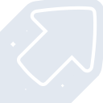
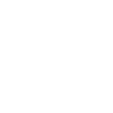

# imgur

[← Back to main README](../../README.md)

<table><tr>
  <td></td>
  <td></td>
  <td></td>
</tr></table>

## 16 px

### black
```
https://georgegach.github.io/compatible-icons/simple-icons/compat/imgur/16/black.png
```

### slate
```
https://georgegach.github.io/compatible-icons/simple-icons/compat/imgur/16/slate.png
```

### white
```
https://georgegach.github.io/compatible-icons/simple-icons/compat/imgur/16/white.png
```

## 64 px

### black
```
https://georgegach.github.io/compatible-icons/simple-icons/compat/imgur/64/black.png
```

### slate
```
https://georgegach.github.io/compatible-icons/simple-icons/compat/imgur/64/slate.png
```

### white
```
https://georgegach.github.io/compatible-icons/simple-icons/compat/imgur/64/white.png
```

## 128 px

### black
```
https://georgegach.github.io/compatible-icons/simple-icons/compat/imgur/128/black.png
```

### slate
```
https://georgegach.github.io/compatible-icons/simple-icons/compat/imgur/128/slate.png
```

### white
```
https://georgegach.github.io/compatible-icons/simple-icons/compat/imgur/128/white.png
```

## 512 px

### black
```
https://georgegach.github.io/compatible-icons/simple-icons/compat/imgur/512/black.png
```

### slate
```
https://georgegach.github.io/compatible-icons/simple-icons/compat/imgur/512/slate.png
```

### white
```
https://georgegach.github.io/compatible-icons/simple-icons/compat/imgur/512/white.png
```

## 1024 px

### black
```
https://georgegach.github.io/compatible-icons/simple-icons/compat/imgur/1024/black.png
```

### slate
```
https://georgegach.github.io/compatible-icons/simple-icons/compat/imgur/1024/slate.png
```

### white
```
https://georgegach.github.io/compatible-icons/simple-icons/compat/imgur/1024/white.png
```

## 16 px in base64

### black
```
data:image/png;base64,iVBORw0KGgoAAAANSUhEUgAAABAAAAAQCAYAAAAf8/9hAAAABmJLR0QA/wD/AP+gvaeTAAABP0lEQVQ4jY3TPUtcQRjF8d+uooEsAW00xK8VLPcDaGrRykatbFOpEBBs9IOIlbUxvuK7uBpFEl0nxTxX7667moEp7tz5P+c8Z2Z4PSawj3ukd+ZapQ1eQB2r2EYTD+jHAP6ghjts4Xs7fI1NLOESDTx2UZ9Dqpbgr/iEERziNL57OrQJFai2wWf4izH8wM8u8POoYhQf5NAG0Yff0Wftfwp8xI4cSiXgeUzhcxcuhYDegGpyyhcBT74BC7ePhQP4EoVm3lA+DpfP6ki9pQ07ch7DXeBZud06hrzkJuEIt/It/KX1vI8wjgPcYBrLWIk1ST6+q1AaDzcF/A278X9bzmlTPu6posB5SfEknGwEvBdQs7TnGotFfwWU5Ed0GAXXA25GeKedYFr7PSu5aYT1JD+ijnB7gfJ8KoFJvmCv4H88kYnUIdL/SgAAAABJRU5ErkJggg==
```

### slate
```
data:image/png;base64,iVBORw0KGgoAAAANSUhEUgAAABAAAAAQCAYAAAAf8/9hAAAABmJLR0QA/wD/AP+gvaeTAAABy0lEQVQ4jX2RT0vUYRSFn3Nn1IkZxiY0pxIpiCD6OoVLF63CpYHUKgitjbVr1abW0sdpYypZMY6JDNow/fvd06Jx+Gna3bzwvjznnPdccWo+7vWWlSyCpsG10+/lkXlXLV/s7B2+psgFYD0qbBaFCyl+QU4gWmT8sIqGqPSxNyxeVU/AznvI79MaKP1AoYpMw6iC/1qKAIzFcwFxAjZN0Gzgz2m6Mk3jypn5jQCiDNvsIf1EsQj5BvHh3AJieMg5j6lhDwSXsMdNHplK36hxrkAOBWzqMtsEGwgZH0GsRfAY+8o5uI36AFVAFg0RrcT7EbFm8+g/MOCBxO/ST7hmWxFacfpsZ7kj2BBYiv6x0miNNtuYeaD9L6xOplZFUYdYkD1DqCbnoApgqRPknRRPZa4CN0pxO5JWI7xsx2TYL1LclLllcaCd3Z7BX0FjwHeFVrLIJUnXkToSzzJzSTAJOgAmgS+I2+F4op3dnmXtW54aWnYdvFT6riLeusiHoLqhJY06OwTW59oX7w8TqAueEfpkMjATSFuYNmLWsBWoaXy5DB+vEfAMgKEGEmIKMWbTE4TMnOXx03BJYFTYdKn6psQFMIhxiW/2SRjgD28R8kJqMAFHAAAAAElFTkSuQmCC
```

### white
```
data:image/png;base64,iVBORw0KGgoAAAANSUhEUgAAABAAAAAQCAYAAAAf8/9hAAAABmJLR0QA/wD/AP+gvaeTAAABSklEQVQ4jY2Tuy6EURRG14wJEhNC49pIRON5ROkBUAutoKJUIdHzIKJSI4OIy7hHRFzGUvx7OMYMvu6cs9e3L9kHaqROq8fqk39rK1cDrwLjwCZwAFSAV6AF6ASegSLwCOwBK99g9V7dVdfVa/VOfWuQfVE1n2QeBdqBAeAEuIhzU22boRxAvgYuAy/ABLAB7DeAP5UHxoBW4AnoApqBh+iz+B+DNqAUQ8kFvATMAr0NOCMBhYCKZFO+CnjmF5io9q1aAUB/GM3/kvksqvzMDlhIAkpk8+hpAC+QtTsOdBNzKyQBI8Ac0AcM1oGngQ5gGRgChoEbYinK6q16pk6qpbg/VafUw3g/UK9i2V7U2arBZbJh5/EfdgI+CqiSxNyra9kUviDNPtFJGG4HXFH31IsfcGJQVTmp5i5KV32uC9cxSPWegKoPP2DgA6b7qkdNR1nUAAAAAElFTkSuQmCC
```

