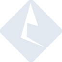

# informatica

[← Back to main README](../../README.md)





## 16 px

### black
```
https://georgegach.github.io/compatible-icons/simple-icons/informatica/16/black.png
```

### slate
```
https://georgegach.github.io/compatible-icons/simple-icons/informatica/16/slate.png
```

### white
```
https://georgegach.github.io/compatible-icons/simple-icons/informatica/16/white.png
```

## 64 px

### black
```
https://georgegach.github.io/compatible-icons/simple-icons/informatica/64/black.png
```

### slate
```
https://georgegach.github.io/compatible-icons/simple-icons/informatica/64/slate.png
```

### white
```
https://georgegach.github.io/compatible-icons/simple-icons/informatica/64/white.png
```

## 128 px

### black
```
https://georgegach.github.io/compatible-icons/simple-icons/informatica/128/black.png
```

### slate
```
https://georgegach.github.io/compatible-icons/simple-icons/informatica/128/slate.png
```

### white
```
https://georgegach.github.io/compatible-icons/simple-icons/informatica/128/white.png
```

## 512 px

### black
```
https://georgegach.github.io/compatible-icons/simple-icons/informatica/512/black.png
```

### slate
```
https://georgegach.github.io/compatible-icons/simple-icons/informatica/512/slate.png
```

### white
```
https://georgegach.github.io/compatible-icons/simple-icons/informatica/512/white.png
```

## 1024 px

### black
```
https://georgegach.github.io/compatible-icons/simple-icons/informatica/1024/black.png
```

### slate
```
https://georgegach.github.io/compatible-icons/simple-icons/informatica/1024/slate.png
```

### white
```
https://georgegach.github.io/compatible-icons/simple-icons/informatica/1024/white.png
```

## 16 px in base64

### black
```
data:image/png;base64,iVBORw0KGgoAAAANSUhEUgAAABAAAAAQCAYAAAAf8/9hAAAABmJLR0QA/wD/AP+gvaeTAAABD0lEQVQ4jZXTvUoDURAF4M9YiI2FIfEnj2Ev+ia+ip0PoYVvIogWtok/MQiiQgRJYSohmLXYueRySTQeGHZ37pwzc2dmWYwO7jCM97loLPDv4BpvqHARvqXQxj0mOMJZiDwuI9IKchXZ29jDxzIiLfWdq7BudtbP/H1sl+QmephmgadYjfPzzD+NRM1E3pxD/sShegKXITYqRHrB1S3IFZ6xgdf4/sZXETNFt5E5crxj3WzMDazN6dtKAwdmnRfPG/UYx5G5RBV92E+Osokj9ciOcYKnuEYq/VbWxIR8B5JN8IKrSDCMmNacqlAvzkMhkmwc5PYici5SVpK2cPcvcsJWUcngP+SEThAHfvmdfwBc925hg7P2hgAAAABJRU5ErkJggg==
```

### slate
```
data:image/png;base64,iVBORw0KGgoAAAANSUhEUgAAABAAAAAQCAYAAAAf8/9hAAAABmJLR0QA/wD/AP+gvaeTAAAB60lEQVQ4jY2TTU9TYRCFn3nvvaIx9QMotgjKokSDiQvjupD4B3ThX8SfoIkJtiyMmrgyfBgbRVtsKV/aQkL63nuPC26hQEk8u3feOWfOTGaMS1Df2bmrOHordNuF8dPp8fHNYXluWHBj+7CoOHyP0TAk+bCysX1Y/C+BWqs7EcR+CZgkTReB1xgll/jqMBEbfDSb3XyPZNmMh8Bmj+BJlCbT5ngDjAPf0iCan8lfb15w0Gx2896SakYG2C8Vcu37k7c+m9leFpt1sa/8aB8Uzgg0Gp2xHvE7OCED+igpAFDKhwHPsy6JlxqNzhiA1et/RxWxbGhOWUtCnUA8T80tSmnNjK9gL4DRrG8JWzVP2X5t7X9B7hHITovw8yhKHl/tBSsypgQpmDc0MjA+YemKQwjQ4DAFrSAeuZY6uUzQnSVnecKcebcArNmpiIQ+Rb3EO7mOZEfniVnuqvOubP0hJkFSNbO543/2QLsSr5wLRiS9RJrBcMcGtebioDw1dWP3pO9zO5BVslhKmzLqhrspNIb4c4WgXCzmtjM3p6i1uhORkmUzHgyx3U1lm97cfKmQa/fjZ1a5VMi1vQVlE+sXBgYtC3vPBskXHPTxfevgTpDG1RMnokbo5+/l87+HOBuO43MOKwAWxguXnfM/YcjrJMGbJHcAAAAASUVORK5CYII=
```

### white
```
data:image/png;base64,iVBORw0KGgoAAAANSUhEUgAAABAAAAAQCAYAAAAf8/9hAAAABmJLR0QA/wD/AP+gvaeTAAABK0lEQVQ4jY2TvU4CURBGz66FsdEEIv7QWBpbe6IPYe+DaWHla/iTWNhCQKAxgQQTglEqEpRjwSXcLLvg1+3cOd/MnbkLBVKralMdqNWivLQAPgJegD4g8BBim6VW1JY6Va/VW+fqbDRR9wOs2g9m5+pwo0mAmy5Vj87aUbytHmbhstpQZ1HijboVzu+i+CwUKi/gUg78rV6GDTwHs1HGpKGWUOsZWPVd3VV74ftXnWRyZmo9DWsyM5IPYIflmlNgO2d0SQpcAK3IROAVmAJjYJI3c6AJ1JLFEIFH4AxIgE9gBNyHylfASejEULCWJMkoidcIPAGnUaUfYAD0gD2gDHwFeLja1/zhvJmvsfNHVsm50opJK8egox6vhSOTg0wn3X/DkUk1gF3X/M5/5kqtjGW4a+cAAAAASUVORK5CYII=
```

