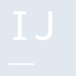

# intellijidea

[← Back to main README](../../README.md)

<table><tr>
  <td></td>
  <td></td>
  <td></td>
</tr></table>

## 16 px

### black
```
https://georgegach.github.io/compatible-icons/simple-icons/compat/intellijidea/16/black.png
```

### slate
```
https://georgegach.github.io/compatible-icons/simple-icons/compat/intellijidea/16/slate.png
```

### white
```
https://georgegach.github.io/compatible-icons/simple-icons/compat/intellijidea/16/white.png
```

## 64 px

### black
```
https://georgegach.github.io/compatible-icons/simple-icons/compat/intellijidea/64/black.png
```

### slate
```
https://georgegach.github.io/compatible-icons/simple-icons/compat/intellijidea/64/slate.png
```

### white
```
https://georgegach.github.io/compatible-icons/simple-icons/compat/intellijidea/64/white.png
```

## 128 px

### black
```
https://georgegach.github.io/compatible-icons/simple-icons/compat/intellijidea/128/black.png
```

### slate
```
https://georgegach.github.io/compatible-icons/simple-icons/compat/intellijidea/128/slate.png
```

### white
```
https://georgegach.github.io/compatible-icons/simple-icons/compat/intellijidea/128/white.png
```

## 512 px

### black
```
https://georgegach.github.io/compatible-icons/simple-icons/compat/intellijidea/512/black.png
```

### slate
```
https://georgegach.github.io/compatible-icons/simple-icons/compat/intellijidea/512/slate.png
```

### white
```
https://georgegach.github.io/compatible-icons/simple-icons/compat/intellijidea/512/white.png
```

## 1024 px

### black
```
https://georgegach.github.io/compatible-icons/simple-icons/compat/intellijidea/1024/black.png
```

### slate
```
https://georgegach.github.io/compatible-icons/simple-icons/compat/intellijidea/1024/slate.png
```

### white
```
https://georgegach.github.io/compatible-icons/simple-icons/compat/intellijidea/1024/white.png
```

## 16 px in base64

### black
```
data:image/png;base64,iVBORw0KGgoAAAANSUhEUgAAABAAAAAQCAYAAAAf8/9hAAAABmJLR0QA/wD/AP+gvaeTAAAApElEQVQ4jc3SMQ4BURSF4W+YaIQELYnaCmxDYTEKK7ADvYWodPYgoSFRKVCgmCdhMIRinOa+5J775+bcF+HsBxV+GU4DFhhigHnKt8UIqyxAFX2U0E75TpiE+hJQC4YY9Q+2fwB8pXeAfagnybWitCG+eW8kQS6wRgPTMLhDE+WsDc4B2MMBRXRwRAVjSU53ivzTR8oHcL3CErMn/S5aWYD8Q7wA6VQcGOGhymwAAAAASUVORK5CYII=
```

### slate
```
data:image/png;base64,iVBORw0KGgoAAAANSUhEUgAAABAAAAAQCAYAAAAf8/9hAAAABmJLR0QA/wD/AP+gvaeTAAAA1klEQVQ4jaWSPUoEQRSEv+oZTERhNVUw9gR7DQMPY+AJvIG5BzEy8w4juyAKi4GBGlQZLAo7MtPuTkUNXe+j3o+ent/CBJUpxRsAQQe6DlwRHnu+VcKNxHIQkORQ5LIoe0hnmza5KbkjeBCANEM4poUcbd3CrhoFJHwAhDgkSdT3tD8Pwaujrm1KZ/slcKzCPSal8I6aE0r26S39N4EhBVo7F0k+gQbnHOXL5iD2LWHWT6DaIWWdblDVIY4V/wtQ02TAegtiIXj482vmEadjgOoQa5rcwjfh5Vc3gU+3UQAAAABJRU5ErkJggg==
```

### white
```
data:image/png;base64,iVBORw0KGgoAAAANSUhEUgAAABAAAAAQCAYAAAAf8/9hAAAABmJLR0QA/wD/AP+gvaeTAAAApElEQVQ4jc3SMQ5BURCF4e8hGiFBS6K2AttQWIzCCuxAbyEqnT1IaEhUChSuwpXw8AgFp5lJ7pk/k3MnCSEEXyj3zXAaMMcAfcxSvg2GWGYBKuihiFbKd8Q41qeAajQUUHtj+zvAR3oF2MV6RECSNhSu+rVzkHOsUMckDm7RQClrgxCBXeyRRxsHlDFyzulGyV8d0m8Al19YYPrgvYNmFuD3IZ4A0HglDyllRlwAAAAASUVORK5CYII=
```

