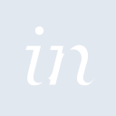

# invision

[← Back to main README](../../README.md)

<table><tr>
  <td></td>
  <td></td>
  <td></td>
</tr></table>

## 16 px

### black
```
https://georgegach.github.io/compatible-icons/simple-icons/compat/invision/16/black.png
```

### slate
```
https://georgegach.github.io/compatible-icons/simple-icons/compat/invision/16/slate.png
```

### white
```
https://georgegach.github.io/compatible-icons/simple-icons/compat/invision/16/white.png
```

## 64 px

### black
```
https://georgegach.github.io/compatible-icons/simple-icons/compat/invision/64/black.png
```

### slate
```
https://georgegach.github.io/compatible-icons/simple-icons/compat/invision/64/slate.png
```

### white
```
https://georgegach.github.io/compatible-icons/simple-icons/compat/invision/64/white.png
```

## 128 px

### black
```
https://georgegach.github.io/compatible-icons/simple-icons/compat/invision/128/black.png
```

### slate
```
https://georgegach.github.io/compatible-icons/simple-icons/compat/invision/128/slate.png
```

### white
```
https://georgegach.github.io/compatible-icons/simple-icons/compat/invision/128/white.png
```

## 512 px

### black
```
https://georgegach.github.io/compatible-icons/simple-icons/compat/invision/512/black.png
```

### slate
```
https://georgegach.github.io/compatible-icons/simple-icons/compat/invision/512/slate.png
```

### white
```
https://georgegach.github.io/compatible-icons/simple-icons/compat/invision/512/white.png
```

## 1024 px

### black
```
https://georgegach.github.io/compatible-icons/simple-icons/compat/invision/1024/black.png
```

### slate
```
https://georgegach.github.io/compatible-icons/simple-icons/compat/invision/1024/slate.png
```

### white
```
https://georgegach.github.io/compatible-icons/simple-icons/compat/invision/1024/white.png
```

## 16 px in base64

### black
```
data:image/png;base64,iVBORw0KGgoAAAANSUhEUgAAABAAAAAQCAYAAAAf8/9hAAAABmJLR0QA/wD/AP+gvaeTAAAA3ElEQVQ4jcXTPUpDURAF4O+piGBEwT+MK3AF2YJV3EdSWVrHwtKFiKWdhUsQbCRNSIooEjFEMUQhFhlDfLxHiEE8cJnLDOfMzLncBENzYGEe8p8JPOEWvd8KvKEWcSoS2SZ+YimV60fuRz49QR1VXOIDJzjHAMc4xXO623DivOAMN0YeNFDGA5rYiiZjTpYHV9hHwcjMI+xiGXsRc1fo4hVrscIFSlHrYQeb0wQOYtQWrrEetUccxr2TJ7CBRdxhG5WJjkXco43Vb0LWM2Y+V+AdK8HLFZgJ//+ZvgBO9TCT+7zFLAAAAABJRU5ErkJggg==
```

### slate
```
data:image/png;base64,iVBORw0KGgoAAAANSUhEUgAAABAAAAAQCAYAAAAf8/9hAAAABmJLR0QA/wD/AP+gvaeTAAABG0lEQVQ4jcWTzS6DYRCFn/N+bUMQEv8k9q7ALdi5DWFlyZYLsHEXYmknrkFiI3YsEPGXalTbb45FS1L9iWjErCbnfefMmTMZXd0+mwEiDVL8NwRC9wRnksu/IrBdUcZuWJWfEKiriaKBKbRjquIogNrw7wousTaJOALVDdugfUyN3Fs2e5jH3gRiRklLoDmI9wTr5DpFPCHvFJ0dkPoRGJznxygtgkZtn6kYa8AsSqU8NeYJl/qM4JdAr4IxRD2ldOjQSuuxHKQZpMl+HrxkmZZtT2GuI9VOkMeb4uLOjtWW0odeI0wEZEqcS0yTFzdkPjsuZEoXoBujkS/bOtZoqpIKxu1rBARvhqFm2oyOT4gh0/2+DMPfsf8/pg+DSnIiRiAAgAAAAABJRU5ErkJggg==
```

### white
```
data:image/png;base64,iVBORw0KGgoAAAANSUhEUgAAABAAAAAQCAYAAAAf8/9hAAAABmJLR0QA/wD/AP+gvaeTAAAA3klEQVQ4jcXTwSrEURgF8N8gKUQZhCfwBF7BivdgZWnNwtKDyNLOwiMoG81GLJCI/kSoY+GqmWnGxCRn893O1zn3fufr1pJEHxjoR/xnBjc4RvVbgydsldoTtS4hvmOojXspXAvf/oIG1rGPN2xiF6/YwDbuWhRpxX2SnSRHSaokZ0lWklwlOU9ST9JoFnTK4AALGPMZ5ipmMYy5UruO8IBHjJcR9rBUehVmMNXLYBF1XOAQE6V3jeVyvu1mMIlBnGAaa003zuMUlxj9EnRaY8d1FTxjBLXvDH6E//9MH1MGbFeBYnivAAAAAElFTkSuQmCC
```

