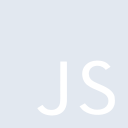
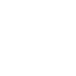

# javascript

[← Back to main README](../../README.md)

<table><tr>
  <td></td>
  <td></td>
  <td></td>
</tr></table>

## 16 px

### black
```
https://georgegach.github.io/compatible-icons/simple-icons/compat/javascript/16/black.png
```

### slate
```
https://georgegach.github.io/compatible-icons/simple-icons/compat/javascript/16/slate.png
```

### white
```
https://georgegach.github.io/compatible-icons/simple-icons/compat/javascript/16/white.png
```

## 64 px

### black
```
https://georgegach.github.io/compatible-icons/simple-icons/compat/javascript/64/black.png
```

### slate
```
https://georgegach.github.io/compatible-icons/simple-icons/compat/javascript/64/slate.png
```

### white
```
https://georgegach.github.io/compatible-icons/simple-icons/compat/javascript/64/white.png
```

## 128 px

### black
```
https://georgegach.github.io/compatible-icons/simple-icons/compat/javascript/128/black.png
```

### slate
```
https://georgegach.github.io/compatible-icons/simple-icons/compat/javascript/128/slate.png
```

### white
```
https://georgegach.github.io/compatible-icons/simple-icons/compat/javascript/128/white.png
```

## 512 px

### black
```
https://georgegach.github.io/compatible-icons/simple-icons/compat/javascript/512/black.png
```

### slate
```
https://georgegach.github.io/compatible-icons/simple-icons/compat/javascript/512/slate.png
```

### white
```
https://georgegach.github.io/compatible-icons/simple-icons/compat/javascript/512/white.png
```

## 1024 px

### black
```
https://georgegach.github.io/compatible-icons/simple-icons/compat/javascript/1024/black.png
```

### slate
```
https://georgegach.github.io/compatible-icons/simple-icons/compat/javascript/1024/slate.png
```

### white
```
https://georgegach.github.io/compatible-icons/simple-icons/compat/javascript/1024/white.png
```

## 16 px in base64

### black
```
data:image/png;base64,iVBORw0KGgoAAAANSUhEUgAAABAAAAAQCAYAAAAf8/9hAAAABmJLR0QA/wD/AP+gvaeTAAAAz0lEQVQ4je3TPU5CQRQF4O/5E6ksaIgFMVFaG2UTVmwAC7dAxWasaFwBNBYUGBtXYCwgJAQjxgoDhT4K7ktIJOERLD3JTU7mzjlzbmYmQWoH7O0i/jf4I4ODDf13HOE4+CtmqKCcJ0Ebz8Hv8RiaLqZ5EmSP7BtPaKAaKQp5EmTYRxO3aOEja2wySJEEv0An1q4xYP0IKT5RxFfs+cEEJ6hjiBFOM8FqveEGPVziBWPUcIcHXFneSJr4/RunEa+Pc5zhMEzGmKMUpyfrDLbCAqaYL5hRELwgAAAAAElFTkSuQmCC
```

### slate
```
data:image/png;base64,iVBORw0KGgoAAAANSUhEUgAAABAAAAAQCAYAAAAf8/9hAAAABmJLR0QA/wD/AP+gvaeTAAAA8UlEQVQ4je2TvS4DYBSGn/dTYTIY/AzSBKvNTbgHi8UsJlcjEYvNxsjSWFyCQUmkSQlLpYZ+j8HPUmkjNTrTSU7Oc553OLnrvMgEVSZZ/gf8EaAxahjoCjPAHB/9DdJPXIesjDVQz0K5BhBPirQSS+QyoTfWgFJEAAehXBn3IZsmfXR2rAG1foWZAg+g7qjHUJ++b4wEgDDIJ2QDcx6KwS2h/WOEBJVnYJ7Ca600gjUlj5JlcFvKPfAANIcNpGt1T2w1Sg6TLJHS1boLHkUurJyWsACQ4W+0B6UdvK1hDVyNmUY6KXSUN2UxSRPMD4Df1TulcnFiHqlmEQAAAABJRU5ErkJggg==
```

### white
```
data:image/png;base64,iVBORw0KGgoAAAANSUhEUgAAABAAAAAQCAYAAAAf8/9hAAAABmJLR0QA/wD/AP+gvaeTAAAA00lEQVQ4je3TvS5EURTF8d/1kVEpNKKQSdBq8BIqL0DhFVReRqXxBDONQkE0nkCmIBIZQVQjFCzNuZWbzJWZ0kp2snL22Sv/k+xTJYkJNDPJ8H/AlALmxvSf0cFi8QN8YAOrbQh6uCn+DFdl5gKjNgT1kn3hGkfYKRQLbQhqzeIYhzjFa90YFxBUxW+iX852cU/zE4I3LOG93PnGC1awjwc8oiu/9ZTkIMllkq0kt0mGSfaSnCQ5T7KdZJAkVcNvHBW8O6xjDfMYlvrEMrqomgL+pB9zRGhfsH3x2gAAAABJRU5ErkJggg==
```

