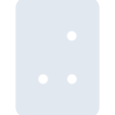
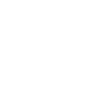

# jovian

[← Back to main README](../../README.md)

<table><tr>
  <td></td>
  <td></td>
  <td></td>
</tr></table>

## 16 px

### black
```
https://georgegach.github.io/compatible-icons/simple-icons/compat/jovian/16/black.png
```

### slate
```
https://georgegach.github.io/compatible-icons/simple-icons/compat/jovian/16/slate.png
```

### white
```
https://georgegach.github.io/compatible-icons/simple-icons/compat/jovian/16/white.png
```

## 64 px

### black
```
https://georgegach.github.io/compatible-icons/simple-icons/compat/jovian/64/black.png
```

### slate
```
https://georgegach.github.io/compatible-icons/simple-icons/compat/jovian/64/slate.png
```

### white
```
https://georgegach.github.io/compatible-icons/simple-icons/compat/jovian/64/white.png
```

## 128 px

### black
```
https://georgegach.github.io/compatible-icons/simple-icons/compat/jovian/128/black.png
```

### slate
```
https://georgegach.github.io/compatible-icons/simple-icons/compat/jovian/128/slate.png
```

### white
```
https://georgegach.github.io/compatible-icons/simple-icons/compat/jovian/128/white.png
```

## 512 px

### black
```
https://georgegach.github.io/compatible-icons/simple-icons/compat/jovian/512/black.png
```

### slate
```
https://georgegach.github.io/compatible-icons/simple-icons/compat/jovian/512/slate.png
```

### white
```
https://georgegach.github.io/compatible-icons/simple-icons/compat/jovian/512/white.png
```

## 1024 px

### black
```
https://georgegach.github.io/compatible-icons/simple-icons/compat/jovian/1024/black.png
```

### slate
```
https://georgegach.github.io/compatible-icons/simple-icons/compat/jovian/1024/slate.png
```

### white
```
https://georgegach.github.io/compatible-icons/simple-icons/compat/jovian/1024/white.png
```

## 16 px in base64

### black
```
data:image/png;base64,iVBORw0KGgoAAAANSUhEUgAAABAAAAAQCAYAAAAf8/9hAAAABmJLR0QA/wD/AP+gvaeTAAAAe0lEQVQ4jdXTSwrCUAyF4U8pugy7mq5YnahdRRfQ7sJOqgO9+OCWVAXRA2cQkvyEA+GmDXqcAh+xTkvzO8AKC7GWKHOAt/Q1wBaHTwDF1dnGFFVjjf8J8WXA3mPqNXa5wbEQB8ye6iG6phH/QXKTln4rxM7lnSP1aFNxBvGkIr5+PVEAAAAAAElFTkSuQmCC
```

### slate
```
data:image/png;base64,iVBORw0KGgoAAAANSUhEUgAAABAAAAAQCAYAAAAf8/9hAAAABmJLR0QA/wD/AP+gvaeTAAAAkklEQVQ4jdWRLQ7CYBBE3zQNSCyuHKap4rpgKJyFOiyyZgdDoSRff0AQGDezu0/Miruay3Unu0QsGJVaQ12sV1uA7BETxfQxgJciNp3LRjZn6TsAmb3g+DHAIgfy1CwZJlR5YPAnJb4NMNT91gUnw2E2QCICogcM6en7Sn/BVHpNSgbe8EMlhtWA2ukTtSY7d+4Gre0lVyI+hdIAAAAASUVORK5CYII=
```

### white
```
data:image/png;base64,iVBORw0KGgoAAAANSUhEUgAAABAAAAAQCAYAAAAf8/9hAAAABmJLR0QA/wD/AP+gvaeTAAAAfklEQVQ4jdWTTQqDMBBGnyLtMexpPLHtxp9TeAC9hdnk68YglWhSFcEHWQyTeUw+CExIeksyCjNKKt1cykwOPAjzBF4+wS4uE3yA5oggm463EUOx1rhPiH8Lan5Tb4HKd3EtRAski9puriKpi/gHji70hGhOFQyAiZgxQO+KLx4GanYaASD3AAAAAElFTkSuQmCC
```

