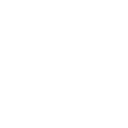

# jsr

[← Back to main README](../../README.md)

<table><tr>
  <td></td>
  <td></td>
  <td></td>
</tr></table>

## 16 px

### black
```
https://georgegach.github.io/compatible-icons/simple-icons/compat/jsr/16/black.png
```

### slate
```
https://georgegach.github.io/compatible-icons/simple-icons/compat/jsr/16/slate.png
```

### white
```
https://georgegach.github.io/compatible-icons/simple-icons/compat/jsr/16/white.png
```

## 64 px

### black
```
https://georgegach.github.io/compatible-icons/simple-icons/compat/jsr/64/black.png
```

### slate
```
https://georgegach.github.io/compatible-icons/simple-icons/compat/jsr/64/slate.png
```

### white
```
https://georgegach.github.io/compatible-icons/simple-icons/compat/jsr/64/white.png
```

## 128 px

### black
```
https://georgegach.github.io/compatible-icons/simple-icons/compat/jsr/128/black.png
```

### slate
```
https://georgegach.github.io/compatible-icons/simple-icons/compat/jsr/128/slate.png
```

### white
```
https://georgegach.github.io/compatible-icons/simple-icons/compat/jsr/128/white.png
```

## 512 px

### black
```
https://georgegach.github.io/compatible-icons/simple-icons/compat/jsr/512/black.png
```

### slate
```
https://georgegach.github.io/compatible-icons/simple-icons/compat/jsr/512/slate.png
```

### white
```
https://georgegach.github.io/compatible-icons/simple-icons/compat/jsr/512/white.png
```

## 1024 px

### black
```
https://georgegach.github.io/compatible-icons/simple-icons/compat/jsr/1024/black.png
```

### slate
```
https://georgegach.github.io/compatible-icons/simple-icons/compat/jsr/1024/slate.png
```

### white
```
https://georgegach.github.io/compatible-icons/simple-icons/compat/jsr/1024/white.png
```

## 16 px in base64

### black
```
data:image/png;base64,iVBORw0KGgoAAAANSUhEUgAAABAAAAAQCAYAAAAf8/9hAAAABmJLR0QA/wD/AP+gvaeTAAAA8UlEQVQ4jdXQL0tDcRTG8c/+IDhY8gWoyMAkNts0ilgEF9btpiVfgMFXYVbBNLQZVgVZMYkONGq5MHHotJwfXC4Xl3fK73DOuc/zfC9zX5Vcf47lGfenuM0P6rl+C2uYoIFPTGNXxSIybBQTpMFlHN3gCFe4Qw0H2C6LVMcAX+H6gefYveIkbmoxG+A++j20qmjiF+MSg0e8BA700cUuHhKbiPqOhRCDTohnuMghT7CEnYQAm6Geoon/sYJvDAvJGpE4SwItHBeOhrjGT3LDarxvOEyReoUP29gP7oRTiUTjwHzCekI4K3Fu+r9GM/bzVH8Swy99vFK2mgAAAABJRU5ErkJggg==
```

### slate
```
data:image/png;base64,iVBORw0KGgoAAAANSUhEUgAAABAAAAAQCAYAAAAf8/9hAAAABmJLR0QA/wD/AP+gvaeTAAABWklEQVQ4jdWSPWvTYRTFf+f+QyCB0IJgpvQFCXQqbm7aUYKLYIfu7k6d+gE69FN0toVOpW4ZsgqSxUk0RpEMloRAQot5TocnkbQW997pPPfe59yXc+HBmxag92t0LKX1/2fH4Vp95cOyq7QAUfCMpCfG16AqeAqkRRhUkRn3B8PtW5z9weU2gClOSK6o4MKJtzangdpJqRB6Dby4r6lSsjpBXEGqgi6d+AoQ0g+Lg3CULBcYsDoSH3NBt4BmCNXyW5N/RrY/G38DTQEsnSe8l+yXEp/mswFy2/DbomzCOZldQ00wlnmfN54kcy14hLXzd4k2T0M6z9itrI0rQhsWf2S6d1qrgibG44UKTeN3OTj3mG4inYVjZnsHgYJNzwDFT5i9iazCcP8Wu/Xc+BVmauFcECEq4IlQmdCXxuOVLYBSo756tPz/+2DUxa6hpSvTEj/GM/Xuk/SB2g1PiZLtxmLssgAAAABJRU5ErkJggg==
```

### white
```
data:image/png;base64,iVBORw0KGgoAAAANSUhEUgAAABAAAAAQCAYAAAAf8/9hAAAABmJLR0QA/wD/AP+gvaeTAAAA/0lEQVQ4jdXRsS6EURAF4O/ubiQ2UXkARCQq0elQimgkFHq9SuUBFJ5CjUQldIptJbKNSpBQ0myyQnAVOzf5bTa23mnuZObMmXPmMvKRSpJzPsbUEPxhSumqWmhU8iXM4hNNvOMnejWMo5NzXvijoFI4DdAldnGGa9SxiZVBkhpo4SO2vuEhes84CEw9ai3cRL6OuRomkNEdsOAOj2EHLrCDNdwWb0LqK8aCDLaDvIOTYlnvRpNYLRZgMdiLNHGPaXyh3aesGYo7hWAOe32gNs7xXbZhJt4XbNH7hf2+wWVshO9iJ4Wibti8TynNQyOldFSdzjm3w/t/8TSkP0rxC1PZPneO/p23AAAAAElFTkSuQmCC
```

