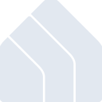
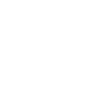

# kasasmart

[← Back to main README](../../README.md)

<table><tr>
  <td></td>
  <td></td>
  <td></td>
</tr></table>

## 16 px

### black
```
https://georgegach.github.io/compatible-icons/simple-icons/compat/kasasmart/16/black.png
```

### slate
```
https://georgegach.github.io/compatible-icons/simple-icons/compat/kasasmart/16/slate.png
```

### white
```
https://georgegach.github.io/compatible-icons/simple-icons/compat/kasasmart/16/white.png
```

## 64 px

### black
```
https://georgegach.github.io/compatible-icons/simple-icons/compat/kasasmart/64/black.png
```

### slate
```
https://georgegach.github.io/compatible-icons/simple-icons/compat/kasasmart/64/slate.png
```

### white
```
https://georgegach.github.io/compatible-icons/simple-icons/compat/kasasmart/64/white.png
```

## 128 px

### black
```
https://georgegach.github.io/compatible-icons/simple-icons/compat/kasasmart/128/black.png
```

### slate
```
https://georgegach.github.io/compatible-icons/simple-icons/compat/kasasmart/128/slate.png
```

### white
```
https://georgegach.github.io/compatible-icons/simple-icons/compat/kasasmart/128/white.png
```

## 512 px

### black
```
https://georgegach.github.io/compatible-icons/simple-icons/compat/kasasmart/512/black.png
```

### slate
```
https://georgegach.github.io/compatible-icons/simple-icons/compat/kasasmart/512/slate.png
```

### white
```
https://georgegach.github.io/compatible-icons/simple-icons/compat/kasasmart/512/white.png
```

## 1024 px

### black
```
https://georgegach.github.io/compatible-icons/simple-icons/compat/kasasmart/1024/black.png
```

### slate
```
https://georgegach.github.io/compatible-icons/simple-icons/compat/kasasmart/1024/slate.png
```

### white
```
https://georgegach.github.io/compatible-icons/simple-icons/compat/kasasmart/1024/white.png
```

## 16 px in base64

### black
```
data:image/png;base64,iVBORw0KGgoAAAANSUhEUgAAABAAAAAQCAYAAAAf8/9hAAAABmJLR0QA/wD/AP+gvaeTAAAA6UlEQVQ4jaXSTUoDQRDF8V/GCMa16BEUj+MiJ3Hh3kVU8BpeQ0H0ACpZuHKR4EI0EAjE+BEXqYGx6YyjPmiYrur3n1dNs1w9PMXq1ZzL6gjPmMca4aSpuYs+PiqAOV5w3OTPI1zhJgOpTXJYiT3FdQ3kNDXvRaN6cBpJbuvGWcE+DnCPTawGtB37B4yxgVb0OtjFJwzio49zTH6RZACz2PwEuYyU1fpMUighFxnIBGdpvUgus4WdmP2unDG0HvcwrhpSQAnZtnjCj5n+N+UAZX0Lr38FNFaB93/43woMl0DaFg8m1VppxvALXZFrsEoaEvoAAAAASUVORK5CYII=
```

### slate
```
data:image/png;base64,iVBORw0KGgoAAAANSUhEUgAAABAAAAAQCAYAAAAf8/9hAAAABmJLR0QA/wD/AP+gvaeTAAABYElEQVQ4jZ2SvW4TQRSFvzOyRXCBFoRsJU1KUEos5TEoKHgCnLwAIg9A4SRSHgBFvFCADiQaCq9trY2LnVgRUkS0h4L87NprSHK6uXPPN0d3LqzQcBL7aRZnaRZnw0nsr+pTXXGQxX1BD/EEwCJScLy5nrxb7A015teSXiKS61dMIngzyOLBPwGDLO4r8EGQA9+AopT1MYGdQRYPawGjn/l7ST1MYugKnS1CZBKCe2l2elSZwXCavyrMR6Hr2FjnVvFF5hHSViWtyQ3Hm+vJntLp/K1c7NqMgG1E61YQKRfqK53kI6QNrO/YU8nbRreEMA6W2hghP0fq2DqR+HXT5Ady6EKIwI/yAA3tINO8PJUgfBJVCCpegD6X6zLN6h5cQUwb+Fr+AVAL+anFvGxZWqS/EJ5hz5CzpfsFNVbUg6UO5vx/gOUEd1SQuLi3W/odisLjOoihAXq4ZDJrV2bs8R/+q57i9fYP0AAAAABJRU5ErkJggg==
```

### white
```
data:image/png;base64,iVBORw0KGgoAAAANSUhEUgAAABAAAAAQCAYAAAAf8/9hAAAABmJLR0QA/wD/AP+gvaeTAAAA+ElEQVQ4jaWPsS4EURiFv5nYYAuV2EQvRKnwIApPwhMoFolnUtEsDSISrYnIhk0kZFl8Cnfi7mTuGpzkNv/5z3fPDwmpXbUfXje1lwrvqvd+a6DuNw1vqpfqu+N6UPea/DxQj9SzGki6iboT1R6qxxMgB9XwRjBiDUOT84nnqFvqtXqoPv0Ssp2pN8AicAXcAetAOyr4ApwCc8AqkEdekamvQAvwB0gP6ABL0XyUhzBABqyEpR7wHC1OA2vASWXeiuvEkAXgAviIvDYwDzzGgSqghCwDfeC2xh9THaCcd/i6/U+AxsqBt3/kRzlQJCBTwGzNfKYMA8Un8o0vtRv6V7IAAAAASUVORK5CYII=
```

