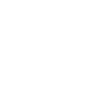

# kaufland

[← Back to main README](../../README.md)

<table><tr>
  <td></td>
  <td></td>
  <td></td>
</tr></table>

## 16 px

### black
```
https://georgegach.github.io/compatible-icons/simple-icons/compat/kaufland/16/black.png
```

### slate
```
https://georgegach.github.io/compatible-icons/simple-icons/compat/kaufland/16/slate.png
```

### white
```
https://georgegach.github.io/compatible-icons/simple-icons/compat/kaufland/16/white.png
```

## 64 px

### black
```
https://georgegach.github.io/compatible-icons/simple-icons/compat/kaufland/64/black.png
```

### slate
```
https://georgegach.github.io/compatible-icons/simple-icons/compat/kaufland/64/slate.png
```

### white
```
https://georgegach.github.io/compatible-icons/simple-icons/compat/kaufland/64/white.png
```

## 128 px

### black
```
https://georgegach.github.io/compatible-icons/simple-icons/compat/kaufland/128/black.png
```

### slate
```
https://georgegach.github.io/compatible-icons/simple-icons/compat/kaufland/128/slate.png
```

### white
```
https://georgegach.github.io/compatible-icons/simple-icons/compat/kaufland/128/white.png
```

## 512 px

### black
```
https://georgegach.github.io/compatible-icons/simple-icons/compat/kaufland/512/black.png
```

### slate
```
https://georgegach.github.io/compatible-icons/simple-icons/compat/kaufland/512/slate.png
```

### white
```
https://georgegach.github.io/compatible-icons/simple-icons/compat/kaufland/512/white.png
```

## 1024 px

### black
```
https://georgegach.github.io/compatible-icons/simple-icons/compat/kaufland/1024/black.png
```

### slate
```
https://georgegach.github.io/compatible-icons/simple-icons/compat/kaufland/1024/slate.png
```

### white
```
https://georgegach.github.io/compatible-icons/simple-icons/compat/kaufland/1024/white.png
```

## 16 px in base64

### black
```
data:image/png;base64,iVBORw0KGgoAAAANSUhEUgAAABAAAAAQCAYAAAAf8/9hAAAABmJLR0QA/wD/AP+gvaeTAAAAs0lEQVQ4jaXTzwpBQRQG8N+VyDtYyJtInsF7eRhbC49gpbgpytZCKQss3MuYe8Xw1Wmac+b8/c5kuPoTl398m8Flim704FycrUDXxhLjuIKFezuh5IWEujV6pW8jseQcQ2xKRUqAijM0a5++ooMVBtjFxjDAucgS2w8Y1TmT1sJbfGJh7z75mGK+ZOGEPuae9D2Q0kIPszhI6gwqQUIWtqofq1zlY6BrY6JmlX/BJavJmoQbihsx4+8jRmoAAAAASUVORK5CYII=
```

### slate
```
data:image/png;base64,iVBORw0KGgoAAAANSUhEUgAAABAAAAAQCAYAAAAf8/9hAAAABmJLR0QA/wD/AP+gvaeTAAAA80lEQVQ4jaWTQUrDQBiF30tCizvFlZBAk7V3cCGeobfwMB7GrZSeQihpyQSMCzFCoVCdeW5sm2lt6ZAHAzNv5n0M/8zPqmmFPqqa1vXJJpuFef96llzqnRDXAABq0PGGoF75vRwLwBYguQzgrQcg5n+TvOOVVnjMs2xVNS2iwFuXVrrPb64WGyMEcBA+D0BeAJhFP/ZuPwx4NcCaROntCgmFltY+pOl1/R8/tAbHASQGAApvEFYRLl0ST+r6Iz0JOCppBaBwSTydv32OwgE7jWLyZR8SWoMDyPYVyMhIzm+s3VdedrxhTDwZY8YC+jcT+7bzLy1vb587zGSGAAAAAElFTkSuQmCC
```

### white
```
data:image/png;base64,iVBORw0KGgoAAAANSUhEUgAAABAAAAAQCAYAAAAf8/9hAAAABmJLR0QA/wD/AP+gvaeTAAAAuklEQVQ4jaWTPQrCQBCFv5Fg8A4WwZuIeAbv5WFsLTyClaBBULC1EIQUeTa7MNmkyJoHy7LztzPzZkySmAJJ7RTfwj0OwDKxacI9d7ISuAC7TgaSzuqjDsfjJqmKvrPMrGtgY2b3KMgJ0HMGKIZtO1gAV2BtZs9U6QM04ZdU/wa2Q86QV8IwRrDwCp1PKR7NwhdYAadIn0dOCRVwTIPk9qAXxLPwANLFiqP8cbIS2EvqjvI/kNTa1HX+AWionYPkr8fcAAAAAElFTkSuQmCC
```

