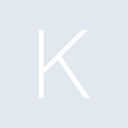
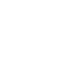

# keras

[← Back to main README](../../README.md)





## 16 px

### black
```
https://georgegach.github.io/compatible-icons/simple-icons/keras/16/black.png
```

### slate
```
https://georgegach.github.io/compatible-icons/simple-icons/keras/16/slate.png
```

### white
```
https://georgegach.github.io/compatible-icons/simple-icons/keras/16/white.png
```

## 64 px

### black
```
https://georgegach.github.io/compatible-icons/simple-icons/keras/64/black.png
```

### slate
```
https://georgegach.github.io/compatible-icons/simple-icons/keras/64/slate.png
```

### white
```
https://georgegach.github.io/compatible-icons/simple-icons/keras/64/white.png
```

## 128 px

### black
```
https://georgegach.github.io/compatible-icons/simple-icons/keras/128/black.png
```

### slate
```
https://georgegach.github.io/compatible-icons/simple-icons/keras/128/slate.png
```

### white
```
https://georgegach.github.io/compatible-icons/simple-icons/keras/128/white.png
```

## 512 px

### black
```
https://georgegach.github.io/compatible-icons/simple-icons/keras/512/black.png
```

### slate
```
https://georgegach.github.io/compatible-icons/simple-icons/keras/512/slate.png
```

### white
```
https://georgegach.github.io/compatible-icons/simple-icons/keras/512/white.png
```

## 1024 px

### black
```
https://georgegach.github.io/compatible-icons/simple-icons/keras/1024/black.png
```

### slate
```
https://georgegach.github.io/compatible-icons/simple-icons/keras/1024/slate.png
```

### white
```
https://georgegach.github.io/compatible-icons/simple-icons/keras/1024/white.png
```

## 16 px in base64

### black
```
data:image/png;base64,iVBORw0KGgoAAAANSUhEUgAAABAAAAAQCAYAAAAf8/9hAAAABmJLR0QA/wD/AP+gvaeTAAAAuElEQVQ4jdXTMWoCQRgF4G+NrYWVx0ghiHgpy5S5h2ATyAVEsLG0ywG2DMFCRMgWC3bJpsgsrOOuG5EUPnjMzM97j/+fYRIUbkDnFvO/Beyxi2oZ0rC2BmTYROdX5OjF4m5Lh6V5hCEe/tJBiRwvGDeZLwUcMcMagyZziSJiike84QNTfNboStYGzPEVuMQq7M8CmkbohfE6mGCB7TV3UEUfT3jGoU4Qt7ULrNa+8e73WU/0ibv/TD+LQEGBUFeBTgAAAABJRU5ErkJggg==
```

### slate
```
data:image/png;base64,iVBORw0KGgoAAAANSUhEUgAAABAAAAAQCAYAAAAf8/9hAAAABmJLR0QA/wD/AP+gvaeTAAAA50lEQVQ4jcWTMUpDURBFz51vG4iVKSyyhgREbKzcjq2lKxArm5SBbMDa0iYrsFYLIxZPCNhlrpXyyf8/CQRxuhnmnrk83tXL4tPsUbGP+G8ARu+gt7VhAT3ZLlsBgYvkx59eoiDPsJch9db3DzbZkyi2Z1gniLGh2urg17VYpj2FOEWMaRF3Apz6UjKB6kH4qEvcCYjIW+Bc5F2GbpAaj7cRkNIl8gg4ZpUXwFwidwbI9EABREScBb7P9OvOgHrZPlzZV1BdCz4ax1qysDAgGNQ5oGfkPqZfX277BwM1ZwIPaYnd/4fpG6p/UX00yXHMAAAAAElFTkSuQmCC
```

### white
```
data:image/png;base64,iVBORw0KGgoAAAANSUhEUgAAABAAAAAQCAYAAAAf8/9hAAAABmJLR0QA/wD/AP+gvaeTAAAAvUlEQVQ4jcXTv0qCARQF8J/mKuSUg+8QFIS4+zo1NvYejUEv0NzoIj2AszioCDkIjR2XT5AvP+1DogOXy/1zDucOt5EkzkDzHPKfCSwxL/XWmBT5pMAao1L9ig3a5eXWCYc78h1ucfEbBzts8IJ+FfmYwBee8Y6rKjLIT0ySXCf5SDJN8pDk88BekqTKwT1u0MMQY3zXOaFdzJoY4A2zOgL76OART1iVh40Dv7AocnevF0xxWcRRgVr4/2faAjXdYraX/z8+AAAAAElFTkSuQmCC
```

