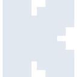
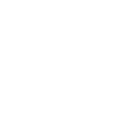

# kick

[← Back to main README](../../README.md)

<table><tr>
  <td></td>
  <td></td>
  <td></td>
</tr></table>

## 16 px

### black
```
https://georgegach.github.io/compatible-icons/simple-icons/compat/kick/16/black.png
```

### slate
```
https://georgegach.github.io/compatible-icons/simple-icons/compat/kick/16/slate.png
```

### white
```
https://georgegach.github.io/compatible-icons/simple-icons/compat/kick/16/white.png
```

## 64 px

### black
```
https://georgegach.github.io/compatible-icons/simple-icons/compat/kick/64/black.png
```

### slate
```
https://georgegach.github.io/compatible-icons/simple-icons/compat/kick/64/slate.png
```

### white
```
https://georgegach.github.io/compatible-icons/simple-icons/compat/kick/64/white.png
```

## 128 px

### black
```
https://georgegach.github.io/compatible-icons/simple-icons/compat/kick/128/black.png
```

### slate
```
https://georgegach.github.io/compatible-icons/simple-icons/compat/kick/128/slate.png
```

### white
```
https://georgegach.github.io/compatible-icons/simple-icons/compat/kick/128/white.png
```

## 512 px

### black
```
https://georgegach.github.io/compatible-icons/simple-icons/compat/kick/512/black.png
```

### slate
```
https://georgegach.github.io/compatible-icons/simple-icons/compat/kick/512/slate.png
```

### white
```
https://georgegach.github.io/compatible-icons/simple-icons/compat/kick/512/white.png
```

## 1024 px

### black
```
https://georgegach.github.io/compatible-icons/simple-icons/compat/kick/1024/black.png
```

### slate
```
https://georgegach.github.io/compatible-icons/simple-icons/compat/kick/1024/slate.png
```

### white
```
https://georgegach.github.io/compatible-icons/simple-icons/compat/kick/1024/white.png
```

## 16 px in base64

### black
```
data:image/png;base64,iVBORw0KGgoAAAANSUhEUgAAABAAAAAQCAYAAAAf8/9hAAAABmJLR0QA/wD/AP+gvaeTAAAAmUlEQVQ4jaXSMQ4BQRQG4C+iVbuBSiKionMEHWfR7Ul06xY67UayFR2V2gFoRojYGWb/5DWTN99M3gwUuH+p0itlQ0/REc8obJ41NXQTwADLWEMMmGOSOCAK9ENlA7HcUKPKBWphsP8CF2xQPRdSz/hTmj5SrPZtbzAMyCIX6GGKcQy44pSSYsAO6zYAHLHFORc4YOVt6p95AKC2Kt83SvHaAAAAAElFTkSuQmCC
```

### slate
```
data:image/png;base64,iVBORw0KGgoAAAANSUhEUgAAABAAAAAQCAYAAAAf8/9hAAAABmJLR0QA/wD/AP+gvaeTAAAA3UlEQVQ4jZ2SvU4CURSEv7nYmo3VUiytFYkxVtLxFvAgJibGRktewk7ewo6WmFBBBySwFSHW7FgYjEHvInfKyZzv/ORovto8IT1yoICGRTPrAyzX29cK9w4z2M9nv8wfWpabKxzujTuxTC1gV+lS+qPzfwA73A3ixnXVdQBBbsiP1NevEIVLH8AEhXESAJi08qyTMsEC+wWF8d4IiRN861RA6+vpfLc3Um/QXpTbEWiQBLB9Dtzi6jq6gqEUzI7BooAGeqvMQzIAoBE8DWgomCcBivzivWhmfaFRLPMJfc88Ay5cbxwAAAAASUVORK5CYII=
```

### white
```
data:image/png;base64,iVBORw0KGgoAAAANSUhEUgAAABAAAAAQCAYAAAAf8/9hAAAABmJLR0QA/wD/AP+gvaeTAAAAoklEQVQ4jaXSIQ7CQBCF4X8IFs0NUCSEoKjjCDg4C64nwZVb4NY2JFXgQFVzgIdZHDsl05es2bx8O8kskmr9TkOOpKbQqSc4kbTKUFXqTD0AWAAHr+ABO2Az8IALzPMJA17eQAe0UaAzsyoywQs4A+33wl3jX3E+kpc0doKlpCRpHwVmwBZYe0APPIYkD7gCpzEAwB24AM8QYGY3MzsCqdT5APKgiog0P9bwAAAAAElFTkSuQmCC
```

