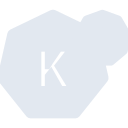
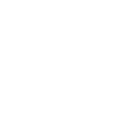

# knative

[← Back to main README](../../README.md)





## 16 px

### black
```
https://georgegach.github.io/compatible-icons/simple-icons/knative/16/black.png
```

### slate
```
https://georgegach.github.io/compatible-icons/simple-icons/knative/16/slate.png
```

### white
```
https://georgegach.github.io/compatible-icons/simple-icons/knative/16/white.png
```

## 64 px

### black
```
https://georgegach.github.io/compatible-icons/simple-icons/knative/64/black.png
```

### slate
```
https://georgegach.github.io/compatible-icons/simple-icons/knative/64/slate.png
```

### white
```
https://georgegach.github.io/compatible-icons/simple-icons/knative/64/white.png
```

## 128 px

### black
```
https://georgegach.github.io/compatible-icons/simple-icons/knative/128/black.png
```

### slate
```
https://georgegach.github.io/compatible-icons/simple-icons/knative/128/slate.png
```

### white
```
https://georgegach.github.io/compatible-icons/simple-icons/knative/128/white.png
```

## 512 px

### black
```
https://georgegach.github.io/compatible-icons/simple-icons/knative/512/black.png
```

### slate
```
https://georgegach.github.io/compatible-icons/simple-icons/knative/512/slate.png
```

### white
```
https://georgegach.github.io/compatible-icons/simple-icons/knative/512/white.png
```

## 1024 px

### black
```
https://georgegach.github.io/compatible-icons/simple-icons/knative/1024/black.png
```

### slate
```
https://georgegach.github.io/compatible-icons/simple-icons/knative/1024/slate.png
```

### white
```
https://georgegach.github.io/compatible-icons/simple-icons/knative/1024/white.png
```

## 16 px in base64

### black
```
data:image/png;base64,iVBORw0KGgoAAAANSUhEUgAAABAAAAAQCAYAAAAf8/9hAAAABmJLR0QA/wD/AP+gvaeTAAABJUlEQVQ4jbXSTyuEURQG8J/XKIXybzkLirIQO59A2VhZ8gEovoO1fAI7Rdna2looC/aSKMn/MQzD0GDx3reu6cWGp2733qfzPOfecw7/gAQz2MUi2gLfGvhtrGO0UVjALA5QwQdecYxl7KEa+A/cYj4TL+AQT1FAvMp4wBvOUQr8CQzi6hthtuphfwzn7F5NMI6eX+pSC3tzVCcoJ5iMCOFv+yHLPu7xjDtpIePYSgH9Ddnq2EERL+gIohJuIoNTTCQhoBFH2ERfJOiWdgqWMIbLBF05Br2YxlZ4RYbOYFSUtliCixyDYbRjIDw9xgVWY2IEZ762LJuHmq/DU8JcTkLTuPbzLNSwlifOsOL7SXyXtrSlUdQUnZuxgaEc8wdMSSf2b/EJlVBmKQqahAkAAAAASUVORK5CYII=
```

### slate
```
data:image/png;base64,iVBORw0KGgoAAAANSUhEUgAAABAAAAAQCAYAAAAf8/9hAAAABmJLR0QA/wD/AP+gvaeTAAABx0lEQVQ4jaWSP2uTYRTFf+cmsY0kkMSWxNCKSgWlzrqL4uJUJx11cBEFwVVwFP0Ajk66iLgo+AF0LCg4SrV/pMY0MS21bTTvcchbjU116bM9995z7jnneWCPRzsLtmOxsXrJ9g3JL3PeelCr1dbn5jyqkfbFUOaalcxnxP2JavmtBoDZ+WbnqhJuYddBBUs/ZJawnxI6Q5KcQMr3AbRAdwTwcal1PbJxk8R1pP27KO1YRJi8URN5BFM2/qSFRueYE16Dx//pUyQ2AV6HVAEEeCPc652F5MD/grLZSqky4BQMEN/Cigug+DPNCtasoIeZBTrYG9htYPTvWa9lhY6krP2a6MnJG6QJo82Qi0aBaWGaQPTfzgs/I3c+kItDkhUfMM8hOdz3DogKQTbN5N7aSunU0WrhS2DKQ6HhMcRlmVegzQF7JUQlsSamp9UFCNvLu8R+0qYAMQW0dnSXcxk/2r5EhGckfR7YMoZ9LpVyGlwe6LVR5m59vDT7m2CyWnmHe7fBzdRfAOln8j4g38fStf3iULX4cFBOAEzWKo+FnmG+D9lJQwn7/deDpSvDrW11dmax0Xli+/gwQax2HTNTtWJj1wV7Ob8Ab/XD9f6YLqQAAAAASUVORK5CYII=
```

### white
```
data:image/png;base64,iVBORw0KGgoAAAANSUhEUgAAABAAAAAQCAYAAAAf8/9hAAAABmJLR0QA/wD/AP+gvaeTAAABPUlEQVQ4ja2SSytFURiGn7UdpVBuQwOKMhAzv0CZGBnyAyj+g7H8AjNFmZqaGigD5pIoyfUc98uh4zGwNrttn5Q8k3etr/W+62utD/4bNVGn1G11Xm2O9aZY31RX1eG8saROq3vqvZ+8qofqorqjPvlNWZ1NzXPqvvpoMTfqnfqmnqqVWD9C7Vcv6hhTalEf4jrdPyXAKND5y9NUozZETaLeJMB4pgBQBnaBWtRb4Bm4BppyZ+9LQG/uthqwBXQDL0BrNFWAq0zAMTCWxAN5DoB1oCdj6ABKcb0AjIQQzhOgvSCgC5gENmIXKW0xqDuE8EpMPysIGARagL7YepYzYPlrpw6pJ7kvS+ehmhueijrz4zp1Ur38ZRaq6kpBt18hS9afxHd1V23M+0ImoAFYAwYK8u+AiRDCRd0O/soH/olzM3kOyjEAAAAASUVORK5CYII=
```

