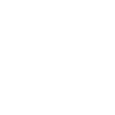

# knip

[← Back to main README](../../README.md)

<table><tr>
  <td></td>
  <td></td>
  <td></td>
</tr></table>

## 16 px

### black
```
https://georgegach.github.io/compatible-icons/simple-icons/compat/knip/16/black.png
```

### slate
```
https://georgegach.github.io/compatible-icons/simple-icons/compat/knip/16/slate.png
```

### white
```
https://georgegach.github.io/compatible-icons/simple-icons/compat/knip/16/white.png
```

## 64 px

### black
```
https://georgegach.github.io/compatible-icons/simple-icons/compat/knip/64/black.png
```

### slate
```
https://georgegach.github.io/compatible-icons/simple-icons/compat/knip/64/slate.png
```

### white
```
https://georgegach.github.io/compatible-icons/simple-icons/compat/knip/64/white.png
```

## 128 px

### black
```
https://georgegach.github.io/compatible-icons/simple-icons/compat/knip/128/black.png
```

### slate
```
https://georgegach.github.io/compatible-icons/simple-icons/compat/knip/128/slate.png
```

### white
```
https://georgegach.github.io/compatible-icons/simple-icons/compat/knip/128/white.png
```

## 512 px

### black
```
https://georgegach.github.io/compatible-icons/simple-icons/compat/knip/512/black.png
```

### slate
```
https://georgegach.github.io/compatible-icons/simple-icons/compat/knip/512/slate.png
```

### white
```
https://georgegach.github.io/compatible-icons/simple-icons/compat/knip/512/white.png
```

## 1024 px

### black
```
https://georgegach.github.io/compatible-icons/simple-icons/compat/knip/1024/black.png
```

### slate
```
https://georgegach.github.io/compatible-icons/simple-icons/compat/knip/1024/slate.png
```

### white
```
https://georgegach.github.io/compatible-icons/simple-icons/compat/knip/1024/white.png
```

## 16 px in base64

### black
```
data:image/png;base64,iVBORw0KGgoAAAANSUhEUgAAABAAAAAQCAYAAAAf8/9hAAAABmJLR0QA/wD/AP+gvaeTAAABD0lEQVQ4jZXTvUoDQRAH8F/OiIpFEGIKiaVg4RNELX0An8rXsRIklbW1IBgRtPAjGi6IoDHJWewexiOXxD8MO+x8/WdmFw5wixTZgpKig5aoLBL0idfCXSdB3Xz0cRqTTKKeoDYnOMMFlrBVsNVyh1yGU6jf4whPJa3J8IgX9OI5iPdfOMFlSXCWROcKNrGBj5gQHnCNnbL+KpH2G0ZIcIU9rOMch8L0hzFmiDGaaFTjcJbxPUF9gCqOo35WKLqb65V8EAX08I7tyKoUZcY7tIVZTCvwh07RIUUXDeEBJUK/CzNIseb3gY1nMUhilSIyPGMlMilDPxFWNImmsJmRsInVGQm6sC/8yP9+5xu0fgCrXXW4LS2bMgAAAABJRU5ErkJggg==
```

### slate
```
data:image/png;base64,iVBORw0KGgoAAAANSUhEUgAAABAAAAAQCAYAAAAf8/9hAAAABmJLR0QA/wD/AP+gvaeTAAABX0lEQVQ4jZWQMW4TYRhE3/y7EdBgkEOQrFAhJAqOAIegoCW3oaHlAhT0VDRUHIGOIgFhIE5EhGwgEizefRSRJVjWivnK+TQzT5P3h1/vUtqnIWNgxGa3AE+6tnqY6fF8H7l5nkP4GflOGP+hHhRke5PGwHOKP/6Ws102wFZ8lVDFTHq/UekJ7QD7R5InndwT0n/XZyQc0VGBNcmScAXZ0jTos3Q8MlwfwitIg4RwjeQqcIrOzoK7D1Vd3li89U/1iiChIokwU0uBt5A76mnkdUf3OOQQnALELC106m5kpxYqYAv8VaABVBsoNcX7kAa7F6vGriRFb0OBmEyP5g6QfQl8A24I/aF7GwydvANeGmaBoYL1AcLccFl8EGmRT/8VEJlHLkFGKmJ3XsBiIFLg2OQCKTvrzMKiEE56BLuUVJA2pAYvrm0Pn4vLskc4WJEINToBJ+B4yCgsEvbbZdn7DRuDoY34PHDeAAAAAElFTkSuQmCC
```

### white
```
data:image/png;base64,iVBORw0KGgoAAAANSUhEUgAAABAAAAAQCAYAAAAf8/9hAAAABmJLR0QA/wD/AP+gvaeTAAABJ0lEQVQ4jZXTQUpcQRDG8d97GYnBhQmaEURXImSRE0ySpQfIpbxJ9lkJ4spDCIJKIC5UJglPkkA0o5+L12GG4Y1Ovk0XXd1V/6rqluR9krMkTeZXk+Q0yaBKcootT+sGv7AysXdWY3WOy9f4jD9T+6s1lp+4HBziGdanfMumaht11Ps1yU6Sy65m9Eqky5KhhxFeYgG3+IRdrHXh1eVQhdd4hd+4KP5zHGN7Vn1VkhG+464EPMJbLGEfH/CtkCnrPTbQ7xX0BfwtNClrDx+LvTeZFG/+2VWSdJD9wE9sFqqZmuX8ggNtL7oSjHE6CBoM0dc+oFpb79wEDV4YP7D7xwjqkmVawRWeF5JZuq61I5rUhnYyd9pJLD4SYCjJu/I1//c7nyQZPADTWPrDjvpz8AAAAABJRU5ErkJggg==
```

