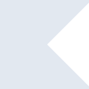
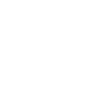

# kotlin

[← Back to main README](../../README.md)





## 16 px

### black
```
https://georgegach.github.io/compatible-icons/simple-icons/kotlin/16/black.png
```

### slate
```
https://georgegach.github.io/compatible-icons/simple-icons/kotlin/16/slate.png
```

### white
```
https://georgegach.github.io/compatible-icons/simple-icons/kotlin/16/white.png
```

## 64 px

### black
```
https://georgegach.github.io/compatible-icons/simple-icons/kotlin/64/black.png
```

### slate
```
https://georgegach.github.io/compatible-icons/simple-icons/kotlin/64/slate.png
```

### white
```
https://georgegach.github.io/compatible-icons/simple-icons/kotlin/64/white.png
```

## 128 px

### black
```
https://georgegach.github.io/compatible-icons/simple-icons/kotlin/128/black.png
```

### slate
```
https://georgegach.github.io/compatible-icons/simple-icons/kotlin/128/slate.png
```

### white
```
https://georgegach.github.io/compatible-icons/simple-icons/kotlin/128/white.png
```

## 512 px

### black
```
https://georgegach.github.io/compatible-icons/simple-icons/kotlin/512/black.png
```

### slate
```
https://georgegach.github.io/compatible-icons/simple-icons/kotlin/512/slate.png
```

### white
```
https://georgegach.github.io/compatible-icons/simple-icons/kotlin/512/white.png
```

## 1024 px

### black
```
https://georgegach.github.io/compatible-icons/simple-icons/kotlin/1024/black.png
```

### slate
```
https://georgegach.github.io/compatible-icons/simple-icons/kotlin/1024/slate.png
```

### white
```
https://georgegach.github.io/compatible-icons/simple-icons/kotlin/1024/white.png
```

## 16 px in base64

### black
```
data:image/png;base64,iVBORw0KGgoAAAANSUhEUgAAABAAAAAQCAYAAAAf8/9hAAAABmJLR0QA/wD/AP+gvaeTAAAAZElEQVQ4jWNkYGD4z0A+eM0ANYAcfJeBgUGBXAPgmskxAEUzqQZgaCbFAKyaiTUAp2ZiDLjNwMAgg0szEy4JUtQQ44X7lHiBoCGkRCNWQ0hNSBiGkJOUUQwhxwC4IYxQDrngLQDmeqIq+BiFBgAAAABJRU5ErkJggg==
```

### slate
```
data:image/png;base64,iVBORw0KGgoAAAANSUhEUgAAABAAAAAQCAYAAAAf8/9hAAAABmJLR0QA/wD/AP+gvaeTAAAAi0lEQVQ4jaXTMQ7CMAyF4eeECzCypRyCFSEOzsDKEaoQdWmlDnCAJO5WKWpUxW7m/N9im4bpz1A+IsxGGwPwMfNNC/jE/Owu56AB1hgApEARS4FNLAGqcSvQm5jutbgV2P3TAlzzyb6/489pAQBwluhVQyRTqCLSPdggmk0sEDpwjSExP45co7NEnwVAWEPh7SOM+gAAAABJRU5ErkJggg==
```

### white
```
data:image/png;base64,iVBORw0KGgoAAAANSUhEUgAAABAAAAAQCAYAAAAf8/9hAAAABmJLR0QA/wD/AP+gvaeTAAAAaUlEQVQ4jaXTuw2AMAxF0RvmoGAKevYfAfHpETO8lChKiGzHde6RLCtJkojPMw3EJ7Ci2BySFoAI8MUBoIydQB07gHZsBHZJ898pLGfsvzGucI2s0EccQBtxAjUSAAokSeHfeAPbCADwZtPkMvI3JqAKAAAAAElFTkSuQmCC
```

