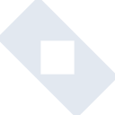
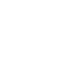

# ktor

[← Back to main README](../../README.md)

<table><tr>
  <td></td>
  <td></td>
  <td></td>
</tr></table>

## 16 px

### black
```
https://georgegach.github.io/compatible-icons/simple-icons/compat/ktor/16/black.png
```

### slate
```
https://georgegach.github.io/compatible-icons/simple-icons/compat/ktor/16/slate.png
```

### white
```
https://georgegach.github.io/compatible-icons/simple-icons/compat/ktor/16/white.png
```

## 64 px

### black
```
https://georgegach.github.io/compatible-icons/simple-icons/compat/ktor/64/black.png
```

### slate
```
https://georgegach.github.io/compatible-icons/simple-icons/compat/ktor/64/slate.png
```

### white
```
https://georgegach.github.io/compatible-icons/simple-icons/compat/ktor/64/white.png
```

## 128 px

### black
```
https://georgegach.github.io/compatible-icons/simple-icons/compat/ktor/128/black.png
```

### slate
```
https://georgegach.github.io/compatible-icons/simple-icons/compat/ktor/128/slate.png
```

### white
```
https://georgegach.github.io/compatible-icons/simple-icons/compat/ktor/128/white.png
```

## 512 px

### black
```
https://georgegach.github.io/compatible-icons/simple-icons/compat/ktor/512/black.png
```

### slate
```
https://georgegach.github.io/compatible-icons/simple-icons/compat/ktor/512/slate.png
```

### white
```
https://georgegach.github.io/compatible-icons/simple-icons/compat/ktor/512/white.png
```

## 1024 px

### black
```
https://georgegach.github.io/compatible-icons/simple-icons/compat/ktor/1024/black.png
```

### slate
```
https://georgegach.github.io/compatible-icons/simple-icons/compat/ktor/1024/slate.png
```

### white
```
https://georgegach.github.io/compatible-icons/simple-icons/compat/ktor/1024/white.png
```

## 16 px in base64

### black
```
data:image/png;base64,iVBORw0KGgoAAAANSUhEUgAAABAAAAAQCAYAAAAf8/9hAAAABmJLR0QA/wD/AP+gvaeTAAAAt0lEQVQ4jZ3TuwlCQRCF4c9HJNiJFdiGkQgm2o1gFxZgYglWYGrq20huKBpcVq7Lul49MMmw59/hzC7vamKJK8Z+VDAXeOCMyb/mUGdM/zWHOn2D5MzVSZKZtNFHJ+rfsIl6M9yxiCFD7KMb14nL1rlJhjjUAIRMktupQnKAr5BdDcAr2Ebi4AhzbKN+D92od0lNESBH+dUWyifwUXGwsXmFVg7wCVLbHDSoQH42B42UqS+Vf+elJw4dXtSUiScJAAAAAElFTkSuQmCC
```

### slate
```
data:image/png;base64,iVBORw0KGgoAAAANSUhEUgAAABAAAAAQCAYAAAAf8/9hAAAABmJLR0QA/wD/AP+gvaeTAAABX0lEQVQ4jY2RsUrDUBSG/5NkEiQqTa3E4gv4BJ27+gBScNFNENTNF7CgbX0AJ0EySncXF5+gq0MSSlJSaaLgosnvoLFJTUP+8dzzfefce4FMSCqOHw1tL3y1vdkBKkTJwu7k7UHAtgg2RJSe64eHlQRZmMDKr7JGSNf1w6MygRTDuQQCXDQba7eFAsePhiJsk4VwminJ852t9bvFAw1ka3EyBe8KZJSbBFy5QRQ3Df0+J1A1OfmK2RegMTdg1GzorWyj7YfPEvPG9mZqdhPFNHRLU+UMwKTkCmlqInKd/R0FAExDt1RVTitKDAKXqURLq6ahW+MgQpygB7KKpGt7s09ZPHGDqIOYfYi8ZOsJuCvEaq6ZmP4TpJLk52Hry1YQwQcpj4UCABgH0X4ccwBgswgG8LRd1/eWCuYSDAD+SXKwSKyU8DAN3UoSHkNkUgSXsbm4QdRxvDBw/GhIMjf0G8Y7srRujqKIAAAAAElFTkSuQmCC
```

### white
```
data:image/png;base64,iVBORw0KGgoAAAANSUhEUgAAABAAAAAQCAYAAAAf8/9hAAAABmJLR0QA/wD/AP+gvaeTAAAAzElEQVQ4jZ2Suw0CMRBExwcREiFdUAFtEKGTSKAYJARdIGISSqACUmI+BxG6CKFHACeZPd93wl3P83jXkicgAnbAA5iqiTxzylcJMGtrxoPM25oz3UohFWY/SXAmXUkjST1Tf0o6mtoSeDvnNjbBBDibGw+BpIfCJD/IpQYgm0l+OwZSBviDdLMDzrktIEmrHD2vgaQF8HKBm2JJa0kn0xpK6pvaPYgHYuBasdoU2BVmDAzWmvdAp/ShBZB6Zg8y9iDNzGYmCd9vH/m9D3HnoGFDJpWJAAAAAElFTkSuQmCC
```

