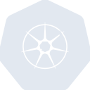

# kubernetes

[← Back to main README](../../README.md)





## 16 px

### black
```
https://georgegach.github.io/compatible-icons/simple-icons/kubernetes/16/black.png
```

### slate
```
https://georgegach.github.io/compatible-icons/simple-icons/kubernetes/16/slate.png
```

### white
```
https://georgegach.github.io/compatible-icons/simple-icons/kubernetes/16/white.png
```

## 64 px

### black
```
https://georgegach.github.io/compatible-icons/simple-icons/kubernetes/64/black.png
```

### slate
```
https://georgegach.github.io/compatible-icons/simple-icons/kubernetes/64/slate.png
```

### white
```
https://georgegach.github.io/compatible-icons/simple-icons/kubernetes/64/white.png
```

## 128 px

### black
```
https://georgegach.github.io/compatible-icons/simple-icons/kubernetes/128/black.png
```

### slate
```
https://georgegach.github.io/compatible-icons/simple-icons/kubernetes/128/slate.png
```

### white
```
https://georgegach.github.io/compatible-icons/simple-icons/kubernetes/128/white.png
```

## 512 px

### black
```
https://georgegach.github.io/compatible-icons/simple-icons/kubernetes/512/black.png
```

### slate
```
https://georgegach.github.io/compatible-icons/simple-icons/kubernetes/512/slate.png
```

### white
```
https://georgegach.github.io/compatible-icons/simple-icons/kubernetes/512/white.png
```

## 1024 px

### black
```
https://georgegach.github.io/compatible-icons/simple-icons/kubernetes/1024/black.png
```

### slate
```
https://georgegach.github.io/compatible-icons/simple-icons/kubernetes/1024/slate.png
```

### white
```
https://georgegach.github.io/compatible-icons/simple-icons/kubernetes/1024/white.png
```

## 16 px in base64

### black
```
data:image/png;base64,iVBORw0KGgoAAAANSUhEUgAAABAAAAAQCAYAAAAf8/9hAAAABmJLR0QA/wD/AP+gvaeTAAABY0lEQVQ4jXXT0UpUURQG4G+mKRlDLKkUTE0ib3qJhG56iK666MJ36D1C8VLoOjACL3sCEZMKKjDUAQsaaBptnC78j7Odph9+zjn//tfae629DqMxjVV8CVdx5z/eS5jHBj6jh354hn28iucfzOF1TP2Ch2Gp7cc7VybYHTJVPApHre1CAwu4kUQ/0MRPfA8rfQoT6OBmuNDAMm7H2Ec3PbiP8ejNlDIWD9zCoyt4gYcRx/ApJ/uDX9mxh2v4hkXUUEe/gaWiFy1cTVlv8CHGB3iS07UwE/9SA5NFglpMe3iHlegvcS/J6oV/EtoGd93BZnY5xlM8TzNbeJuyzhLTrqU500XWj6m3kyecpKHdlFPhqO58TNuFeBe/sY3r4Xa02cLXxlr1sYlTgyE5cD5Ae3ifUx4U66eJuUATO4WhW9RZatX7jsGMXGAeX40e2+F/YbEKqg0leYx1l6+qRA/PsFUJfwGZkX+fXUKagAAAAABJRU5ErkJggg==
```

### slate
```
data:image/png;base64,iVBORw0KGgoAAAANSUhEUgAAABAAAAAQCAYAAAAf8/9hAAAABmJLR0QA/wD/AP+gvaeTAAACIUlEQVQ4jX2TPWuTYRiFr/O8b6pNW5rWj5TGfkBtQZ0EF4eCgh100EH/gZsuLk6ugv4CQRR/hiIVHNTJodBJK7QYSZoUTEJbaFOT9zi8SZMW8WzP/XHuj3M/4h9Yr+7mM249TWCpY1r+Q/Tk/MTI1vFY9T/K5dp0O/A8sa4KTSNCx2VEGSdf4oTHk5PjxSMEpdLvqSSKX1i+jCn06FXFAM73lSzJWgnt1oNC4dSvGKAdRe/BF9LgvvZspeX7YArGhXYUzQEX4/VyfQaUA2NTlzQY5G2bWoJraZLqQRo3jGDvIcaAsfVyfSaOxXXwmbRjjNxM0AZ4LqCsU/sgcsX2CUndhk5H4lpA3Abizsw5TBF7EKhb3hZuGBpGWaE1oVyHIJa4E0NY6E5pewuTCWIG8y5BaxIBM4+5idV0YAszkXKEhRh5tLslISE3E/NNsT6rzUPbyLwEz1oEm9DVXvaoipuNHcSwbUuhKfHR9hUgCtIjcDZBz0jcQsmKCIuJfVKSMLv6WWlUBD2d8Q+hAdCe7QEEMgfGWUlNw3yf0NUg/Mp4pycz55D2E3sVMQQaslgF7UPvyNIcvxZAcbPxVtKScdzxVwwBUwdZYgxsSJcn1EIsT+VHb8UAau3cdWb4K+hSh35cIoM4e3iH5qD7c0zyPW7v3UvJOiiXa9OtED4B0/wPopSYxdmJ3MYRAoBStXGjZb8Rh7/weHY7EvcL+dyHruUvfSD5P87LNFQAAAAASUVORK5CYII=
```

### white
```
data:image/png;base64,iVBORw0KGgoAAAANSUhEUgAAABAAAAAQCAYAAAAf8/9hAAAABmJLR0QA/wD/AP+gvaeTAAABc0lEQVQ4jXWTQUtUcRTFf294GjMhapgKpaOIfg4FN23qE7Rq0cJPJBMtg9aBEbT0E4io5MKSAceBVBxIJ7FfC++zi7wOnM155x7u/977oAbqjNpRvwc76nSd92HhvPpBPVJv/Yc/alf9qM7XFc6pn8KU0QtmdMM7lwP2rMdpsA57AKXaBiYi6xxoApfAWbDSnwBjwBUwCUyq7RJYA55WzQBD4AhYAlqhN4Ee8Cg8AFPAagN4CZQhTgDHUXAenVwEW8C31G0JvCqBlTTPPjACtIHPUdAAloEX0V0fmA3/SgmMp4AiTAfANrAR+iawEGGN5B9HHaRdX6lbal/9qb5W36pnoX1Rf4VXdVCoPWAmpR4CozHt0dB+xwyG8ZwKpw2gAwyS+By4BnaAx8Gd0J4l3wB4B0C0fZOO5CQO6EDdj2s8Sd9v1K37KLWp7ibDML0zaxV21RYZ3v1IP/5zthlddTGvLYesA+8frCrjFnhTFMXXSvgLLTm1SeE+EesAAAAASUVORK5CYII=
```

