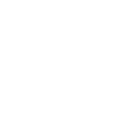

# kubespray

[← Back to main README](../../README.md)




## 16 px

### black
```
https://georgegach.github.io/compatible-icons/simple-icons/kubespray/16/black.png
```

### slate
```
https://georgegach.github.io/compatible-icons/simple-icons/kubespray/16/slate.png
```

### white
```
https://georgegach.github.io/compatible-icons/simple-icons/kubespray/16/white.png
```

## 64 px

### black
```
https://georgegach.github.io/compatible-icons/simple-icons/kubespray/64/black.png
```

### slate
```
https://georgegach.github.io/compatible-icons/simple-icons/kubespray/64/slate.png
```

### white
```
https://georgegach.github.io/compatible-icons/simple-icons/kubespray/64/white.png
```

## 128 px

### black
```
https://georgegach.github.io/compatible-icons/simple-icons/kubespray/128/black.png
```

### slate
```
https://georgegach.github.io/compatible-icons/simple-icons/kubespray/128/slate.png
```

### white
```
https://georgegach.github.io/compatible-icons/simple-icons/kubespray/128/white.png
```

## 512 px

### black
```
https://georgegach.github.io/compatible-icons/simple-icons/kubespray/512/black.png
```

### slate
```
https://georgegach.github.io/compatible-icons/simple-icons/kubespray/512/slate.png
```

### white
```
https://georgegach.github.io/compatible-icons/simple-icons/kubespray/512/white.png
```

## 1024 px

### black
```
https://georgegach.github.io/compatible-icons/simple-icons/kubespray/1024/black.png
```

### slate
```
https://georgegach.github.io/compatible-icons/simple-icons/kubespray/1024/slate.png
```

### white
```
https://georgegach.github.io/compatible-icons/simple-icons/kubespray/1024/white.png
```

## 16 px in base64

### black
```
data:image/png;base64,iVBORw0KGgoAAAANSUhEUgAAABAAAAAQCAYAAAAf8/9hAAAABmJLR0QA/wD/AP+gvaeTAAABJUlEQVQ4jcXSu0oDYRAF4C8m3hotEqy8VBbaWdnZWfkMChY+hJ2FT6CFRcDXsLK3Ey0EUTCCgjeMF0g0xsRiJ7AuiVbigWWXf+ecmTnn5x+wjkvMQl+XgjlsYw0DmX/9cTaOjSx/Cnu4RRt1nGEZuaiZxzs+0cIqDGEXV0HMPs84xgIOUUMjBCqwgrcUoYVrPGWETlCO7ve4Q6sQprzG4QBKQS7iMQgN5DGCpdj9PFbSjgmuQvUjBJqpTh1fjrKOF+I9GF7Uw7CLcLoUE+SzxA7SMeQwHMXFEK2FaE+kBUYlEb1gIoSa4cOPAtX4zmNMYtij5NI0MJmqr+qCMm58j+zB9xjrOMV0r0lmsB+d2xL3q7FCBZsST37FIg6wJbl1O5Ls/w5f0ltdE3bo5GgAAAAASUVORK5CYII=
```

### slate
```
data:image/png;base64,iVBORw0KGgoAAAANSUhEUgAAABAAAAAQCAYAAAAf8/9hAAAABmJLR0QA/wD/AP+gvaeTAAABwklEQVQ4jb2RvWuTYRTFf+d53yQtglESgtovHPzAQdClk4ODLv4PDko2d+kmOjuIIOLs6u7kIAgirkWoYkgbbVIhX5U2iX2f4xC0sbVdBO9yudxzf5x7L/zvaGx0l9aa3Xp9ffMCQNgr+LLRubTa7D1ea3ary8vOT/be27ksU954NgTfsx30q/n5a2chlZ5KXDZUQANww9H3508eey7Ja83eouE1OAWEfVu1mqeS6d4T5OtYM39x3QfXCekdx51HMudQSMGpYFWNVu9mZj8TFAAEtrSOOQIu7nL0QfiN4RbQFrJxOc2ilwSbBL7ZyoPLOHYhlMZCMosR0UlUPBpjckPKQpqmn+KPuJhKnAcNwcMAAmJEMxrvGW0Q5CzOCg1Onyq+nFhvJR1nF7CmrLiNpQA1o1lwWSIzJAe9dfeNtiBMMxaXRCyAtwzbBw3/CYAijkPjvmEOlBh2sNuHA0RnfGQSoYqsEXY7Qk7WCGl+16U6+wC2XxhaAIYUUUbBwBaiPJZpgFlRouo+wMKJ41XH5KrhFf7txhIGMkE94ofD78WLc5Xix70ATRb1VveazAOhd+ArNm+H+ezumVKpf9gd/il+AvRi1RENBhnBAAAAAElFTkSuQmCC
```

### white
```
data:image/png;base64,iVBORw0KGgoAAAANSUhEUgAAABAAAAAQCAYAAAAf8/9hAAAABmJLR0QA/wD/AP+gvaeTAAABR0lEQVQ4jb2SvUpDQRBGzzWaKIgiipU/lYU2YmVnZ+UzKFj4EOksfAItLARfw8reTrAQREEFBTUh8QcTDUmORUa4XBItBD9YdmBnzu7Mt/DfUovqrboA0NclYUndU7fUfOZsAMgDU8C22pc+nFWP1Ec7qquX6rqaRM6y+qm21La6iTqoHqp3dteLeqauqKdqTW0E4AZ1Q/1IFbTVe/U5AzpXD+L2kvqktvuBIvAGlKK/CeAZGAcqQAtoADlgBFiL2V0By4kq8AmUAzAGvAPDQBUw1iRwliTJYnqw/bEXgEGgDiTAdUx6Il6Q62Vr2sYEGIrk8YDWAtpTacBotPIKTAeoGXP4EVCNOEenz0YUDUQ8k8qvklVY85CxrJyxsa5eqHNdn6HOq8dqJQpKalVtqjfqjlr4qZVv0Kp6ou7Gr9tXR34t/Iu+AOB2UfN1xSBAAAAAAElFTkSuQmCC
```

