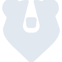

# kuma

[← Back to main README](../../README.md)





## 16 px

### black
```
https://georgegach.github.io/compatible-icons/simple-icons/kuma/16/black.png
```

### slate
```
https://georgegach.github.io/compatible-icons/simple-icons/kuma/16/slate.png
```

### white
```
https://georgegach.github.io/compatible-icons/simple-icons/kuma/16/white.png
```

## 64 px

### black
```
https://georgegach.github.io/compatible-icons/simple-icons/kuma/64/black.png
```

### slate
```
https://georgegach.github.io/compatible-icons/simple-icons/kuma/64/slate.png
```

### white
```
https://georgegach.github.io/compatible-icons/simple-icons/kuma/64/white.png
```

## 128 px

### black
```
https://georgegach.github.io/compatible-icons/simple-icons/kuma/128/black.png
```

### slate
```
https://georgegach.github.io/compatible-icons/simple-icons/kuma/128/slate.png
```

### white
```
https://georgegach.github.io/compatible-icons/simple-icons/kuma/128/white.png
```

## 512 px

### black
```
https://georgegach.github.io/compatible-icons/simple-icons/kuma/512/black.png
```

### slate
```
https://georgegach.github.io/compatible-icons/simple-icons/kuma/512/slate.png
```

### white
```
https://georgegach.github.io/compatible-icons/simple-icons/kuma/512/white.png
```

## 1024 px

### black
```
https://georgegach.github.io/compatible-icons/simple-icons/kuma/1024/black.png
```

### slate
```
https://georgegach.github.io/compatible-icons/simple-icons/kuma/1024/slate.png
```

### white
```
https://georgegach.github.io/compatible-icons/simple-icons/kuma/1024/white.png
```

## 16 px in base64

### black
```
data:image/png;base64,iVBORw0KGgoAAAANSUhEUgAAABAAAAAQCAYAAAAf8/9hAAAABmJLR0QA/wD/AP+gvaeTAAABJ0lEQVQ4jZXTvy4EURQG8F/GSlTolkKik2xhG81WakRE1OIVeArPoUUhNN5AgRCNELL+h7HxP1kJySrmTjKZnQ2+5BRzz/m+891z7kA3dvGCD5ziAA0soIYnHOISn4ixImAuHLZy8YAK+nFdkL/FQIQ+lLTjHcfB2XNBHroirOGqIHkTOsFeQb6O2yh0WsZXJtnCDlaxgX3JfFJ8Yx2icDAlGWaKOFifxQzKkkGmKGE+FejGaM7eJ7aDyKtkS2+5mjIGS6hKBplFT7jGeOj2iN5czSAmS5LdNgvUN3EU7lvFUK6mifv0Y0v7nn+LE3SlAgM4/wc5xkTOkYriF5ePBhbz5BRjv4jEWOpEzjqpF5Dvhd3/BSO4yJDvMP1XcophnEn+k1qnoh9nM3Z/eVdZVAAAAABJRU5ErkJggg==
```

### slate
```
data:image/png;base64,iVBORw0KGgoAAAANSUhEUgAAABAAAAAQCAYAAAAf8/9hAAAABmJLR0QA/wD/AP+gvaeTAAAB7ElEQVQ4jYWRPU/TYRTFf+f+W2RAmhpKaVIsDMaEQQY/gHH1JYY4OBkn42pi/Ajq6ncwLupgJARNnGUQF000YRApLy00SgsSUP7Pcx0g0taqZ3ty7j3nPOdq3j1bqLfeYH5KTkaytei+Ixg1szs4CyHGGYmqIB+doklb0eNspZS/oeX15tUYeSxxjDYINqIn52N/upb81AecMh3wtWDZs2aynIkMXXC0fXJk4NN4Pt/E2ezmhZGxvcT69OOpQ7V7AI8rkvzwMf+nQVwcHRpatUKhsO2RB4j9dl5K5pbXm0+q9c3nmL1DfD9yVxrgGYAByHQRJ9sWcAOPTWAKdMUCRTnfjtw9Y67rADbvngXOdMXbk/lLXE3wVpDeOr7V0YFR/NLYKWWGa61JRA51FNTvBI9u58xCJlrSUBoG22dwSomHC5mskqV9pbt0skXcXkjxvWOphXQSabTrDLsKXhfAcr017fil7qYPjDqlf++LhfJwbsIAUktuAp97CfRchkaIui0pGMD48EDdPbmMWOkl0hXpq/D7Y6XcLByeEaBSOv6RwNS/RAQNk98rj+Qf/jXhUm17QkpnQGOdxqwj3a0Uc4/+90VWG1unYxpfuagcLKsG4VZl5MR0j1S9sVjbHEuk14I+ya6Vi4NzveZ+AaBtygwJ69WnAAAAAElFTkSuQmCC
```

### white
```
data:image/png;base64,iVBORw0KGgoAAAANSUhEUgAAABAAAAAQCAYAAAAf8/9hAAAABmJLR0QA/wD/AP+gvaeTAAABQklEQVQ4jZWSuy5EURSGv33MJCp0QyHRSRSm0ajUiIioxSvwFJ5Di0JovIECIRohhMHIGBPGJSEh+RSO5Dg2w1/trP+y19p7oRbVLbWpPqlH6q7aUGfVYfVW3VMr6otaVxcBUKfTYh7X6oDapV5E+KranQCdQIHveAQOQghN4C7CA7QlwDJwHiEvQwim5+0IfxpCqCYhhEdgAXjNkAKb6pK6CuwATxn+DVgBSNLCOFDMCOpAE5gCJoEScJvhC8AMQKIWgcFcey/ARhpyD2wBDzlNSe0pAGU+HjKL9nSMkfS2G6Ajp+kBxgpABXjOpwNrwH46bxnozWmegRoA6nrkn1vhUG37DOhWT/5hrqujX/pJty62cXk01DliUIdahNTV+ag518lpxFxTZ341Z0L61bOM+Uqd+JM5E9KnHqvn6vBPuncNP61iPU/R5AAAAABJRU5ErkJggg==
```

