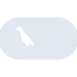

# langchain

[← Back to main README](../../README.md)

<table><tr>
  <td></td>
  <td></td>
  <td></td>
</tr></table>

## 16 px

### black
```
https://georgegach.github.io/compatible-icons/simple-icons/compat/langchain/16/black.png
```

### slate
```
https://georgegach.github.io/compatible-icons/simple-icons/compat/langchain/16/slate.png
```

### white
```
https://georgegach.github.io/compatible-icons/simple-icons/compat/langchain/16/white.png
```

## 64 px

### black
```
https://georgegach.github.io/compatible-icons/simple-icons/compat/langchain/64/black.png
```

### slate
```
https://georgegach.github.io/compatible-icons/simple-icons/compat/langchain/64/slate.png
```

### white
```
https://georgegach.github.io/compatible-icons/simple-icons/compat/langchain/64/white.png
```

## 128 px

### black
```
https://georgegach.github.io/compatible-icons/simple-icons/compat/langchain/128/black.png
```

### slate
```
https://georgegach.github.io/compatible-icons/simple-icons/compat/langchain/128/slate.png
```

### white
```
https://georgegach.github.io/compatible-icons/simple-icons/compat/langchain/128/white.png
```

## 512 px

### black
```
https://georgegach.github.io/compatible-icons/simple-icons/compat/langchain/512/black.png
```

### slate
```
https://georgegach.github.io/compatible-icons/simple-icons/compat/langchain/512/slate.png
```

### white
```
https://georgegach.github.io/compatible-icons/simple-icons/compat/langchain/512/white.png
```

## 1024 px

### black
```
https://georgegach.github.io/compatible-icons/simple-icons/compat/langchain/1024/black.png
```

### slate
```
https://georgegach.github.io/compatible-icons/simple-icons/compat/langchain/1024/slate.png
```

### white
```
https://georgegach.github.io/compatible-icons/simple-icons/compat/langchain/1024/white.png
```

## 16 px in base64

### black
```
data:image/png;base64,iVBORw0KGgoAAAANSUhEUgAAABAAAAAQCAYAAAAf8/9hAAAABmJLR0QA/wD/AP+gvaeTAAAA30lEQVQ4jd3SsS5EYRAF4G9XNEJjFQTZWq+l8xjeRCWegWziKbyBqLzBJhLN3rCIJdi7ubFchZFMFFeUnGQykzNzJpPz//x5tFK9gu3ITbjGKYZfRBvHKDBF/UNMY7YXWgcYR/MC/QbxMMQVXrAPg2hWuEQ3cTlu8BhLRsENYJKGKuxiB1eJv43TX3Efy2qU3xfUOA9z96I3wgPu8IanyDXKVpyxllye4AQdbGA+zCoxh4U0W8xgEZuYDfI9hOtxdgfPUS8l8RiHYnvP75/xCO38kZaxhVXNKHDm08j/gA/4smOVrJd89AAAAABJRU5ErkJggg==
```

### slate
```
data:image/png;base64,iVBORw0KGgoAAAANSUhEUgAAABAAAAAQCAYAAAAf8/9hAAAABmJLR0QA/wD/AP+gvaeTAAABUUlEQVQ4jdWSsU7TYRTFf+e2JaTUdChCETDBhfgO2hUTJp7AwGZ08R2cHSFhID6DhI2F+BokEPkn9F8GamIBKd93HIwVSCwzZ7rD/Z2Tk3vh0Ut/h+OzwVykYcdobjzg0xTVg6WZRhdAtuOk7G8jvRFq2648kJnAXcHewmzznYpe/1PO/giqIw6dSRLL/4FL8A32U0lD258jm7eguq1rZyrJXsEu7qM2PWASqCpiYJgiWA/MNIDkCUnzFeg4awN8eos/k2hJnsLUshn+6a9W3MuZQPrw/FlzH6qbtq4w56Ca4NwmJNdEnh6V+l72TzALt0wuIb4iWuCXQMN2gC6w65KejGBRRMhfsC/+dVVg1rBfya5hmkK/hNMdGAY5px3ZjqL8sWVYFWqb8WcUJOMu1u5iu/l+9EhHvZ/tSDevkebHGVTCxbWr317MNspxe49IvwGJoJpsgdrIfgAAAABJRU5ErkJggg==
```

### white
```
data:image/png;base64,iVBORw0KGgoAAAANSUhEUgAAABAAAAAQCAYAAAAf8/9hAAAABmJLR0QA/wD/AP+gvaeTAAAA90lEQVQ4jdWSTUoDQRBGXzfowh9cxIVBIWvvoN7BK3gOV+IdJCDiGbyBuMoNBMHNDJgQiCImYTDhuamBIYsMLvM23dRXX1dXdcPGk+qN2gUugG6L5wN4TikNa2NW79VSXdjOInL7aka9Vachvqmva8zDMFfqj3qDWoRYqe9qrxFrMlK/4pBJxIoMHEZv28BxzOEqeq0ZAx1gF9gCfiPeQZ2vVBqoSb0ObaJ+qmN1qX7HqjpLagGcNKrNgaeoeArsARmYATvAfiO3zMBjiDUZuATO4roHQAUsV8xT4KF+xr7/f8Y7NTc/0hFwHoNcRwm8pJRGLXmbwh8aXFENzDF8AwAAAABJRU5ErkJggg==
```

