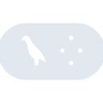
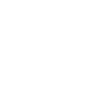

# langgraph

[← Back to main README](../../README.md)





## 16 px

### black
```
https://georgegach.github.io/compatible-icons/simple-icons/langgraph/16/black.png
```

### slate
```
https://georgegach.github.io/compatible-icons/simple-icons/langgraph/16/slate.png
```

### white
```
https://georgegach.github.io/compatible-icons/simple-icons/langgraph/16/white.png
```

## 64 px

### black
```
https://georgegach.github.io/compatible-icons/simple-icons/langgraph/64/black.png
```

### slate
```
https://georgegach.github.io/compatible-icons/simple-icons/langgraph/64/slate.png
```

### white
```
https://georgegach.github.io/compatible-icons/simple-icons/langgraph/64/white.png
```

## 128 px

### black
```
https://georgegach.github.io/compatible-icons/simple-icons/langgraph/128/black.png
```

### slate
```
https://georgegach.github.io/compatible-icons/simple-icons/langgraph/128/slate.png
```

### white
```
https://georgegach.github.io/compatible-icons/simple-icons/langgraph/128/white.png
```

## 512 px

### black
```
https://georgegach.github.io/compatible-icons/simple-icons/langgraph/512/black.png
```

### slate
```
https://georgegach.github.io/compatible-icons/simple-icons/langgraph/512/slate.png
```

### white
```
https://georgegach.github.io/compatible-icons/simple-icons/langgraph/512/white.png
```

## 1024 px

### black
```
https://georgegach.github.io/compatible-icons/simple-icons/langgraph/1024/black.png
```

### slate
```
https://georgegach.github.io/compatible-icons/simple-icons/langgraph/1024/slate.png
```

### white
```
https://georgegach.github.io/compatible-icons/simple-icons/langgraph/1024/white.png
```

## 16 px in base64

### black
```
data:image/png;base64,iVBORw0KGgoAAAANSUhEUgAAABAAAAAQCAYAAAAf8/9hAAAABmJLR0QA/wD/AP+gvaeTAAAA3klEQVQ4jdXSvy5EURAG8B8bjWhEohItvSfgIfRexGsQCeIpdHrRKRQiQjZXIRHN5gqxrmK/K8eVdeudZJJzZr6Z+eYPMy9zxXsd21juiXnFBYatYYAzVPhC06PjYE8S6wh1nLe4mRL4iPviX+NAqDR4D2ijsJX6VhRqdSiO1vCJPezgqbBfY5QEVynWsviVoMFlhrtf+Kq8P/CQOfwk6NKtsYvzDotn3HVbGGAVW1jIVpq0sJmKi2E0CmYpuBqH7RpPQ3Ps7/CmrfEY8+UhrZkc0or/5cXkkKoe3KzIN0rvbJvss5hVAAAAAElFTkSuQmCC
```

### slate
```
data:image/png;base64,iVBORw0KGgoAAAANSUhEUgAAABAAAAAQCAYAAAAf8/9hAAAABmJLR0QA/wD/AP+gvaeTAAABTUlEQVQ4jdWRP0ubYRTFf+e+r5bQQSVp1cZUOjr4AdotUIRClw5uhU6C38dFRATBD2EX/QJuHd2S1EYxahVqMb7PcUjUiP9mz3Tv8Dvn3OeBFy9dD3t7R++7yuvIY08S1nGeulvVarkJINtZs326RvAZe3LQ9BElpDZOP2vjowtq7p+s2HwHSoZdwSUw8wDYAArgQ6+Jz0HrYfgClGxdBLzKivgmuXW/Om+xJ26PVwn8NTCV3u5h4ypDfCq6+gH+M/BQv5ALBEI7oIseo3LcjVFWFGlxujqybbEM/O+Fq4wjQ5FDegPOr4mQOLzr4dlG+++80Efj437/dwqfYTeMpoHoV+sEBRuC81uHyBBLJOqBMgn3WyTg9UDSP4l12c4aByercsyBJ27cH1cCtSFt1sZHF27+vNXqTBWR1wnKz+CdGO5u1SqV388EvRRdAUPZe2cSnznDAAAAAElFTkSuQmCC
```

### white
```
data:image/png;base64,iVBORw0KGgoAAAANSUhEUgAAABAAAAAQCAYAAAAf8/9hAAAABmJLR0QA/wD/AP+gvaeTAAAA8UlEQVQ4jdXSvUpDQRAF4C83YmMl0UZFSysfQDsfwtrW97FQBBXB59AXsBMsLAQNwcZgISQqJMcie+ES0GCZ0+zszDk7Oz/MPVq1kWQT+1ieoXnHTavV6tbCdpKrJL0k48zGqHAvkrQlOUsyKMHHJA+/CJ+TPDXugyQnknSL46uQthu+JoaNRDW6FVZKbYtYxx4O8dqo+x6jYt/hu9idaqpBbRzhFqf4rIkltoDVcoIKb1OP7OAAu6XjsIYPvGCr6KBf4RrDqV8cm4y0jRT/GEsN3gBX9Rgvy2hG/xjjeZKquUgbJWvH3+ibLFJvBm9e8AP0QRZePAVkjgAAAABJRU5ErkJggg==
```

