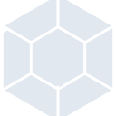
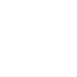

# launchpad

[← Back to main README](../../README.md)

<table><tr>
  <td></td>
  <td></td>
  <td></td>
</tr></table>

## 16 px

### black
```
https://georgegach.github.io/compatible-icons/simple-icons/compat/launchpad/16/black.png
```

### slate
```
https://georgegach.github.io/compatible-icons/simple-icons/compat/launchpad/16/slate.png
```

### white
```
https://georgegach.github.io/compatible-icons/simple-icons/compat/launchpad/16/white.png
```

## 64 px

### black
```
https://georgegach.github.io/compatible-icons/simple-icons/compat/launchpad/64/black.png
```

### slate
```
https://georgegach.github.io/compatible-icons/simple-icons/compat/launchpad/64/slate.png
```

### white
```
https://georgegach.github.io/compatible-icons/simple-icons/compat/launchpad/64/white.png
```

## 128 px

### black
```
https://georgegach.github.io/compatible-icons/simple-icons/compat/launchpad/128/black.png
```

### slate
```
https://georgegach.github.io/compatible-icons/simple-icons/compat/launchpad/128/slate.png
```

### white
```
https://georgegach.github.io/compatible-icons/simple-icons/compat/launchpad/128/white.png
```

## 512 px

### black
```
https://georgegach.github.io/compatible-icons/simple-icons/compat/launchpad/512/black.png
```

### slate
```
https://georgegach.github.io/compatible-icons/simple-icons/compat/launchpad/512/slate.png
```

### white
```
https://georgegach.github.io/compatible-icons/simple-icons/compat/launchpad/512/white.png
```

## 1024 px

### black
```
https://georgegach.github.io/compatible-icons/simple-icons/compat/launchpad/1024/black.png
```

### slate
```
https://georgegach.github.io/compatible-icons/simple-icons/compat/launchpad/1024/slate.png
```

### white
```
https://georgegach.github.io/compatible-icons/simple-icons/compat/launchpad/1024/white.png
```

## 16 px in base64

### black
```
data:image/png;base64,iVBORw0KGgoAAAANSUhEUgAAABAAAAAQCAYAAAAf8/9hAAAABmJLR0QA/wD/AP+gvaeTAAABIklEQVQ4jaXTOy8EcRQF8B+7EiEKIjQiUYleo0A8ap9J7SsQH2ELEiFZ0Uj0XvEovAusxKNcrGLuMMZ4JE5yk5nzP/fMzZn7pxgT2MEhjnGAqW+0n9CHFdyige2oBmrYxEBRYxvmcB7iRoFBWpdYQEfa3I0T1HPCJ1SxHs/ZszpO0V3CbBCX4dqKMyxjEO1YQ1ec17CFCwyV0YmZGH8JJfQH1xNT9kpC3cALpkOzCPOZ0a5RyY2brUpo0vf55lyYz8hzWTSF5h0/if+EvEEZr99o07HLRQavPpK/l/y6m4zuJrh7SdCn6YdKGMUdHjCOkTBeRYsktCqGMSZJfw+7uOL3Rari0ddFOole/HOVs0gvU63A4MfLlMck9nEUtR/cF7wBzi95k5Zc+/YAAAAASUVORK5CYII=
```

### slate
```
data:image/png;base64,iVBORw0KGgoAAAANSUhEUgAAABAAAAAQCAYAAAAf8/9hAAAABmJLR0QA/wD/AP+gvaeTAAAB0UlEQVQ4jY2TsU9TURjFf+e+pxGCpKZQSVOwi5PROAjMCI52dvEv0MX/wNnFxDg5mPgvwOJSXSUuTVhMHERoqxIaGjQsbe9xeALvNdV4xnvPOd/57v0+MQHtb0drI/FC0kVMsBgx4NG1Wqk5zlVB2O7V4oXklaxl4zlgRwKbm5ge8qeIHtYXSl8KBt1ud3qQTD9V9AOkxZznucEZ3BF6eykZPJmfn/+pbvd4bhjiR4maTZoj/jJsgyS8AprJ5R7K7iQxuaP9H8fP7HgdMW1zW3aZoD3bTcEqQGbEhsyipZ5EC3Mihc8pjlewG5b2gE0SJYosidAwrgAEdBW844T3REaGDdlLEF+HLJKCTD1IDUzJsH4qzhK4YlgnuhSkhkwdKWTmOdgMQYWzwpdJyjjn+Cv5f1EwkEjBcWJ1sG1nnHEDOxp/Rd5C9AVNoYNzsQ4MzQj9aG9a7OKsUIrCEXhL8lSM3JdddtCeHTclrQqMRx9QuBciaxY9QQuphcLR2SAhakwcJEBakbmc62eIaacxLIdqdfYwjSc3DM+x93NdzwhVhCoFMe5g3kwlg1vV6uzhxGXCWgGXgZ0/V/9epnHsfu/fFbw8fXGboeFxfaH0bpz7G/GW57dz5VPeAAAAAElFTkSuQmCC
```

### white
```
data:image/png;base64,iVBORw0KGgoAAAANSUhEUgAAABAAAAAQCAYAAAAf8/9hAAAABmJLR0QA/wD/AP+gvaeTAAABOklEQVQ4jaXTsUqcURAF4G/XbSIRIobYGNEi1haa1HFj64P5DOJDJGAnNikiNqIgSWwSMY0xYCFWq8fiv6t35U8weGDgMnPOudyZubQgyfskh0m+JTlO8jVJv437UDiTZCvJ7zQ4KJEk50k+J5lvE44nWU9yklHUBkOcJtlIMgGdJC+xhxn0Kt9L7KKDt3he1Qb4haVOknW8wTgWMYUTbONdEeziA17jD/ZxheMeJrFWRB8xhtmSe1UMpnGIHVwXs1lsdguhi7kieoF+JVbO/VJbK9zuUFhj0JKr0SmcO/yL/Cg8NOjh5i/clKgndWdwg5/4hAvNBM4q3lnJXWga/WN40XCMC3imfYzBF6xqOj8yxscsEs0iTVS1AU6x3DzuCas82qX7z3T+X5+pxWglyVGS7yWOkqy0cW8B5hccJ/xnlXoAAAAASUVORK5CYII=
```

