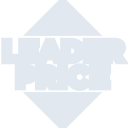

# leaderprice

[← Back to main README](../../README.md)





## 16 px

### black
```
https://georgegach.github.io/compatible-icons/simple-icons/leaderprice/16/black.png
```

### slate
```
https://georgegach.github.io/compatible-icons/simple-icons/leaderprice/16/slate.png
```

### white
```
https://georgegach.github.io/compatible-icons/simple-icons/leaderprice/16/white.png
```

## 64 px

### black
```
https://georgegach.github.io/compatible-icons/simple-icons/leaderprice/64/black.png
```

### slate
```
https://georgegach.github.io/compatible-icons/simple-icons/leaderprice/64/slate.png
```

### white
```
https://georgegach.github.io/compatible-icons/simple-icons/leaderprice/64/white.png
```

## 128 px

### black
```
https://georgegach.github.io/compatible-icons/simple-icons/leaderprice/128/black.png
```

### slate
```
https://georgegach.github.io/compatible-icons/simple-icons/leaderprice/128/slate.png
```

### white
```
https://georgegach.github.io/compatible-icons/simple-icons/leaderprice/128/white.png
```

## 512 px

### black
```
https://georgegach.github.io/compatible-icons/simple-icons/leaderprice/512/black.png
```

### slate
```
https://georgegach.github.io/compatible-icons/simple-icons/leaderprice/512/slate.png
```

### white
```
https://georgegach.github.io/compatible-icons/simple-icons/leaderprice/512/white.png
```

## 1024 px

### black
```
https://georgegach.github.io/compatible-icons/simple-icons/leaderprice/1024/black.png
```

### slate
```
https://georgegach.github.io/compatible-icons/simple-icons/leaderprice/1024/slate.png
```

### white
```
https://georgegach.github.io/compatible-icons/simple-icons/leaderprice/1024/white.png
```

## 16 px in base64

### black
```
data:image/png;base64,iVBORw0KGgoAAAANSUhEUgAAABAAAAAQCAYAAAAf8/9hAAAABmJLR0QA/wD/AP+gvaeTAAABG0lEQVQ4jaXSPS/DURQG8J8WERpiRWKxmJGy2PlIvotR7FaDxSD1MonNgHpJRL22KFXD/9ykaapRnuTmJuee5znPOffwM4oo4wAjXfI6Yh4XaKKBQxT+Qk7n1yJFVNrIrSLH2trJYwnDmMYaatgJoT08YR+n6MNk8KZwRTaoDdmwmvgKgSa2ovJ7CDda3HxgMxeEiXABVSxH4gpecI2hyBVv+RBxFoHPln5rKEWlBh5wGQIp9xFHaRazEaziPkh30f8JnuO8hsBtIuZaBtrEIEZDbAwDmInqh8kybrQhOViPYb6Fi1q4qMd7PQpVErE/7nOsYgHjYbEg+7ay7Otq4WgX2+0OEnpepE6Y849V7iTSMzlhUbaqJV1sfwNXu3gDrCU7RQAAAABJRU5ErkJggg==
```

### slate
```
data:image/png;base64,iVBORw0KGgoAAAANSUhEUgAAABAAAAAQCAYAAAAf8/9hAAAABmJLR0QA/wD/AP+gvaeTAAAB0ElEQVQ4jZ2TPWvTYRTFf+fJS/9IaFPBEE3TQUQRXKRKKoitg4P6lfw0zvUFHBwcpEUQQbHg0MVB079tkiokttXm7TkOTbGtyeIdD/ecy733HDGhNhudmvETm8aUDpbK5fL+uL4wDqxvtW9YXgEqyNd7TtZarVZhXK/GkcnwDDN3hBlHWetJprdUKpX2JgpsNjo12y8Rs2NGRayNPL9rx9dR2vx5i8CPQT8WQuARqITjZ0lVQxM0b7khO4c5C7x20JqG7rXOF9+q3mynDFlFXEEsAAZWgWXwCwgPsQfgIWIKFIAIiuCVIBMRFxBnRjvtI+6MhO4j71lsIyWHJEAYYsZ2P9gYsSy4fHgwCoIugfejaQWJInjbdubY4XYDuiaAL1u7VzOZ4SdM17gHmsa0HcjJpBJVA0SyiAT4Pl8unjvtAxvywDRoIDEjkzNcivCNyAcH+qO3No5I4S9bwjzG+igwQmAHcYC5iLiNSQBkVY54WYAk7Nd7Sh4ANwWztnewCkiySeVYQfoFzmHeYL/6TyN5I0/3hJFOZKFannnnLPcQ6XHcJjqynoT+4ulQ/ZMFgK877QVFnmPmbKJgbA4mCgCkjc7i0PGpUJrXwd1Jcf4Dq7rmuuXO2fAAAAAASUVORK5CYII=
```

### white
```
data:image/png;base64,iVBORw0KGgoAAAANSUhEUgAAABAAAAAQCAYAAAAf8/9hAAAABmJLR0QA/wD/AP+gvaeTAAABNElEQVQ4jZ2Su0qDQRCFv8QLokHRwkLRQmysVVQQe30mn0YQe1uLgAiCGG3EykZNNBLiPfGSy2fh/BAkf2EGlll255w9c3YgJdQVtaieqiNpdWngJfXW32ipBTXXC9h/kYTsR7tHS734205GXQOqQA7YBiaBK2AGeABmgTIwAEwAeeAQ+AaOCaN2wyzVtpqP/X68/KXWY5+oaah7WaANTAHDoaoGbAACm8A7cA8MRS1x1wc0UK+DtdnRb109iZda6rNaCnVJ7Yt6lpi3EIc19SlAVfVVvVTfYn0EQSUxMdv5CcAgMAo0gbEwbh4oAQWgEbXlbgQZYAc4D7JM5E9gDlgPHwCmE1B/5BtgC1gGxoFKfGsGKAagHoqOgAO6RS+D1I1k0V5HOYXkf+AOklX1LuYhVfYPLe2ihe0g4bEAAAAASUVORK5CYII=
```

