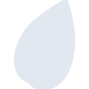
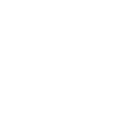

# leaflet

[← Back to main README](../../README.md)

<table><tr>
  <td></td>
  <td></td>
  <td></td>
</tr></table>

## 16 px

### black
```
https://georgegach.github.io/compatible-icons/simple-icons/compat/leaflet/16/black.png
```

### slate
```
https://georgegach.github.io/compatible-icons/simple-icons/compat/leaflet/16/slate.png
```

### white
```
https://georgegach.github.io/compatible-icons/simple-icons/compat/leaflet/16/white.png
```

## 64 px

### black
```
https://georgegach.github.io/compatible-icons/simple-icons/compat/leaflet/64/black.png
```

### slate
```
https://georgegach.github.io/compatible-icons/simple-icons/compat/leaflet/64/slate.png
```

### white
```
https://georgegach.github.io/compatible-icons/simple-icons/compat/leaflet/64/white.png
```

## 128 px

### black
```
https://georgegach.github.io/compatible-icons/simple-icons/compat/leaflet/128/black.png
```

### slate
```
https://georgegach.github.io/compatible-icons/simple-icons/compat/leaflet/128/slate.png
```

### white
```
https://georgegach.github.io/compatible-icons/simple-icons/compat/leaflet/128/white.png
```

## 512 px

### black
```
https://georgegach.github.io/compatible-icons/simple-icons/compat/leaflet/512/black.png
```

### slate
```
https://georgegach.github.io/compatible-icons/simple-icons/compat/leaflet/512/slate.png
```

### white
```
https://georgegach.github.io/compatible-icons/simple-icons/compat/leaflet/512/white.png
```

## 1024 px

### black
```
https://georgegach.github.io/compatible-icons/simple-icons/compat/leaflet/1024/black.png
```

### slate
```
https://georgegach.github.io/compatible-icons/simple-icons/compat/leaflet/1024/slate.png
```

### white
```
https://georgegach.github.io/compatible-icons/simple-icons/compat/leaflet/1024/white.png
```

## 16 px in base64

### black
```
data:image/png;base64,iVBORw0KGgoAAAANSUhEUgAAABAAAAAQCAYAAAAf8/9hAAAABmJLR0QA/wD/AP+gvaeTAAABCElEQVQ4jY3Su0oDQRgF4A9NioCXwgsSsVcfwEYQxEJr38JnschzpBfsbBQ7G0HERlRQiCKCl0QNZi12VtZhEvbAsP/8c86Zw+xPNczhGD/Yqqj5wyau0Q8G7arCMeyjgwyfweCqingap3gP4sIgwwOao8QTOA+3FeJXdEPdxXY5Zow2VqOzOhqhbmB5mME61jBe6r2hF/GWiqIWHbQwG/VqmIx6g1SCJhYjYk/+kDE+UgY7WIiI35iJel84SxmsRPt+iBq/0wsuUgaPCWI9zi7/pTcpgyM8h3qAKflMlJHhIHyTOJEP0H1IlEXrFvPDxMKth/5PYbE62B0lLmMPd/KxfcIlNlLEX1jxRj52dVNIAAAAAElFTkSuQmCC
```

### slate
```
data:image/png;base64,iVBORw0KGgoAAAANSUhEUgAAABAAAAAQCAYAAAAf8/9hAAAABmJLR0QA/wD/AP+gvaeTAAABkklEQVQ4jY2TP2tTURjGf8/JjaXY2EIbDRUtioMKioOo4CQu4gdRHB39COLg19BdEBwc7OTQUegiSFq9aapNbCzlJs15HJLCvblX7Jne877v8+/AgROcNB002+nv9XanN97u9B/mZ+F/4O2092Ck+FnyPRARPTkRge3QTvuvLL0BX7IZTwbcyu+pCvx1b28xycL7ELhpc3razoA541S1o9sXm80flQ663e5Cfaj1ELh7DJYYCOIEoCXiqRv/jJDFubeg63ZuZuqG+UnJvB2vVhJ839m/b7gD1HIZBxaHhdzWheM6yQ/Gjq+BlXzPdgJqFHrTOAUH7d3dVfD5ghIcovBnNiaMD8oRxskjUCu/FmEIXi46IkP1jRJBtK/l7xYjSZGZd5LUM/FLiaBG0s0vBqsnXC+5t/fXzi1+q3AQPwK/pirR+IzNQkEdGfROkksEa6tLG0ibiGjTAQYlcbw1VHhZcJq/ZMnRYyIfwC2gWQTTVfTzK61GIWrlX2jv9J8ReYG8gjmQ9HMUak8vn218mt39CyqGpPDZ1PNvAAAAAElFTkSuQmCC
```

### white
```
data:image/png;base64,iVBORw0KGgoAAAANSUhEUgAAABAAAAAQCAYAAAAf8/9hAAAABmJLR0QA/wD/AP+gvaeTAAABGElEQVQ4jY2SvUoDQRRGT2JSBGIs/EEUe/UBbARBLLT2LXyWFD5HesHORrGzEURsRAWFRESIMYkGcyycxTA7yn7N3r3zfWcuw4UCUufVU/VL3SmSmQxvq7fqKABaRYNltam2/dEwAG6KhGfUc7Xnr4bh+6Qu/Reuq5fhtkxdtR/qvrqb+csJRgtYj86qQC3UNWA1CVA3gQ1gaqL9BgyiS1ayohIdHAJzUa8CTEe9cW6C8DDLkXEA9MjrPQcA9oDFyPgJzEa9D+AiBViL/kdh1PihX4GrFKCTMFbj2YEucJcCnAAvoR4DDaAehQWOSqWSCTCoZ2GBHtWOed2rC8lwADTU42gLM7XV/T/DEehAfQhr+6xeq1sp7zeBkP+HCAIiggAAAABJRU5ErkJggg==
```

