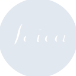
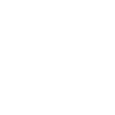

# leica

[← Back to main README](../../README.md)





## 16 px

### black
```
https://georgegach.github.io/compatible-icons/simple-icons/leica/16/black.png
```

### slate
```
https://georgegach.github.io/compatible-icons/simple-icons/leica/16/slate.png
```

### white
```
https://georgegach.github.io/compatible-icons/simple-icons/leica/16/white.png
```

## 64 px

### black
```
https://georgegach.github.io/compatible-icons/simple-icons/leica/64/black.png
```

### slate
```
https://georgegach.github.io/compatible-icons/simple-icons/leica/64/slate.png
```

### white
```
https://georgegach.github.io/compatible-icons/simple-icons/leica/64/white.png
```

## 128 px

### black
```
https://georgegach.github.io/compatible-icons/simple-icons/leica/128/black.png
```

### slate
```
https://georgegach.github.io/compatible-icons/simple-icons/leica/128/slate.png
```

### white
```
https://georgegach.github.io/compatible-icons/simple-icons/leica/128/white.png
```

## 512 px

### black
```
https://georgegach.github.io/compatible-icons/simple-icons/leica/512/black.png
```

### slate
```
https://georgegach.github.io/compatible-icons/simple-icons/leica/512/slate.png
```

### white
```
https://georgegach.github.io/compatible-icons/simple-icons/leica/512/white.png
```

## 1024 px

### black
```
https://georgegach.github.io/compatible-icons/simple-icons/leica/1024/black.png
```

### slate
```
https://georgegach.github.io/compatible-icons/simple-icons/leica/1024/slate.png
```

### white
```
https://georgegach.github.io/compatible-icons/simple-icons/leica/1024/white.png
```

## 16 px in base64

### black
```
data:image/png;base64,iVBORw0KGgoAAAANSUhEUgAAABAAAAAQCAYAAAAf8/9hAAAABmJLR0QA/wD/AP+gvaeTAAABGklEQVQ4jZ3T20pCURAG4G97iA5oGT1A3fUUhdIrdhP4KEFv0E2XRgphJpFUJiVpXTgL1NKygWGvmT3z//+sA7O2izqu0cVbeDdydVQssBO0MMLnAh+hidpPzZ0ljfPeQXVadmuF5uRNVPI4xRGyAOzE3BmKi+ZFGXticxJqD1foox251yUqGgWUArEfALCBzSgqzDGPkUsqclMARVziEI8xwijWbbyEf0Q8QCkh9SLxHgW3ke8G210wN0PRTcSymDHJHcQ6wzAUJBIRr0duiKeCya4fBMBWfB9MTiIfxePEGCOXsYbnAi6wP8WUieP5xcY4Z3K3m/53kbYTWs3qV/l4XlI1UP/ymL41J9vBGRq4N/ucG/FvZ7rhC51NkyhoC17nAAAAAElFTkSuQmCC
```

### slate
```
data:image/png;base64,iVBORw0KGgoAAAANSUhEUgAAABAAAAAQCAYAAAAf8/9hAAAABmJLR0QA/wD/AP+gvaeTAAABzElEQVQ4jZWSTY6SYRCEn3r5GIQJIxCNMUGBuHFnPIE/mTuYWZnMGYyHGL2CO68hjifgCOMnzghGhz8lgvCWiw8IMUOitepFV3dXVYstdLujGnm/MjzGlIEDAMQYNIF46pleNBqVwZqjdXHeHx4uo99IoW4cuBrRouvfHDfrlfZmwHl/eLgwbwW3dhD/Rj/aR83b1ffqdkc152MHdPcfyQAYUmY8TJyPr0WoG69EqSeTRLwvKO4aILijAicB9Git2fIQx+/IRRGHq97pjhnB6EkClFdH/cAagMAu4lCS5GgSydvECGQm2wdhFRdYeYkO+L7hEiHjpeRLpAvhidAEtEC6QJ4C5YAEYkBgipkBC+PPmVH+KghEvkQpQvxonABnMhFAn3rDn0ApM9ZTUAkQZo68xMqWZCYvBdcMATMHRgnQA1pZh/YNlv0N9AvIIQUToyAKEXFZ6ACxBxon4FNQc22MQEg3NmFhtHpYw3YdA36nNB1WKbgj1NiV+VUwThd7fhAajcrACx0b+v/B78dc8vxerTYKAM16pW37yJCS5bxjK9F2uszlnrVulj+sRW5wNhhUkrlOsJ4C5WhfXzWNkcbC7UXBL1vV6vpL+QMGINgw6PNjigAAAABJRU5ErkJggg==
```

### white
```
data:image/png;base64,iVBORw0KGgoAAAANSUhEUgAAABAAAAAQCAYAAAAf8/9hAAAABmJLR0QA/wD/AP+gvaeTAAABKUlEQVQ4jZ2TW04CQRBFzyAa0YBgXID+uQsCcZUa3ImJO3ADGCExgvjAJ0HicPywJhkIiniTzlTV9K17q9MNOai7aku9VAfqONYgai21xiKoR2pXTf0ZqdpRm4vI/V+I8+irjbzt7grkDB21hno6Z7un3qmjJQ1S9aQA1IFCTPMEPACliAFGCw/tm9MoAuUovAHDiEvAFiBQnCNOc4KVQq7BOnABHAKPQAKkEd8Ar7E+Ix8B5azTMAofseE66oNQ64VyJxxdRU6ivufsjiJOgEk4yESIfDNqE+C5CPSBg2iwHd97YAysxeZpphgjV4AN4KUInAP7OaUE2GM5psAZai0uxX8u0g4AatPVr3J9xo/aiK5/eUz1BSOBWlWP1bZ66+xzbse/ap7zBbqL/e9XjjnCAAAAAElFTkSuQmCC
```

