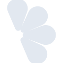
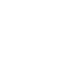

# lemonsqueezy

[← Back to main README](../../README.md)





## 16 px

### black
```
https://georgegach.github.io/compatible-icons/simple-icons/lemonsqueezy/16/black.png
```

### slate
```
https://georgegach.github.io/compatible-icons/simple-icons/lemonsqueezy/16/slate.png
```

### white
```
https://georgegach.github.io/compatible-icons/simple-icons/lemonsqueezy/16/white.png
```

## 64 px

### black
```
https://georgegach.github.io/compatible-icons/simple-icons/lemonsqueezy/64/black.png
```

### slate
```
https://georgegach.github.io/compatible-icons/simple-icons/lemonsqueezy/64/slate.png
```

### white
```
https://georgegach.github.io/compatible-icons/simple-icons/lemonsqueezy/64/white.png
```

## 128 px

### black
```
https://georgegach.github.io/compatible-icons/simple-icons/lemonsqueezy/128/black.png
```

### slate
```
https://georgegach.github.io/compatible-icons/simple-icons/lemonsqueezy/128/slate.png
```

### white
```
https://georgegach.github.io/compatible-icons/simple-icons/lemonsqueezy/128/white.png
```

## 512 px

### black
```
https://georgegach.github.io/compatible-icons/simple-icons/lemonsqueezy/512/black.png
```

### slate
```
https://georgegach.github.io/compatible-icons/simple-icons/lemonsqueezy/512/slate.png
```

### white
```
https://georgegach.github.io/compatible-icons/simple-icons/lemonsqueezy/512/white.png
```

## 1024 px

### black
```
https://georgegach.github.io/compatible-icons/simple-icons/lemonsqueezy/1024/black.png
```

### slate
```
https://georgegach.github.io/compatible-icons/simple-icons/lemonsqueezy/1024/slate.png
```

### white
```
https://georgegach.github.io/compatible-icons/simple-icons/lemonsqueezy/1024/white.png
```

## 16 px in base64

### black
```
data:image/png;base64,iVBORw0KGgoAAAANSUhEUgAAABAAAAAQCAYAAAAf8/9hAAAABmJLR0QA/wD/AP+gvaeTAAABHElEQVQ4jZXSzSqFURQG4Md/UiR/KS5ADMTMdZAyMXQfpgauA8UFuAVkZER+8j8goXOO/A32+rKdznfirdXe+/vWWu+73r35wTquUcMllv0DQ7jCVxYn8W8cC5hs1mAwWPMGZ1jCTZxvsdqsyX5dg4Nokn+7QHde1Jrt1/AS+2qso3UkLegqU9CG42A6j8jZX7HTqKjAF0Ywh56Q2oFn3OMuYgyHeG+koh97kmF3Ufwkzf4WJG/YLRujwLTk/mPdGEVcYpjfJuaYRW/M3UjqJyrQXtJgRXK8RXqdVfRJ7+UBGzFeKRYjoZj5DNuYx0SzwgL5lRZRw1Z9YpkHH9iMtUAnZv7CXmBAur5cxVEjqWWoSA9qKpReS+ae5knf9DRc8RNT/uAAAAAASUVORK5CYII=
```

### slate
```
data:image/png;base64,iVBORw0KGgoAAAANSUhEUgAAABAAAAAQCAYAAAAf8/9hAAAABmJLR0QA/wD/AP+gvaeTAAABx0lEQVQ4jY2QPU+TYRiFr/O8CMQgULFpSyiNwcTV4OLm5E8wGv+Ai4uDk5urIe5ujuDm4mAcXBwMRhdNXERa+aoB2oBSad/nOBTtp9Ez3vd5ruecW5yovF1/BNywPaPgb47J/VJh8gn/kAC2tg6yzRDfY892Vv48n88sbGzsFlshuQLpx1Jh5kM/IADYtmx3L2ySyvberVaSvJFYURh5+WVr/8HQBADlnfpb7MU/ZPHO9lmjUhe2oubhxWKxeNSToL1LHyIOAYwaaTRGhd7vpNbExNhABYBiLvMU2GkPXZU0A4x2eX9gr57PZGpDAZJSUpYRqVHeOHvS8UCmAlqT1Cxv1++urXl84AYA6+u1jMb9wlFzbSanDVG4bpQXnEI0sV7N56euDQB+62t1/1KM4TnyOGZ6wCA2jp0sXsifqYYh73HUZfAk8D2g1sD7SJxKGkcAI0MBcLudTjLexDQQU4JzwJ4Dy9ls9qDniL1KlxAp9mwUBYsxEV5HczONydX53PS9TpthCeykslP7BFrozHRMiM9Kucz1bu/QBJLSgFaAtDPzqKzFfu9fKgCtsCTY7EP//G/A3NzkrqMeG1fBR0LrAd/p9/0CHP2/DEY/4CYAAAAASUVORK5CYII=
```

### white
```
data:image/png;base64,iVBORw0KGgoAAAANSUhEUgAAABAAAAAQCAYAAAAf8/9hAAAABmJLR0QA/wD/AP+gvaeTAAABLUlEQVQ4jY2SzS5DURRG10X8TIgoYeABxER4A89AJCaGxuZGpgaeoyQ8gFfA0Iiov2JCpIqWWgbdleOmLSu5Oedmn/Pt/e19IFB31LJaU2/UNf6LOq7e+pvziE2ry+psN4FCZE0pqavqXfzfq1vdRI5zAichknKlDqX3epL9NvAS+/dYp3J5MmCgUwW96llkuowvpaoe5O/9VJBlWQMoAg1gEhiPUAW4Bi6AD3VDHexUxah6FA17UCvqc3ivRyV19bCtQCI0F91/sj036sQvCzkWgGGgCny2iX8BbwB9HQTWaXY8A8o0pzICFIBHoJhlWaWbhZXw3/JcUvfVJXWmq/8QSEfaoqbu5c+27UGMdJfmSFv0A/N/Zk+qGIvxpZz+WyBENuM9vEYfFvNnvgGskHkCDYzxLwAAAABJRU5ErkJggg==
```

