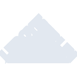
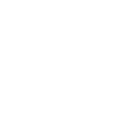

# leroymerlin

[← Back to main README](../../README.md)

<table><tr>
  <td></td>
  <td></td>
  <td></td>
</tr></table>

## 16 px

### black
```
https://georgegach.github.io/compatible-icons/simple-icons/compat/leroymerlin/16/black.png
```

### slate
```
https://georgegach.github.io/compatible-icons/simple-icons/compat/leroymerlin/16/slate.png
```

### white
```
https://georgegach.github.io/compatible-icons/simple-icons/compat/leroymerlin/16/white.png
```

## 64 px

### black
```
https://georgegach.github.io/compatible-icons/simple-icons/compat/leroymerlin/64/black.png
```

### slate
```
https://georgegach.github.io/compatible-icons/simple-icons/compat/leroymerlin/64/slate.png
```

### white
```
https://georgegach.github.io/compatible-icons/simple-icons/compat/leroymerlin/64/white.png
```

## 128 px

### black
```
https://georgegach.github.io/compatible-icons/simple-icons/compat/leroymerlin/128/black.png
```

### slate
```
https://georgegach.github.io/compatible-icons/simple-icons/compat/leroymerlin/128/slate.png
```

### white
```
https://georgegach.github.io/compatible-icons/simple-icons/compat/leroymerlin/128/white.png
```

## 512 px

### black
```
https://georgegach.github.io/compatible-icons/simple-icons/compat/leroymerlin/512/black.png
```

### slate
```
https://georgegach.github.io/compatible-icons/simple-icons/compat/leroymerlin/512/slate.png
```

### white
```
https://georgegach.github.io/compatible-icons/simple-icons/compat/leroymerlin/512/white.png
```

## 1024 px

### black
```
https://georgegach.github.io/compatible-icons/simple-icons/compat/leroymerlin/1024/black.png
```

### slate
```
https://georgegach.github.io/compatible-icons/simple-icons/compat/leroymerlin/1024/slate.png
```

### white
```
https://georgegach.github.io/compatible-icons/simple-icons/compat/leroymerlin/1024/white.png
```

## 16 px in base64

### black
```
data:image/png;base64,iVBORw0KGgoAAAANSUhEUgAAABAAAAAQCAYAAAAf8/9hAAAABmJLR0QA/wD/AP+gvaeTAAAAxklEQVQ4jc3RPWpCQRTF8Z8QNEZB4gKyAvdimzVZuJFgbadNsFMwESys0ga/YrooPos3D8ZHNImNOTDMneH+zx3O8N91i+qlcAnP6F0KD7DDFi8o/xYuo4sEm7AnGKPyE1zEJILeo3qPIe5OwTW0Q+MH1lhgHpkkeJKGe6Q6ZrnGRVRnJrsw4FGaE7jH2xk4b/KKKfrZS1rhkDUuv4HzJlkmHfiMJp6DY5N9qL8KaGAk/e/NqYRzquEGzUK4eAgXf9EqrCvrAHWDV2ZswPljAAAAAElFTkSuQmCC
```

### slate
```
data:image/png;base64,iVBORw0KGgoAAAANSUhEUgAAABAAAAAQCAYAAAAf8/9hAAAABmJLR0QA/wD/AP+gvaeTAAABVklEQVQ4jc2Su0oDURRF17mZaHxrrKONNoKNoGInVlrZ+0XiX/gF+gGCYKUIYqFYiIQwMA6BzMQH5qWzLRJEh0zAQnB395y91733cOBfq1xWoVqtjg/yeFmN+3sN50bqJ41kqA1sZfksK1yYeD4F1mSIJLmz99f1UqnUSHtduuD7/kh+PD4W2khMb0geZsvKT5yHYTg2EHB7qyHlJy+duW0JHNb81l5uW+EsCILRvoCHKJoam63vg5aAZ3M8KVEOqH19V6x0bPSwXFbhxwx8/6movC6AhS+0iDCKvVMNmAU+upfaXutl8mhx0VpWqdRnbJhrYC4jTApyI5nnTOF7Y2rHKo/RgTO3KtjshWOMmfSwes+tqQvpOqUj88P6i0Qbo4gRo/7hFKQIGGYdTyQbOHdl4k1YCyMcBBCAkqYwTwm7BhAE0Vwn5zK3sq+axPPz0/GvMn+iT45BkiSud1AzAAAAAElFTkSuQmCC
```

### white
```
data:image/png;base64,iVBORw0KGgoAAAANSUhEUgAAABAAAAAQCAYAAAAf8/9hAAAABmJLR0QA/wD/AP+gvaeTAAAA0klEQVQ4jc3RwS5DQRyF8XMT0RZJ0z6AJ/Autp7JwouItR0bsSNBEwsrW1Gldtr4WZgbdYNqE4lv9Z/J+c5MZpJ/DdrYWFZu4QRHy8qnmGKCS3R+K3dw6J2xDy6wPk9exWBGupuZX3GGte/kLvZK8AmPGOLeZ/bRbsp93DSCw5m5LpmWA3bQquUebn+QmyVXuMYx2sFuWdQ8fCE3S5SbHFR4TvKSpJ9klKQ356OGJVslmVTYSnKeZJJkPEeu6SZZSbJdlXfYLBuLMKqqarSg8we8AflLWb1RTvbWAAAAAElFTkSuQmCC
```

