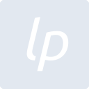
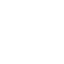

# liberapay

[← Back to main README](../../README.md)

<table><tr>
  <td></td>
  <td></td>
  <td></td>
</tr></table>

## 16 px

### black
```
https://georgegach.github.io/compatible-icons/simple-icons/compat/liberapay/16/black.png
```

### slate
```
https://georgegach.github.io/compatible-icons/simple-icons/compat/liberapay/16/slate.png
```

### white
```
https://georgegach.github.io/compatible-icons/simple-icons/compat/liberapay/16/white.png
```

## 64 px

### black
```
https://georgegach.github.io/compatible-icons/simple-icons/compat/liberapay/64/black.png
```

### slate
```
https://georgegach.github.io/compatible-icons/simple-icons/compat/liberapay/64/slate.png
```

### white
```
https://georgegach.github.io/compatible-icons/simple-icons/compat/liberapay/64/white.png
```

## 128 px

### black
```
https://georgegach.github.io/compatible-icons/simple-icons/compat/liberapay/128/black.png
```

### slate
```
https://georgegach.github.io/compatible-icons/simple-icons/compat/liberapay/128/slate.png
```

### white
```
https://georgegach.github.io/compatible-icons/simple-icons/compat/liberapay/128/white.png
```

## 512 px

### black
```
https://georgegach.github.io/compatible-icons/simple-icons/compat/liberapay/512/black.png
```

### slate
```
https://georgegach.github.io/compatible-icons/simple-icons/compat/liberapay/512/slate.png
```

### white
```
https://georgegach.github.io/compatible-icons/simple-icons/compat/liberapay/512/white.png
```

## 1024 px

### black
```
https://georgegach.github.io/compatible-icons/simple-icons/compat/liberapay/1024/black.png
```

### slate
```
https://georgegach.github.io/compatible-icons/simple-icons/compat/liberapay/1024/slate.png
```

### white
```
https://georgegach.github.io/compatible-icons/simple-icons/compat/liberapay/1024/white.png
```

## 16 px in base64

### black
```
data:image/png;base64,iVBORw0KGgoAAAANSUhEUgAAABAAAAAQCAYAAAAf8/9hAAAABmJLR0QA/wD/AP+gvaeTAAAA9UlEQVQ4jaXTsUoDQRSF4W+DKCoSRUTsFMEXsFextrPQB/B18h62PoLYWIlVmiAGCwuNoiSKsGgs9hbLMrshemHYYTjzc+65s9BDjvGUK0cvi82Mv1WeBS1VzwFeaSK0as5fcBbfxqoDDHGLxUmAut4H2MeaIuRHRVbb2EQ2ycEVjvGBU7xihD08VMXV8byHsIt7bIWDEQ5xU9anHLzhDu1o5SBa+Qr4QlmcAnxiVhHgJY7i4jV2sF4Wp0JsKwLs4gLzOMcuOlielME47A6wgafY/6S0dVOYUyR/giWsKo2uXE1PeYjvlOUq4F8/Uwv9gEx9Gf1ffb5ToNBdb8MAAAAASUVORK5CYII=
```

### slate
```
data:image/png;base64,iVBORw0KGgoAAAANSUhEUgAAABAAAAAQCAYAAAAf8/9hAAAABmJLR0QA/wD/AP+gvaeTAAABTElEQVQ4jZ2QvU5UURSFv7XvGYwSMgRCLJ3EZDorGyuhsbOjgAfwdXgPS3kEQmOpjQ0xmUxhSGR+gNFA5p6zLNAEM3fuBHa791r7W0vD8+mZoGdIPGAEtWEQjxEDGJLFi2gR/0RMWilMJ5bsRuAP2KNVJI0GhutU/AVYX2XQiC+4KFW1C94BzrB/oJjbfino3Z20EIBOSy77tn+VzKHQGJdZVee3xsPWCMZXlPIJRV9oQjAxfoP0rk5VP6xxq4FgqrX8naALXHQi9kA7mBsVLgk9W2Gg37lOa9jrmJOSy3vg0uhz6qhf8PP79wslGnVTaNfF3+x87CqeuvAxwq9z9pHQ5n8Ph+dTL5hYtyFmuUqvIs+//iXd4l77SyMASH5iPFauD2w2gO0m8VKCuyhcA1mw2bT/NwlR48UuBBttQgCLeWAGFvNVx01imcEfFvGTyt6UqJ0AAAAASUVORK5CYII=
```

### white
```
data:image/png;base64,iVBORw0KGgoAAAANSUhEUgAAABAAAAAQCAYAAAAf8/9hAAAABmJLR0QA/wD/AP+gvaeTAAAA90lEQVQ4jaXTu0oEQRQE0DOLKCqyPhBTQTAzMjFSEzMzA/2A/R3/w1A/QUwMNTFZhMHARF3foozSBt3CIPNg9ULTcPtWUVXczkIIfSxixHD1iTwLIRR/AP9UkYUQQs3jTSKeaWLo1PTv0Et3Y9URPOMMk20Edd5vsYF59HGNAkti4FmbghPs4BV7GOAF67hqs/CEQyzjPp01bKXeoI3gAZfoJiubyco7HjHRRvCGUTHAY2wn4GlSsFAergqxKwZ4gSOM4wCr2Md0ebhukT7E0FZwnpTOKqXfZAHGxLB2MYW5KnCTAuIyff2WXEXwr8/UQS5u2dBg5N8s9EZUfBkSiAAAAABJRU5ErkJggg==
```

