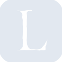
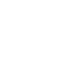

# librarything

[← Back to main README](../../README.md)

<table><tr>
  <td></td>
  <td></td>
  <td></td>
</tr></table>

## 16 px

### black
```
https://georgegach.github.io/compatible-icons/simple-icons/compat/librarything/16/black.png
```

### slate
```
https://georgegach.github.io/compatible-icons/simple-icons/compat/librarything/16/slate.png
```

### white
```
https://georgegach.github.io/compatible-icons/simple-icons/compat/librarything/16/white.png
```

## 64 px

### black
```
https://georgegach.github.io/compatible-icons/simple-icons/compat/librarything/64/black.png
```

### slate
```
https://georgegach.github.io/compatible-icons/simple-icons/compat/librarything/64/slate.png
```

### white
```
https://georgegach.github.io/compatible-icons/simple-icons/compat/librarything/64/white.png
```

## 128 px

### black
```
https://georgegach.github.io/compatible-icons/simple-icons/compat/librarything/128/black.png
```

### slate
```
https://georgegach.github.io/compatible-icons/simple-icons/compat/librarything/128/slate.png
```

### white
```
https://georgegach.github.io/compatible-icons/simple-icons/compat/librarything/128/white.png
```

## 512 px

### black
```
https://georgegach.github.io/compatible-icons/simple-icons/compat/librarything/512/black.png
```

### slate
```
https://georgegach.github.io/compatible-icons/simple-icons/compat/librarything/512/slate.png
```

### white
```
https://georgegach.github.io/compatible-icons/simple-icons/compat/librarything/512/white.png
```

## 1024 px

### black
```
https://georgegach.github.io/compatible-icons/simple-icons/compat/librarything/1024/black.png
```

### slate
```
https://georgegach.github.io/compatible-icons/simple-icons/compat/librarything/1024/slate.png
```

### white
```
https://georgegach.github.io/compatible-icons/simple-icons/compat/librarything/1024/white.png
```

## 16 px in base64

### black
```
data:image/png;base64,iVBORw0KGgoAAAANSUhEUgAAABAAAAAQCAYAAAAf8/9hAAAABmJLR0QA/wD/AP+gvaeTAAAA9UlEQVQ4jaXTzUrDQBQF4K9JraJgLfiLPrXv4NqFO6m68CFc6EpLRYsuXLS10MRFJjiEiRU9cMkk58zJPclc2MENxpijXFHzoB1iG65R/GJjs5YYdoLbkW+8YoIptrCLfWk8C8LY+R0XGOAFnz90Mc3Qa7gOcByMFwk+Ri9DniDWsdfCxcizFiILtRJtohxvqi/9J4MlOv/poMBGi8kkvum2GKxhM/GCUfNZJp2zwJPqDNT4wHngaiwz1b+uUeIRt6oZOcU9HnCGS/Qj/SJ1lEeq7GW41utSFfkw0o67uMNBlO0kESmFIuzVx1XoZGb1FM5E4/wFXcBeOcEP9osAAAAASUVORK5CYII=
```

### slate
```
data:image/png;base64,iVBORw0KGgoAAAANSUhEUgAAABAAAAAQCAYAAAAf8/9hAAAABmJLR0QA/wD/AP+gvaeTAAABYElEQVQ4jZ2Sz04UYRDEf9Wz/9ADg0Fko3cNT8HN+z6a7+CZOwcw8R3ggAlhIUAksuCBzI47X3Fww+4wAxL70kl1V3V1f5+OJ5M8K9ix+CjiDbjPs6GpSdeBDopuNdLJ5c1ewLZBzxMf65CU2O+APxlpgfPT6Ap8B34ttG7YaAiYMN6KQHkNN12Rjj3lsxTrCfIGeTEtD1DvEbiG9L4sV++cUinoPUFHRC+Ms4Y7u7+ycv0W0ajVt3AW7cqKCAW0lmvR2mHIIspfyNV/CQiqiHjRsz7hwGk2Gwxwy98wV/92IHVh9gpUr4sz5D81AaG2PdNwuHYKni6Rf9veQUoLSFWAy7p7j5P5Ph7f5oG/CB0h/SDxFbJdmdVFcyp1cjk5Fxo+qNpnFsIYIYEMlrGlDrC5tNN5J6xDgnf233tY+jD3N58yz81zJtmHUfbTiORv2BeYou2otTAF9oXwftGrRvcveJhjYNYEwwAAAABJRU5ErkJggg==
```

### white
```
data:image/png;base64,iVBORw0KGgoAAAANSUhEUgAAABAAAAAQCAYAAAAf8/9hAAAABmJLR0QA/wD/AP+gvaeTAAAA/0lEQVQ4jaXTy0oDQRCF4S8TbyhoBK/o+/h+voNr9+Jl4UO4UBBUIhjcuPAGyXGRCTbDDIr+MExPnarqPkyXJIMkF0mGSd7zM+917mmSVUnOk0x+UdhknOS0l2SIXd88YYRXrGADW9p5rDBoBOdxi4O6uKmXDCosNILr2KtP8NmilyxU6LcIi9js0Er6VYdQ1c+PdCX18YzxXxuM0fvPCSZY6mgyKj/mOhrMY7llg4dmrNLuc4J7fBSxFxzX2oxxZfqvZwR3uDS9QIe4xg2OcIK1Iv+z7So/mHpP/Z6tY2p5p8gdzuEK24W3/RZLbUxwJclakrN6RN9+MYVv5Th/Aapt5p2RGgVSAAAAAElFTkSuQmCC
```

