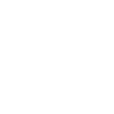

# libreoffice

[← Back to main README](../../README.md)




## 16 px

### black
```
https://georgegach.github.io/compatible-icons/simple-icons/libreoffice/16/black.png
```

### slate
```
https://georgegach.github.io/compatible-icons/simple-icons/libreoffice/16/slate.png
```

### white
```
https://georgegach.github.io/compatible-icons/simple-icons/libreoffice/16/white.png
```

## 64 px

### black
```
https://georgegach.github.io/compatible-icons/simple-icons/libreoffice/64/black.png
```

### slate
```
https://georgegach.github.io/compatible-icons/simple-icons/libreoffice/64/slate.png
```

### white
```
https://georgegach.github.io/compatible-icons/simple-icons/libreoffice/64/white.png
```

## 128 px

### black
```
https://georgegach.github.io/compatible-icons/simple-icons/libreoffice/128/black.png
```

### slate
```
https://georgegach.github.io/compatible-icons/simple-icons/libreoffice/128/slate.png
```

### white
```
https://georgegach.github.io/compatible-icons/simple-icons/libreoffice/128/white.png
```

## 512 px

### black
```
https://georgegach.github.io/compatible-icons/simple-icons/libreoffice/512/black.png
```

### slate
```
https://georgegach.github.io/compatible-icons/simple-icons/libreoffice/512/slate.png
```

### white
```
https://georgegach.github.io/compatible-icons/simple-icons/libreoffice/512/white.png
```

## 1024 px

### black
```
https://georgegach.github.io/compatible-icons/simple-icons/libreoffice/1024/black.png
```

### slate
```
https://georgegach.github.io/compatible-icons/simple-icons/libreoffice/1024/slate.png
```

### white
```
https://georgegach.github.io/compatible-icons/simple-icons/libreoffice/1024/white.png
```

## 16 px in base64

### black
```
data:image/png;base64,iVBORw0KGgoAAAANSUhEUgAAABAAAAAQCAYAAAAf8/9hAAAABmJLR0QA/wD/AP+gvaeTAAAAsElEQVQ4je3TO4oCQRCA4W90DExcI0EMBDM38wx7Iw/gLTyFgUcRQTAzMPOBsJr6CuyRBgdfGPonXV1d9VPd0IkLK1RwckuCBXb4jfJzNNOwKWKAXo6ggSGqWKIW8oe4aIN+TnNGG2tswzQnzKBwpylmij/sUQ6TpK8IYBxJSujGh4+uENMJ9ZNXJ8gYuTx4/V0BHLPgXcGVr+ADgjSKf9B6sq+SBUlY733nPBL8o3YGHRUeTHCAmTQAAAAASUVORK5CYII=
```

### slate
```
data:image/png;base64,iVBORw0KGgoAAAANSUhEUgAAABAAAAAQCAYAAAAf8/9hAAAABmJLR0QA/wD/AP+gvaeTAAAA60lEQVQ4je3TPVICQRDF8f+bWQMCcUkQxa8y9A5GewW9iAewuA+Bh/AAlpEZpQRaYAJFys4zwKUo12ChDH3RzNT0rztpAYw/Zp9IbcDUYmFPICyQr6pXwfi0l59n3/doyiEK9z/LpdSnDA+S8wRTQZdVpxIgW390mJ/18lF9Akav74vroPQYcGsTAQi/FNRycbz/EpSKZJYBt4ym8qp5IwDg5LDznEUXtpay9xS52woA6Hc7TzG6AEjJg62BCrHSEMLRTgCAHFJ13gnYzD/wB8B6F6x08DaZXTasa1d7WwGliLeYm4aAZM8BvgCxuUs/yH+E0gAAAABJRU5ErkJggg==
```

### white
```
data:image/png;base64,iVBORw0KGgoAAAANSUhEUgAAABAAAAAQCAYAAAAf8/9hAAAABmJLR0QA/wD/AP+gvaeTAAAAsklEQVQ4je3TMU5CQRAG4G/0UdigFQmxIKHkDlbeyAMY7vMKD+EBiJUdBR1QEVt1LFzIxvcSgVj6V7OTnS+ZYgIyc4shUjeBNd4wq/qriJg05XGJFo89wC2ecIMNRqX/AU31cRcRyx5gmZl3eMbVD8RFz0B3h4hX3OO9QpqjgYK8VMgADycBBVkUBOYnAxXSYnwWUPK5L84FDvkH/gCob+E6M6dHzg33RfDrOfclfB/f6AtSNybdPjFnPwAAAABJRU5ErkJggg==
```

