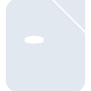
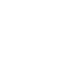

# libreofficebase

[← Back to main README](../../README.md)





## 16 px

### black
```
https://georgegach.github.io/compatible-icons/simple-icons/libreofficebase/16/black.png
```

### slate
```
https://georgegach.github.io/compatible-icons/simple-icons/libreofficebase/16/slate.png
```

### white
```
https://georgegach.github.io/compatible-icons/simple-icons/libreofficebase/16/white.png
```

## 64 px

### black
```
https://georgegach.github.io/compatible-icons/simple-icons/libreofficebase/64/black.png
```

### slate
```
https://georgegach.github.io/compatible-icons/simple-icons/libreofficebase/64/slate.png
```

### white
```
https://georgegach.github.io/compatible-icons/simple-icons/libreofficebase/64/white.png
```

## 128 px

### black
```
https://georgegach.github.io/compatible-icons/simple-icons/libreofficebase/128/black.png
```

### slate
```
https://georgegach.github.io/compatible-icons/simple-icons/libreofficebase/128/slate.png
```

### white
```
https://georgegach.github.io/compatible-icons/simple-icons/libreofficebase/128/white.png
```

## 512 px

### black
```
https://georgegach.github.io/compatible-icons/simple-icons/libreofficebase/512/black.png
```

### slate
```
https://georgegach.github.io/compatible-icons/simple-icons/libreofficebase/512/slate.png
```

### white
```
https://georgegach.github.io/compatible-icons/simple-icons/libreofficebase/512/white.png
```

## 1024 px

### black
```
https://georgegach.github.io/compatible-icons/simple-icons/libreofficebase/1024/black.png
```

### slate
```
https://georgegach.github.io/compatible-icons/simple-icons/libreofficebase/1024/slate.png
```

### white
```
https://georgegach.github.io/compatible-icons/simple-icons/libreofficebase/1024/white.png
```

## 16 px in base64

### black
```
data:image/png;base64,iVBORw0KGgoAAAANSUhEUgAAABAAAAAQCAYAAAAf8/9hAAAABmJLR0QA/wD/AP+gvaeTAAAAzUlEQVQ4jZ3SUUpCQRjF8Z+alLUD1yBYz27DlbSQVtI2IlpD6IMIESg9SXhTbw93wmmYO6gHPjgz3zeH/9y5NHrEB/aok/rGK1bJ/kqkWeZgXJsQEs8toBsC+sq6xT2+MI8b3ex4XjcYBfR3DM4NgOsQskZ1SQDNdR6whKvMwAueg59i0kIybCPoJLVtIanjxcLxeQ6J30U+7v17xpJ+Ss3cN6gTvy8F5AjSgKJyBL3E3wXfOZXgLP0FVBecrTji9jDW/GVZ1EgHfOIJb78sDT7i0fk1NgAAAABJRU5ErkJggg==
```

### slate
```
data:image/png;base64,iVBORw0KGgoAAAANSUhEUgAAABAAAAAQCAYAAAAf8/9hAAAABmJLR0QA/wD/AP+gvaeTAAABB0lEQVQ4jZ2OPUoDURSFv/NUjLERFAkp0tmFoKW6DXdhJ7gScRduI336QAqxiJAgWIhGfMdifpjMvEjGUzzuve+cez8BPL++38m+Nz4FAuv6BCbGZ0LHlfly0Ds6ycyOt8a9RBigIzESmmLPiqHggyIg2EsES9l0jc4JejPMqn+pi0kJdzBD2QtginXQakGufQUNgaUVV/9ZgE0XuMC8AOw2DGgMPOXtjfB1igTU30QgESWiAgj4SpFIOEkgfAm6ymhsUCTzurRU1CCwvV7b3ymCQg2CIJUrgmTgx3XTXwQV1Hq9HYFhp1Yf5q3q3k0ErRSyS1q1DRaZkD+PhjkQt8hGw9zEB4BfjstaTcVhl8gAAAAASUVORK5CYII=
```

### white
```
data:image/png;base64,iVBORw0KGgoAAAANSUhEUgAAABAAAAAQCAYAAAAf8/9hAAAABmJLR0QA/wD/AP+gvaeTAAAAy0lEQVQ4jZ2SSw5BQRBFj1/8dmANBgyxDSuxFbEL2xCLEAYiYfDESMQTroFGa/U6vJt0Uum6dXL7A4CkkaStpKu+dZI0l5QE+wlPSVoag76ODuL71gBFx6gQVwPoAAdg5TeKpt1WDWgDCbAA6v8CAKoOsgfSPAB4HKcLbADKhmEGTF09BAYZSVpZCQrBOmckUVaCHtD3TDd/wEFf+uUOLrGmlUBBfY0BrAQhICorQSmom64uGN5c/8AEpDlmP37iBNjxfrKYbs47BrgDE++Jyd+gzu8AAAAASUVORK5CYII=
```

