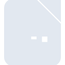
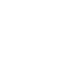

# libreofficecalc

[← Back to main README](../../README.md)

<table><tr>
  <td></td>
  <td></td>
  <td></td>
</tr></table>

## 16 px

### black
```
https://georgegach.github.io/compatible-icons/simple-icons/compat/libreofficecalc/16/black.png
```

### slate
```
https://georgegach.github.io/compatible-icons/simple-icons/compat/libreofficecalc/16/slate.png
```

### white
```
https://georgegach.github.io/compatible-icons/simple-icons/compat/libreofficecalc/16/white.png
```

## 64 px

### black
```
https://georgegach.github.io/compatible-icons/simple-icons/compat/libreofficecalc/64/black.png
```

### slate
```
https://georgegach.github.io/compatible-icons/simple-icons/compat/libreofficecalc/64/slate.png
```

### white
```
https://georgegach.github.io/compatible-icons/simple-icons/compat/libreofficecalc/64/white.png
```

## 128 px

### black
```
https://georgegach.github.io/compatible-icons/simple-icons/compat/libreofficecalc/128/black.png
```

### slate
```
https://georgegach.github.io/compatible-icons/simple-icons/compat/libreofficecalc/128/slate.png
```

### white
```
https://georgegach.github.io/compatible-icons/simple-icons/compat/libreofficecalc/128/white.png
```

## 512 px

### black
```
https://georgegach.github.io/compatible-icons/simple-icons/compat/libreofficecalc/512/black.png
```

### slate
```
https://georgegach.github.io/compatible-icons/simple-icons/compat/libreofficecalc/512/slate.png
```

### white
```
https://georgegach.github.io/compatible-icons/simple-icons/compat/libreofficecalc/512/white.png
```

## 1024 px

### black
```
https://georgegach.github.io/compatible-icons/simple-icons/compat/libreofficecalc/1024/black.png
```

### slate
```
https://georgegach.github.io/compatible-icons/simple-icons/compat/libreofficecalc/1024/slate.png
```

### white
```
https://georgegach.github.io/compatible-icons/simple-icons/compat/libreofficecalc/1024/white.png
```

## 16 px in base64

### black
```
data:image/png;base64,iVBORw0KGgoAAAANSUhEUgAAABAAAAAQCAYAAAAf8/9hAAAABmJLR0QA/wD/AP+gvaeTAAAAxUlEQVQ4jaXSX2oCMRDH8Y9aUXuEnkGw9jB7EA/itUTwBBZ9EKEUlD6JsOCfh40lu8SuXX8wZDIz+WZChkITfOGES8WOmGFXie9EWiUOxnYIkLhuA+0A6Ppbr3jHD9Zxop0sT6uPYWj9E4P/AqAXIHvkTQAUzxljew9wqVlvnbw17aB00SOAVrRuq8k6wBJZ8DPFwCW1kR6gc+QvgpUG6eWBJ9z0kQrWAVp3/F898wslQN7gbA6dsOlgpJiyZKuRzvjGFPMrM908i9AMGJoAAAAASUVORK5CYII=
```

### slate
```
data:image/png;base64,iVBORw0KGgoAAAANSUhEUgAAABAAAAAQCAYAAAAf8/9hAAAABmJLR0QA/wD/AP+gvaeTAAAA7klEQVQ4jZ2RsWoCURBFz30YNFYBQ5AU6ewkqB/jT6QTQj4k5CfyNakVLIKFgYhgIcHi3RTuLipvXd1bvBlm5p4ZeAL4/tlMZL8aPwCBY/0BX8Y9oc5BffXUvbvfDzu+GHcTZoCWxLPQDHueFwVbcoPgJmEsZNM2GhC0NswPe6mNSQm3MH3Zv8AM6/YqQKamgvrAyoq7OgBs2sAQsygDuCICNEGPtS7IJe2BlwBURHlx2jwPMFObMYDN2FGT05HG+Y30BJ8ACrxl0EpA2TWjVLkKoJK8UO1fOAIY7a415p6QPR+GJRAv8EbD0sR3gH/7VUwveERa3QAAAABJRU5ErkJggg==
```

### white
```
data:image/png;base64,iVBORw0KGgoAAAANSUhEUgAAABAAAAAQCAYAAAAf8/9hAAAABmJLR0QA/wD/AP+gvaeTAAAAxElEQVQ4jaWSSwrCMBCGvxbFxxE8gwv1MD1IryKeyY0nUHRRCrqouCpCwf4uTCWpqa31h5BhHl9myAAgKZZ0lvTQp+6StpKymj+jkqSjp9BWbiB2XgIQGsaQ75oCC+AGnOxA6E33awzMgQw4AJNfAQAjA7kCRR8AvMZZAmkTQC131cmsbwfOQ10AgXWn9WAbYA9Exo6A2N+LlDQsUGnZO3OcRRp0GKHSyudsAwQN9lv//IIDKHrUOpu4AS5A2aGwNLlrgCcVjbuFUA8p2QAAAABJRU5ErkJggg==
```

