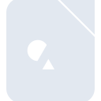
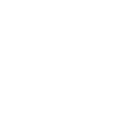

# libreofficedraw

[← Back to main README](../../README.md)





## 16 px

### black
```
https://georgegach.github.io/compatible-icons/simple-icons/libreofficedraw/16/black.png
```

### slate
```
https://georgegach.github.io/compatible-icons/simple-icons/libreofficedraw/16/slate.png
```

### white
```
https://georgegach.github.io/compatible-icons/simple-icons/libreofficedraw/16/white.png
```

## 64 px

### black
```
https://georgegach.github.io/compatible-icons/simple-icons/libreofficedraw/64/black.png
```

### slate
```
https://georgegach.github.io/compatible-icons/simple-icons/libreofficedraw/64/slate.png
```

### white
```
https://georgegach.github.io/compatible-icons/simple-icons/libreofficedraw/64/white.png
```

## 128 px

### black
```
https://georgegach.github.io/compatible-icons/simple-icons/libreofficedraw/128/black.png
```

### slate
```
https://georgegach.github.io/compatible-icons/simple-icons/libreofficedraw/128/slate.png
```

### white
```
https://georgegach.github.io/compatible-icons/simple-icons/libreofficedraw/128/white.png
```

## 512 px

### black
```
https://georgegach.github.io/compatible-icons/simple-icons/libreofficedraw/512/black.png
```

### slate
```
https://georgegach.github.io/compatible-icons/simple-icons/libreofficedraw/512/slate.png
```

### white
```
https://georgegach.github.io/compatible-icons/simple-icons/libreofficedraw/512/white.png
```

## 1024 px

### black
```
https://georgegach.github.io/compatible-icons/simple-icons/libreofficedraw/1024/black.png
```

### slate
```
https://georgegach.github.io/compatible-icons/simple-icons/libreofficedraw/1024/slate.png
```

### white
```
https://georgegach.github.io/compatible-icons/simple-icons/libreofficedraw/1024/white.png
```

## 16 px in base64

### black
```
data:image/png;base64,iVBORw0KGgoAAAANSUhEUgAAABAAAAAQCAYAAAAf8/9hAAAABmJLR0QA/wD/AP+gvaeTAAAA5UlEQVQ4jZ3SO0oEQRAG4G9nfYdmegZBvZEnMPAMYugVvIqZGBgYuxosPhBW10QHRhwNplZ7h3bE+aGg+6+qv+vRNDjAAz7w2bISZ5i0+IkEo0xiaq8hcp1wYyhCYEk31rCDKW5SR5ENz2MFW1H6FVb/KwDLIfKEqo8ATTu7uIWFTMA9TjDAHjZ/qWSOH/uZ7mFwRfCl/GbmtpDDfrzyoulZJGaRVnCHI7zhAjWew1e3K8gJzGyKdZx2tZAb4gwlLuP8jsVcUJfARofvG33+QVag6pFbwTAuQ2xrftngj8QajzjG+RexqVPf0ihdYAAAAABJRU5ErkJggg==
```

### slate
```
data:image/png;base64,iVBORw0KGgoAAAANSUhEUgAAABAAAAAQCAYAAAAf8/9hAAAABmJLR0QA/wD/AP+gvaeTAAABLElEQVQ4jZ2TzUpCURSFv3X6M0dGESbRrJlEPkSPEdS0QUTQIOgtorHv0hPkWBCyMIWkW4N+rO5qcFXMe63sGx322WvtdTjnCKDZeTqWfWK8CgS+8wpcGW8KLY/UuxvFwkrSbB8YFzPEADmJLaE6dmNQFDwzEAjPZwiH2OSNtgl6MDRG97ImZiKcw5Rl3wN1rMWpDPosKKgMdK249x8DbPJABXMLMJtqwC2hKjEieA9UykoyqKcMZlB1vVg4sx1uOo+7JNeYG++T8I9HaN5Fh4ISEAHdYcAxUgk+8f51KwoEH8WmJlFBRGlpQiqBUEmBU4m38KEd4BKzNNz+LcEQhxfPx7VkrXdgLqttsgFew6mBKaZ+BxMM1JtW6L6m/5m4MLSB+A/a2NA28TnAFxkwZ4EbCxA8AAAAAElFTkSuQmCC
```

### white
```
data:image/png;base64,iVBORw0KGgoAAAANSUhEUgAAABAAAAAQCAYAAAAf8/9hAAAABmJLR0QA/wD/AP+gvaeTAAAA5ElEQVQ4jZ3SO04DQRRE0YPFPySDNRDAjmADCLEGdoCI2QoZMTGfwEJAYGQnyJIRLgK3xdhuj8A3rKlX/Wq6QZKLJG9JvrPIMMldkt6c3jMlyWNlsMlnCXlqaF3olIxN7eziCH08Nz90qvY62zhEDw/Y+W8AbJWQD4xWCWBS5xgvsF4xvOIGazjBwZJNfvUk3cbfvSxap+jDJTczcws1zsopA5POkHlTrcJpkg7OcV/6DloOWqgwpZ9kL8ltW4XaBlOGZQP4wkbN1Baw37p2YZV3UA0YrTA78xKv8Y7xHwbHxXsFP/PL8qE66cnZAAAAAElFTkSuQmCC
```

