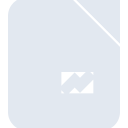
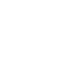

# libreofficeimpress

[← Back to main README](../../README.md)





## 16 px

### black
```
https://georgegach.github.io/compatible-icons/simple-icons/libreofficeimpress/16/black.png
```

### slate
```
https://georgegach.github.io/compatible-icons/simple-icons/libreofficeimpress/16/slate.png
```

### white
```
https://georgegach.github.io/compatible-icons/simple-icons/libreofficeimpress/16/white.png
```

## 64 px

### black
```
https://georgegach.github.io/compatible-icons/simple-icons/libreofficeimpress/64/black.png
```

### slate
```
https://georgegach.github.io/compatible-icons/simple-icons/libreofficeimpress/64/slate.png
```

### white
```
https://georgegach.github.io/compatible-icons/simple-icons/libreofficeimpress/64/white.png
```

## 128 px

### black
```
https://georgegach.github.io/compatible-icons/simple-icons/libreofficeimpress/128/black.png
```

### slate
```
https://georgegach.github.io/compatible-icons/simple-icons/libreofficeimpress/128/slate.png
```

### white
```
https://georgegach.github.io/compatible-icons/simple-icons/libreofficeimpress/128/white.png
```

## 512 px

### black
```
https://georgegach.github.io/compatible-icons/simple-icons/libreofficeimpress/512/black.png
```

### slate
```
https://georgegach.github.io/compatible-icons/simple-icons/libreofficeimpress/512/slate.png
```

### white
```
https://georgegach.github.io/compatible-icons/simple-icons/libreofficeimpress/512/white.png
```

## 1024 px

### black
```
https://georgegach.github.io/compatible-icons/simple-icons/libreofficeimpress/1024/black.png
```

### slate
```
https://georgegach.github.io/compatible-icons/simple-icons/libreofficeimpress/1024/slate.png
```

### white
```
https://georgegach.github.io/compatible-icons/simple-icons/libreofficeimpress/1024/white.png
```

## 16 px in base64

### black
```
data:image/png;base64,iVBORw0KGgoAAAANSUhEUgAAABAAAAAQCAYAAAAf8/9hAAAABmJLR0QA/wD/AP+gvaeTAAAAyklEQVQ4jaXSzUpCQRjG8V+apNHOndcQmF5a99C2dRfTXtq6FRNECEFxZcaBrMXMgekwHvH0wMt8vn+eYR6CHvGBb/xU6oAJNpX9jUTzTGNa+whJ7y2hFQEd9brFA3Z4Tw9a2et5dXEfrc/QuxQANxGyRdEEQHjOCKumgNLJ4D8Awk9kAduaplV1IwfoJ/MJxnjFFHenyEv5AC2EJB7j+KQSpOsau6WbL7zgU8jCRQ7q6k+UG6sEFA16C2jHRRtDIWVXZxqPWOMZb7/tk0oFmR6iDQAAAABJRU5ErkJggg==
```

### slate
```
data:image/png;base64,iVBORw0KGgoAAAANSUhEUgAAABAAAAAQCAYAAAAf8/9hAAAABmJLR0QA/wD/AP+gvaeTAAAA/0lEQVQ4jaWSsUoDQRRFzx0V16AgRCRa2GkVRP0FP8dGhHyJKH6MtbZiG0ghKSK4CBYhBJlr4W5Yl4lu4i2G4c07583ACODl9eNKds94Fwj8zAR4Mj4Ualfq+UFne+e72fHCuJOAATKJY6E+9qAsCsaUgGAtAc5i0zI6IejdMKiepSYmI5xhurLfgD7WxkKCIusK6gK5FafLCLBpAaeY4VKC8iag/f8IkPA8QT6f8rBeSglmn8XwuBJ8hrgHnkGbTQTV7H1GPWDODUeY23rD6m90EG3DBOtOeIyVITcX2GwVu0uAOtzkCX8mABhNFwVLJhTLjWEExAZsNIxMvAb4Ao8HVEoYfa6IAAAAAElFTkSuQmCC
```

### white
```
data:image/png;base64,iVBORw0KGgoAAAANSUhEUgAAABAAAAAQCAYAAAAf8/9hAAAABmJLR0QA/wD/AP+gvaeTAAAAzElEQVQ4jaXSTUoDQRiE4Yeg+IM7d57BhXo07+AJRPAw7rN3KyqEgC4muPKHgFMu0gOTcTKYsTbdfP3VSzUUSHKZ5CXJd37rM8k0SdWZVxoleewxtvVeIO29GUwKY9ewDnGGNzy1Hya96/3axykqPOBgWwDsFcgCyzEAVt85x3wsoEly8h8AZBNgMWCadwd9gOPWfYoL3OEeR/1ZktmGAj2XJtblvOoWaWcgbpPmC7f4sOrCVgmGtFbl0WoAyxHetSbe4BX1H4x12b2GHxQV8tVPAqgUAAAAAElFTkSuQmCC
```

