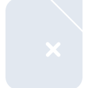
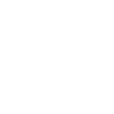

# libreofficemath

[← Back to main README](../../README.md)

<table><tr>
  <td></td>
  <td></td>
  <td></td>
</tr></table>

## 16 px

### black
```
https://georgegach.github.io/compatible-icons/simple-icons/compat/libreofficemath/16/black.png
```

### slate
```
https://georgegach.github.io/compatible-icons/simple-icons/compat/libreofficemath/16/slate.png
```

### white
```
https://georgegach.github.io/compatible-icons/simple-icons/compat/libreofficemath/16/white.png
```

## 64 px

### black
```
https://georgegach.github.io/compatible-icons/simple-icons/compat/libreofficemath/64/black.png
```

### slate
```
https://georgegach.github.io/compatible-icons/simple-icons/compat/libreofficemath/64/slate.png
```

### white
```
https://georgegach.github.io/compatible-icons/simple-icons/compat/libreofficemath/64/white.png
```

## 128 px

### black
```
https://georgegach.github.io/compatible-icons/simple-icons/compat/libreofficemath/128/black.png
```

### slate
```
https://georgegach.github.io/compatible-icons/simple-icons/compat/libreofficemath/128/slate.png
```

### white
```
https://georgegach.github.io/compatible-icons/simple-icons/compat/libreofficemath/128/white.png
```

## 512 px

### black
```
https://georgegach.github.io/compatible-icons/simple-icons/compat/libreofficemath/512/black.png
```

### slate
```
https://georgegach.github.io/compatible-icons/simple-icons/compat/libreofficemath/512/slate.png
```

### white
```
https://georgegach.github.io/compatible-icons/simple-icons/compat/libreofficemath/512/white.png
```

## 1024 px

### black
```
https://georgegach.github.io/compatible-icons/simple-icons/compat/libreofficemath/1024/black.png
```

### slate
```
https://georgegach.github.io/compatible-icons/simple-icons/compat/libreofficemath/1024/slate.png
```

### white
```
https://georgegach.github.io/compatible-icons/simple-icons/compat/libreofficemath/1024/white.png
```

## 16 px in base64

### black
```
data:image/png;base64,iVBORw0KGgoAAAANSUhEUgAAABAAAAAQCAYAAAAf8/9hAAAABmJLR0QA/wD/AP+gvaeTAAAA20lEQVQ4jZ3SQUpDMRDG8V9btSqIiFBa990J6n08hQdx7d7DiGcQuyiCFVtciBQeaF1krI8S82o/CEkm3/yZSULSFZ7xicXKmOMO05X4VE2PmcT6+AhI3TeGdgC2lbWPc7xhVD9oZ+157eI0Sn/A3n8B0A3IDNUmAFI7F3hqAswbKjmBrULyz9kIh1LvPRxFfFGqYAevsR7jEjc5Yw4wiXi/4Fkq10If7ziI/QC30s2vBSCeKDSMueW3/6X+Ku94zdhG/yALqIquvCroxKaDM+mXtRoSv/CCa9x/Aw73NAVblLNTAAAAAElFTkSuQmCC
```

### slate
```
data:image/png;base64,iVBORw0KGgoAAAANSUhEUgAAABAAAAAQCAYAAAAf8/9hAAAABmJLR0QA/wD/AP+gvaeTAAABEUlEQVQ4jZWSMUsDQRSEv9lEjQFBichpYZcuiP4f/4Gd4C8Rwd4/ZCuBFMHiRI+AgpEDdyxyF6Ksl8sUC2/2zbx5ywpg+vJ+LfvG+AgI/MYX8Gg8FBqs8MVptn+4aHa8Ms4SYoCexJnQGHtSk4JPaoFgKyFcwqZvdE7QzDBZvUtNTEK4hxnJfgPGWLsbGVTYUdAIKKxYNhv4H9r0gQvM85oEnjclAZ00GHjuoG6VZIIpLJ4ws7pDWmRMGghty36tiqk6uuxY96nelEFuCKCsmtT40N0El1l8yOwtNuCY6IdvxyIkvFIGyJTLwgwBgoKAgzYrAAxacht/pLSBUbmu8S9qTaiOO0MOxBbaaMhNvAX4AShWXUkH27k3AAAAAElFTkSuQmCC
```

### white
```
data:image/png;base64,iVBORw0KGgoAAAANSUhEUgAAABAAAAAQCAYAAAAf8/9hAAAABmJLR0QA/wD/AP+gvaeTAAAA3klEQVQ4jZ3STUoDQRCG4ceg8QdERJDo3p0LvY+n8CoiuPcwHkLMIggKjrgQCQRMuZhKHGM7GfNuurv6q4+q6gYRcRkRTxHxGb8ZR8RdRFQL8cqMiHgoJDb5SJOmbgS99NjQzg7O8IZh86JXlJfZwikq3GP7vwawmSavmKxiQN3OOR6XGYyXVHIM6y3Js7sh9tS9H2I/49FWQR8vuR/hAjclYcngOeODFs2cUgsDvGM3z0e4VU++kwH5RMlJrmu++5/zV3kHHWMr/YOiwaRVVebHT7xWT3/aIXGa2iv4AmvuiSkOsb4aAAAAAElFTkSuQmCC
```

