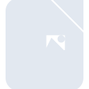
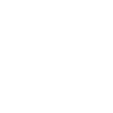

# libreofficewriter

[← Back to main README](../../README.md)

<table><tr>
  <td></td>
  <td></td>
  <td></td>
</tr></table>

## 16 px

### black
```
https://georgegach.github.io/compatible-icons/simple-icons/compat/libreofficewriter/16/black.png
```

### slate
```
https://georgegach.github.io/compatible-icons/simple-icons/compat/libreofficewriter/16/slate.png
```

### white
```
https://georgegach.github.io/compatible-icons/simple-icons/compat/libreofficewriter/16/white.png
```

## 64 px

### black
```
https://georgegach.github.io/compatible-icons/simple-icons/compat/libreofficewriter/64/black.png
```

### slate
```
https://georgegach.github.io/compatible-icons/simple-icons/compat/libreofficewriter/64/slate.png
```

### white
```
https://georgegach.github.io/compatible-icons/simple-icons/compat/libreofficewriter/64/white.png
```

## 128 px

### black
```
https://georgegach.github.io/compatible-icons/simple-icons/compat/libreofficewriter/128/black.png
```

### slate
```
https://georgegach.github.io/compatible-icons/simple-icons/compat/libreofficewriter/128/slate.png
```

### white
```
https://georgegach.github.io/compatible-icons/simple-icons/compat/libreofficewriter/128/white.png
```

## 512 px

### black
```
https://georgegach.github.io/compatible-icons/simple-icons/compat/libreofficewriter/512/black.png
```

### slate
```
https://georgegach.github.io/compatible-icons/simple-icons/compat/libreofficewriter/512/slate.png
```

### white
```
https://georgegach.github.io/compatible-icons/simple-icons/compat/libreofficewriter/512/white.png
```

## 1024 px

### black
```
https://georgegach.github.io/compatible-icons/simple-icons/compat/libreofficewriter/1024/black.png
```

### slate
```
https://georgegach.github.io/compatible-icons/simple-icons/compat/libreofficewriter/1024/slate.png
```

### white
```
https://georgegach.github.io/compatible-icons/simple-icons/compat/libreofficewriter/1024/white.png
```

## 16 px in base64

### black
```
data:image/png;base64,iVBORw0KGgoAAAANSUhEUgAAABAAAAAQCAYAAAAf8/9hAAAABmJLR0QA/wD/AP+gvaeTAAAAxklEQVQ4jaXSvWoCURCG4cc/orZ2NrmBQCLkNnIx8Rqsc1vBpLOVpNCAiIpFEGHBaLEncLKs7mb9YIozZ76XGWZINcQCBxwzsccr1pn8WqSPHGMcuwCJ62ZQD4CWy+riAVt8xh/13PJ8tXEXWp+i818A3ATIBkkVAOk4A3xBs4ThBRM84RG3oZN+2Q5WGOEdb1H+GBfNnF/hCt+Y41lmjWUA5+LPHVRWEWBzLaB3LaBQv4CkgjeBRng0cC+9slqB8QdL6YGNT2EUSNIsbprLAAAAAElFTkSuQmCC
```

### slate
```
data:image/png;base64,iVBORw0KGgoAAAANSUhEUgAAABAAAAAQCAYAAAAf8/9hAAAABmJLR0QA/wD/AP+gvaeTAAAA9klEQVQ4ja2QMUtCURzFf+eiaNIgKCENOrlJJPQ1+iQ1FX2DZhfpMwm5RKvgEA2GPgIHCYd7GvKFyYP3XnWGO5xzf+d//1cAL2/rG9l3xidA4Kc+gCfjvlBrz0+6nWb767LjlXEnAwaoS5wJzbDnqSnYkAKCagb4LZuG0TlB74b5fpY1MVPCdcxA9gqYYR2VKtippqABkFhx+5sCbBrAEPMKUMknNDLxGXQJXEj0gBrotNALLC8VuCcyBR5TX8KFCmTfymoqcC15cpjnryC1DSCOQaPDuPQnli1I/lrQysn/aQWjbVkwZcLueDAsgFiAjYaFiWOAT0HPTUpkUfIEAAAAAElFTkSuQmCC
```

### white
```
data:image/png;base64,iVBORw0KGgoAAAANSUhEUgAAABAAAAAQCAYAAAAf8/9hAAAABmJLR0QA/wD/AP+gvaeTAAAAyklEQVQ4jaXSsUoDQRSF4Y+gqGntbHwBCwVfw4eJz2BtIz6ToJ2taBEFhWywEBEC5lg4wU1ck3XzV8PMPT93uBckOU3ynOQzv/lIcpWkWrivzEhy3xCs814k9boh9Ipj03L6OMQrHuoPvcbyZrZxgAp32PmvALaKZIxJFwHf3znCE2y0CJzjFic4xn7pZK9tByOc4QbXtfv8nJLhkhGOkrwleUwyWBxjG8FfzO1BZ1YJxusKdtcVrGQmmHTIzm3iJV4wbRGcltoL+AKnUPGi4gtXTAAAAABJRU5ErkJggg==
```

