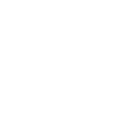

# line

[← Back to main README](../../README.md)




## 16 px

### black
```
https://georgegach.github.io/compatible-icons/simple-icons/line/16/black.png
```

### slate
```
https://georgegach.github.io/compatible-icons/simple-icons/line/16/slate.png
```

### white
```
https://georgegach.github.io/compatible-icons/simple-icons/line/16/white.png
```

## 64 px

### black
```
https://georgegach.github.io/compatible-icons/simple-icons/line/64/black.png
```

### slate
```
https://georgegach.github.io/compatible-icons/simple-icons/line/64/slate.png
```

### white
```
https://georgegach.github.io/compatible-icons/simple-icons/line/64/white.png
```

## 128 px

### black
```
https://georgegach.github.io/compatible-icons/simple-icons/line/128/black.png
```

### slate
```
https://georgegach.github.io/compatible-icons/simple-icons/line/128/slate.png
```

### white
```
https://georgegach.github.io/compatible-icons/simple-icons/line/128/white.png
```

## 512 px

### black
```
https://georgegach.github.io/compatible-icons/simple-icons/line/512/black.png
```

### slate
```
https://georgegach.github.io/compatible-icons/simple-icons/line/512/slate.png
```

### white
```
https://georgegach.github.io/compatible-icons/simple-icons/line/512/white.png
```

## 1024 px

### black
```
https://georgegach.github.io/compatible-icons/simple-icons/line/1024/black.png
```

### slate
```
https://georgegach.github.io/compatible-icons/simple-icons/line/1024/slate.png
```

### white
```
https://georgegach.github.io/compatible-icons/simple-icons/line/1024/white.png
```

## 16 px in base64

### black
```
data:image/png;base64,iVBORw0KGgoAAAANSUhEUgAAABAAAAAQCAYAAAAf8/9hAAAABmJLR0QA/wD/AP+gvaeTAAABEklEQVQ4jaXT3ypEURTH8c+MYcjN+NMghUvXSinJI3gJkmfyBkrJjSt5BW5E5M8gkchcCI0/F7NOjtPMNMavVvucvdd3rbXXauf8Vh5LWMYkirH/hkusYxufGmgRR6jiq4lVw2chC6/hvgWYtTusJvD8H+F0kDk46ABObL+AkajkGa/xf4M+PGAIT5jCIYbRE+tIAaUIUIsAosu1VON60RVnRRTiu5THR7aj6uNM1jJOUmfdyCWJ8lGeiHqtPqbxyFhCP0ajqpfweQ/mEXb/0cQdmEClA/gCY8m9ZnEeZbYDVzCTbVwZm7jyM4GsfeAU01k4rUGsYAu3KbiKPT9jb0tnkfVC/b3kWno30DE2MNDM4RtRJo4Lr40ZzwAAAABJRU5ErkJggg==
```

### slate
```
data:image/png;base64,iVBORw0KGgoAAAANSUhEUgAAABAAAAAQCAYAAAAf8/9hAAAABmJLR0QA/wD/AP+gvaeTAAABu0lEQVQ4jZ2TQU/TQRTEf/PaWg2BAAKFmgicuHnUgwcTr5oQ5RNoNIRPZIwfQY2JJy+ePHvgYkg0QlugRQ0tNDFV+9/x0JYQWw04p82+nXkzb3fFKdiOSr29itKjkBaRi72CfiS7YsezpYXx15LSgKPBYvtr+1ak7GmYsmGcP2AgoJ3EvhSPr85NvKO3B9WD1kYuy57LrIwiDzoZxmVWZL+o7LfWAbR3cHwzc3oFzI4i/g1CXwSrqjWON026dh7yKWzmE6nUt3ck1AGXgD3MJdA3yZcNTUlL2B+MZ7AuIGZApcBM9jN2bXf6ysmia2zDMfZF2zkLsIoEBQDsyZCcDTtzACgUwJzh40kpKNj92xMpgCa9CHmFdm22QFdC5IBJYEyKeYkk853kXVk/+wKHqtRbbyVu/9cIpTdRcHqAXTsv17iSIv8wyuXpKsQasNNLcha2a4Wc7i/NjtVPnvKnRnuu6OyJ8XWJBaPcsGOSzXY+xd1yeWILTv2FAWq1o+lU6K4pxR1CN4B5AJm25fdZkXvLU1OtMzmtNlqfq41WVms0d7brhxu2hxrm/yUg61cKv3RH68uLU81RZ34DsHjKmOLf5U0AAAAASUVORK5CYII=
```

### white
```
data:image/png;base64,iVBORw0KGgoAAAANSUhEUgAAABAAAAAQCAYAAAAf8/9hAAAABmJLR0QA/wD/AP+gvaeTAAABKklEQVQ4jZ2TTyuEURSHn/c1DNmMPxlSWFpZKKUkH8GXIPlMvoFSsrGSz2AjIsYgkcgshMY8Fs7onTHD8Nvcezrn+Z1z7+0mZKSmwDKwAkwC+Ui9AhfABrCTJEmNZqlL6pFasb0qUbPYDK+rdz+AzbpV1+rwwh/hrMl8oh4AM9/O1JkOckAxgifgJeJroA+4B4aAR2AKOASGgZ5YizmgEAbVMACoRSxQAXqBrsjlgVzsCynw3mK0NLOOACeZXDeQ1BulMR7hegUcAePRsQD0A6Mx1XPUvAXzgLr3jxeoaxd1Qi3/Ay6pYwCoc+q5WusQLquzDbemjqhb6qVabQO+q6fqdIuL/zIaVFfVbfUmA1fUfbXQFm5hdhZdS37+l+R3qtHgWN1UB9rVfAD4S+P2NzvzSgAAAABJRU5ErkJggg==
```

