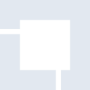
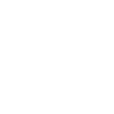

# linuxfoundation

[← Back to main README](../../README.md)

<table><tr>
  <td></td>
  <td></td>
  <td></td>
</tr></table>

## 16 px

### black
```
https://georgegach.github.io/compatible-icons/simple-icons/compat/linuxfoundation/16/black.png
```

### slate
```
https://georgegach.github.io/compatible-icons/simple-icons/compat/linuxfoundation/16/slate.png
```

### white
```
https://georgegach.github.io/compatible-icons/simple-icons/compat/linuxfoundation/16/white.png
```

## 64 px

### black
```
https://georgegach.github.io/compatible-icons/simple-icons/compat/linuxfoundation/64/black.png
```

### slate
```
https://georgegach.github.io/compatible-icons/simple-icons/compat/linuxfoundation/64/slate.png
```

### white
```
https://georgegach.github.io/compatible-icons/simple-icons/compat/linuxfoundation/64/white.png
```

## 128 px

### black
```
https://georgegach.github.io/compatible-icons/simple-icons/compat/linuxfoundation/128/black.png
```

### slate
```
https://georgegach.github.io/compatible-icons/simple-icons/compat/linuxfoundation/128/slate.png
```

### white
```
https://georgegach.github.io/compatible-icons/simple-icons/compat/linuxfoundation/128/white.png
```

## 512 px

### black
```
https://georgegach.github.io/compatible-icons/simple-icons/compat/linuxfoundation/512/black.png
```

### slate
```
https://georgegach.github.io/compatible-icons/simple-icons/compat/linuxfoundation/512/slate.png
```

### white
```
https://georgegach.github.io/compatible-icons/simple-icons/compat/linuxfoundation/512/white.png
```

## 1024 px

### black
```
https://georgegach.github.io/compatible-icons/simple-icons/compat/linuxfoundation/1024/black.png
```

### slate
```
https://georgegach.github.io/compatible-icons/simple-icons/compat/linuxfoundation/1024/slate.png
```

### white
```
https://georgegach.github.io/compatible-icons/simple-icons/compat/linuxfoundation/1024/white.png
```

## 16 px in base64

### black
```
data:image/png;base64,iVBORw0KGgoAAAANSUhEUgAAABAAAAAQCAYAAAAf8/9hAAAABmJLR0QA/wD/AP+gvaeTAAAAnUlEQVQ4jcXTPQrCQBCG4ScSEGsrW/EGNpbeyTNYeAYbD+AxFDyECHZCEO1slLVIik0Q3BDBgWV29p359j9D0MF6XYp/IpA34hMOX2pmGMcDN1xQYJ0w6UZ5bgEhxzSC9wSBmuXY4VH1t1i0FRhF8bDtCv5/jf8XyNT/whH7D3lXLLHCHJMYhoR2Vr6+oslSt/Cs/KsJUgUGle83wRtWoiQyEq7F/QAAAABJRU5ErkJggg==
```

### slate
```
data:image/png;base64,iVBORw0KGgoAAAANSUhEUgAAABAAAAAQCAYAAAAf8/9hAAAABmJLR0QA/wD/AP+gvaeTAAAAxUlEQVQ4jcWTP2oCcRCFv7euhnRCLLQSQm5gk1IP4wk8g4W3yAE8g5WC3iGk2CY2IduJS/J7KRQWd+OfRcFphmF437xhGCXr1FwR0TXimwDiQv0BLM9oXoHnHCCl2FtMzWLWbTeHp9TJ5/cbUg4w7iFAEGVKK25ALDQHb2THamgKjCoBsDsARjiEp6oO7n/G+wNU+IV37EVpShR9OWMc6p4I+sDLMcD/U3ASpIECK0TrAH6JTUs/e9Jvyd0lANDjLumh2PkDLlM6XXQhfRoAAAAASUVORK5CYII=
```

### white
```
data:image/png;base64,iVBORw0KGgoAAAANSUhEUgAAABAAAAAQCAYAAAAf8/9hAAAABmJLR0QA/wD/AP+gvaeTAAAAoElEQVQ4jcWTMQrCQBBFXyQg1la2wRvYWHonz2DhGWw8gMdQ8BAi2Aki2tlEns0S4iJkQ4T8Zvbzd/7MMLuZKh0w6JL8F4M84mfg2JAzB4qKqQ/1qt7UTVNFdWsNOTCr6c/EzivkwB54hfMOWLY1mNT4uG0H/a+xf4Ms+gsn4PDj3h1YAWtgAUwrxTRc1CI8ti+kjlCG+I6FVINRiMNY+ADJf3HkDC5MdAAAAABJRU5ErkJggg==
```

