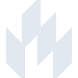

# lit

[← Back to main README](../../README.md)

<table><tr>
  <td></td>
  <td></td>
  <td></td>
</tr></table>

## 16 px

### black
```
https://georgegach.github.io/compatible-icons/simple-icons/compat/lit/16/black.png
```

### slate
```
https://georgegach.github.io/compatible-icons/simple-icons/compat/lit/16/slate.png
```

### white
```
https://georgegach.github.io/compatible-icons/simple-icons/compat/lit/16/white.png
```

## 64 px

### black
```
https://georgegach.github.io/compatible-icons/simple-icons/compat/lit/64/black.png
```

### slate
```
https://georgegach.github.io/compatible-icons/simple-icons/compat/lit/64/slate.png
```

### white
```
https://georgegach.github.io/compatible-icons/simple-icons/compat/lit/64/white.png
```

## 128 px

### black
```
https://georgegach.github.io/compatible-icons/simple-icons/compat/lit/128/black.png
```

### slate
```
https://georgegach.github.io/compatible-icons/simple-icons/compat/lit/128/slate.png
```

### white
```
https://georgegach.github.io/compatible-icons/simple-icons/compat/lit/128/white.png
```

## 512 px

### black
```
https://georgegach.github.io/compatible-icons/simple-icons/compat/lit/512/black.png
```

### slate
```
https://georgegach.github.io/compatible-icons/simple-icons/compat/lit/512/slate.png
```

### white
```
https://georgegach.github.io/compatible-icons/simple-icons/compat/lit/512/white.png
```

## 1024 px

### black
```
https://georgegach.github.io/compatible-icons/simple-icons/compat/lit/1024/black.png
```

### slate
```
https://georgegach.github.io/compatible-icons/simple-icons/compat/lit/1024/slate.png
```

### white
```
https://georgegach.github.io/compatible-icons/simple-icons/compat/lit/1024/white.png
```

## 16 px in base64

### black
```
data:image/png;base64,iVBORw0KGgoAAAANSUhEUgAAABAAAAAQCAYAAAAf8/9hAAAABmJLR0QA/wD/AP+gvaeTAAABCElEQVQ4jY3TvUoDQRQF4M8giD9lUpkqaGlppbHwCSz0KbT0BcQ3EQWx8BXE0sTS0k5FQsSfIioorsXu6jCZXXJgmdlz7zl39s5dqtHGEDs1ORo14ks068RVBm1coBPxU1iZxOAASwnxMXYnMUhxR9jCTByYLtaWvGEpHGIRcxHfwrCsdoJuQvws78lCxHcLzd9xmzjDRpD0hCvMJ8SnohvqI8MjenjFnnwGsuDp4aHY91MGGV6wX/ChwRfegvd++AkhPnEecd+4xXucXDWJIX5wje1UsBGtKdxgEx91xddw57+R5RgvY7bYd4pYJm/k2LWv4h4D4/9BaTAoxOtVx+1iVGMwiiv/AgAjPGW8Ud6fAAAAAElFTkSuQmCC
```

### slate
```
data:image/png;base64,iVBORw0KGgoAAAANSUhEUgAAABAAAAAQCAYAAAAf8/9hAAAABmJLR0QA/wD/AP+gvaeTAAABhElEQVQ4jYWSwWoTURSGv/9OQNCSbGJsa1NBFBfFvZu68AmKKOozCOIrFH0E94JYqC58BRF1Ibpw4U43xpi0UatNwBamc383zTiZSdqz/O/5Ps4998KM6nZ/LXW2fv/42v9zc1YPQG0WHGvJK6B5FAwQZsAvgfPF3La+be1cPlYQa2EduFCGu9u7T61w91gBCtWptodPjNdAJ6YK+v3R6Yrofz2w4xroZDEcMwEgVdzoDIarFdTsSCwhzRXjzmC4mipu5ALbTWfxeW8wulqAfyroHXCqDDvLNm03c4FEJjGfxuyZzApiV2g9Rj+enMgrRG9KWpTIcsG4BPMmXoyRh+2FxqOJM3EAvgReLOZTXkH7CrwoiQ+IfEH6W26vCsplouFDJLsx7fhwiUeIxCelo2uEZG/Ce8gEgFoI97C7FXuij0pHV9rtdgl2T0m4nwvOnqm/hXAd+K7CtdqtxuciLBNs90iSW8ut+utcALC80HhPCHdsJj7N5DqYU5LcPteqvxln/wCKuJ8sHtDetAAAAABJRU5ErkJggg==
```

### white
```
data:image/png;base64,iVBORw0KGgoAAAANSUhEUgAAABAAAAAQCAYAAAAf8/9hAAAABmJLR0QA/wD/AP+gvaeTAAABHElEQVQ4jY2SvUpDQRCFvw2C+FMmIJrqYrCytNJY+AQW5in0JUQfwScQA2LhK4iliaWlnQaRiNhELcTPwg3cLHtDTrPDnDkzh5mFCqhNdah2qmoAalVi4BaoTxNnG0TxDVAk+aBuzuLgGFhPxcAFcDhLg1zuHNgH5lNiLk5ohBCGGSHACbAGLCauGiGE4XhaV21nxO9AE1hOxG2gW7ZbB67U3VLdG3AHLGXEl5QvpPb9x4vaUz/UI7XjJHrqIMb9soMxVoAWcBpCOEu4H2ADWC0ncxv/Bq4z4kfgMy3O/sQEv8A9cJAja8mbwwOwB3xVDle31afSIouYb6kLMS4iZ1zk5NnVLfVZfR03SPgicgN1J+tVbaujKQ1G6eQ/3gfVLEMClCkAAAAASUVORK5CYII=
```

