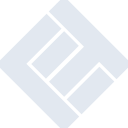

# litiengine

[← Back to main README](../../README.md)

<table><tr>
  <td></td>
  <td></td>
  <td></td>
</tr></table>

## 16 px

### black
```
https://georgegach.github.io/compatible-icons/simple-icons/compat/litiengine/16/black.png
```

### slate
```
https://georgegach.github.io/compatible-icons/simple-icons/compat/litiengine/16/slate.png
```

### white
```
https://georgegach.github.io/compatible-icons/simple-icons/compat/litiengine/16/white.png
```

## 64 px

### black
```
https://georgegach.github.io/compatible-icons/simple-icons/compat/litiengine/64/black.png
```

### slate
```
https://georgegach.github.io/compatible-icons/simple-icons/compat/litiengine/64/slate.png
```

### white
```
https://georgegach.github.io/compatible-icons/simple-icons/compat/litiengine/64/white.png
```

## 128 px

### black
```
https://georgegach.github.io/compatible-icons/simple-icons/compat/litiengine/128/black.png
```

### slate
```
https://georgegach.github.io/compatible-icons/simple-icons/compat/litiengine/128/slate.png
```

### white
```
https://georgegach.github.io/compatible-icons/simple-icons/compat/litiengine/128/white.png
```

## 512 px

### black
```
https://georgegach.github.io/compatible-icons/simple-icons/compat/litiengine/512/black.png
```

### slate
```
https://georgegach.github.io/compatible-icons/simple-icons/compat/litiengine/512/slate.png
```

### white
```
https://georgegach.github.io/compatible-icons/simple-icons/compat/litiengine/512/white.png
```

## 1024 px

### black
```
https://georgegach.github.io/compatible-icons/simple-icons/compat/litiengine/1024/black.png
```

### slate
```
https://georgegach.github.io/compatible-icons/simple-icons/compat/litiengine/1024/slate.png
```

### white
```
https://georgegach.github.io/compatible-icons/simple-icons/compat/litiengine/1024/white.png
```

## 16 px in base64

### black
```
data:image/png;base64,iVBORw0KGgoAAAANSUhEUgAAABAAAAAQCAYAAAAf8/9hAAAABmJLR0QA/wD/AP+gvaeTAAAA8ElEQVQ4jZXRvy4EURSA8Z9JRE83eDueQiPiBTyBQqEi2diIKDSKVQmikJ0lQTRKu9MQRuEUN2Nmd+dU98/5vnPuPbTHGgo8xrpTLOMMP6hCNLckxwh93OC7iyTHMIAJdrpIUvgLVzjCOW5nSdrgMUoc4j7u/0lyPCTwIOCPOHvBBl4TQSWZzrABHsfZMzbxFvsS7+lzMmTRSYYlLGIhKu9iO7oscYE93IUArPsbWxXma+zXKk9wgsvorodTrKaSoiY5iOQU/oycJ6zUJ9EkOW6AR5HbGE2SreRTp8LTJL1oeybcJulrePO8kkLy2/X4BRQbd+NxFVxPAAAAAElFTkSuQmCC
```

### slate
```
data:image/png;base64,iVBORw0KGgoAAAANSUhEUgAAABAAAAAQCAYAAAAf8/9hAAAABmJLR0QA/wD/AP+gvaeTAAABrUlEQVQ4jY2SsWoUURSGv//eHW2iBjcg7M6CuLFTkiaksEgimNqX8D0sfAF7n8LeXW1ERIuNqCARZXdGhGVAi1jN3N8mhmx2Erzl5Xz/+c69R5xziqLKUyeOgRDqZifPu0VbXWi7nM1+X08xPsMMgVupE8dFUeX/FTCdz3u+5LfCtYIPJBKwfl5IOAvTZC8xQ4tdEZ6DP1wUoiUYbgtqw3tMibgCviHpjk0ADkPd7P17k3AhHNgX3AN9svX5uNeCSZjO5z3V2egU/A67dOABZsW4SvAC+9op8/XUia+Koso1/fnryyLMDwL7mBXw1ElPFPQY3MP8kXSE3D0Zx3YAMA4Sl4nKZLQEw5GkkVPzFDiwMYDKshrUIYwlDcFJ0sR44kavF2A0llhN9ibSiORMWf1IAGVZDZoYR8A6OMmapOCPQg8xMh5HhdVkbwMZ8C3UYSvPr1Yn39gWYvFdKDvuvA1ktr92Utrr97uzhUXq97uz2DT3gUNQsLwhc9OpeWO82QYvLNK5JtLEaIZ9NzbNzml4aZVbTewNpxRDHbbOwq0GSyYGZfXuYG2tbKv7C251E3CGBHuhAAAAAElFTkSuQmCC
```

### white
```
data:image/png;base64,iVBORw0KGgoAAAANSUhEUgAAABAAAAAQCAYAAAAf8/9hAAAABmJLR0QA/wD/AP+gvaeTAAABMUlEQVQ4jY2Svy6DYRSHn36JWIWtaqvJBZjdC1dhEXEDrsBgMBkaIiYkBmIQpINoK7SxdFRd0D6Gnraf5vvKb3rfN+f355zzQg7UklpTG2opry6PPK+eqn0HqOWJJBnkInADfAMPQB8oA+d/JlGL6lO4fqjb6p3ay0uSpMnABbAc7lVgBWjHOT/JhPOXeq0eqh21qx6oVccYJwnyY4p8FeT3eGuq62rL3xhsZ8J5SO7E26u6ob7Fvau20zNJUnNIgFlgBigATWAH2AKKQBc4A3ZjOw5bWFLrodhTb9W9CecP9Ui9jHQV9URdTIvUJkT2ozhN/oyaZ3WBiDoSiYjlWNk98BItzQGrcW4Aa4VCoZX1kbKSbKaGWg+jqb8xS6QSsaeTp4gcD3v+N1IitdG0M/AD6afztaaDB00AAAAASUVORK5CYII=
```

