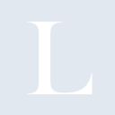
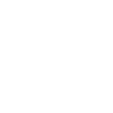

# lobsters

[← Back to main README](../../README.md)





## 16 px

### black
```
https://georgegach.github.io/compatible-icons/simple-icons/lobsters/16/black.png
```

### slate
```
https://georgegach.github.io/compatible-icons/simple-icons/lobsters/16/slate.png
```

### white
```
https://georgegach.github.io/compatible-icons/simple-icons/lobsters/16/white.png
```

## 64 px

### black
```
https://georgegach.github.io/compatible-icons/simple-icons/lobsters/64/black.png
```

### slate
```
https://georgegach.github.io/compatible-icons/simple-icons/lobsters/64/slate.png
```

### white
```
https://georgegach.github.io/compatible-icons/simple-icons/lobsters/64/white.png
```

## 128 px

### black
```
https://georgegach.github.io/compatible-icons/simple-icons/lobsters/128/black.png
```

### slate
```
https://georgegach.github.io/compatible-icons/simple-icons/lobsters/128/slate.png
```

### white
```
https://georgegach.github.io/compatible-icons/simple-icons/lobsters/128/white.png
```

## 512 px

### black
```
https://georgegach.github.io/compatible-icons/simple-icons/lobsters/512/black.png
```

### slate
```
https://georgegach.github.io/compatible-icons/simple-icons/lobsters/512/slate.png
```

### white
```
https://georgegach.github.io/compatible-icons/simple-icons/lobsters/512/white.png
```

## 1024 px

### black
```
https://georgegach.github.io/compatible-icons/simple-icons/lobsters/1024/black.png
```

### slate
```
https://georgegach.github.io/compatible-icons/simple-icons/lobsters/1024/slate.png
```

### white
```
https://georgegach.github.io/compatible-icons/simple-icons/lobsters/1024/white.png
```

## 16 px in base64

### black
```
data:image/png;base64,iVBORw0KGgoAAAANSUhEUgAAABAAAAAQCAYAAAAf8/9hAAAABmJLR0QA/wD/AP+gvaeTAAAAn0lEQVQ4jdXTzQnCQBAF4C/qRexAsQZP1mEXdiNWYiMWoHjzJiQqHrwoknhIhGQNBslBfDDs7vw8ZmZnImRaoNMmGHrBO8Y90EUYfZPBAVOMsaohfEMWSIp5YdvX2CtSl0GEfun+Ea2b+J8EVzzaEJxxaSK4FWca6I9YhM7lf42xkw8RLLHBFmvMMEHyiolUlynBqaGELoYYkA/Kb7fxCeKcKsS3EeBhAAAAAElFTkSuQmCC
```

### slate
```
data:image/png;base64,iVBORw0KGgoAAAANSUhEUgAAABAAAAAQCAYAAAAf8/9hAAAABmJLR0QA/wD/AP+gvaeTAAAAz0lEQVQ4jdWTMW7CUBBE33xDEVGlACRQkLgDuUaUQ+Q6HCUSTQ6QmgOAKNMEYYgo0sQyHgqIwBZYgCumW+3O+7PSX33N16aCQhUzQO24ECwsJ7kJI1D38gTW90b151778ckO7xCSE77TAEMLNAhp8rJr+hXcvxjwH4Ggh32hMvMZwHW6S4B/hdIKAP0Y1qWASPoDMGSF1tJoCIffnwfYMWKmdPOxA2gETISmwBj8Fin7zOUpHFMstCpbwBBB1gE1oHALQNO4WQbYv3tmhRu0BVP0Ov6ksaRTAAAAAElFTkSuQmCC
```

### white
```
data:image/png;base64,iVBORw0KGgoAAAANSUhEUgAAABAAAAAQCAYAAAAf8/9hAAAABmJLR0QA/wD/AP+gvaeTAAAAnklEQVQ4jdXTMQ5BQRSF4W/QiB0Qy7AjsRtLkWgsQG0BRKWTeIhCQ8RoXvGMF/Iylb+ZuefmnpzcyYQYY5RBK2cYOkl9wD3RAgZNEuwxCiEMMasxfCd+8owxTsrerqb/Rl2CgG7l/pXsJf6nwRWPHIMzLr8MbuX5TPQjplUhNSiwxaKs51hjgxXGWFYHQvKZCpy+5UcbffTqDBqT/YwvuYNcEiDQli0AAAAASUVORK5CYII=
```

