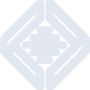

# local

[← Back to main README](../../README.md)

<table><tr>
  <td></td>
  <td></td>
  <td></td>
</tr></table>

## 16 px

### black
```
https://georgegach.github.io/compatible-icons/simple-icons/compat/local/16/black.png
```

### slate
```
https://georgegach.github.io/compatible-icons/simple-icons/compat/local/16/slate.png
```

### white
```
https://georgegach.github.io/compatible-icons/simple-icons/compat/local/16/white.png
```

## 64 px

### black
```
https://georgegach.github.io/compatible-icons/simple-icons/compat/local/64/black.png
```

### slate
```
https://georgegach.github.io/compatible-icons/simple-icons/compat/local/64/slate.png
```

### white
```
https://georgegach.github.io/compatible-icons/simple-icons/compat/local/64/white.png
```

## 128 px

### black
```
https://georgegach.github.io/compatible-icons/simple-icons/compat/local/128/black.png
```

### slate
```
https://georgegach.github.io/compatible-icons/simple-icons/compat/local/128/slate.png
```

### white
```
https://georgegach.github.io/compatible-icons/simple-icons/compat/local/128/white.png
```

## 512 px

### black
```
https://georgegach.github.io/compatible-icons/simple-icons/compat/local/512/black.png
```

### slate
```
https://georgegach.github.io/compatible-icons/simple-icons/compat/local/512/slate.png
```

### white
```
https://georgegach.github.io/compatible-icons/simple-icons/compat/local/512/white.png
```

## 1024 px

### black
```
https://georgegach.github.io/compatible-icons/simple-icons/compat/local/1024/black.png
```

### slate
```
https://georgegach.github.io/compatible-icons/simple-icons/compat/local/1024/slate.png
```

### white
```
https://georgegach.github.io/compatible-icons/simple-icons/compat/local/1024/white.png
```

## 16 px in base64

### black
```
data:image/png;base64,iVBORw0KGgoAAAANSUhEUgAAABAAAAAQCAYAAAAf8/9hAAAABmJLR0QA/wD/AP+gvaeTAAABRElEQVQ4jYXTzUobYRTG8d9Yol3VhURauxB0Kb0D8Y7EvasuewW9gUrVreDCpcFVKO2m8QONQj9EWtIkCmKbaLvIGRjfTNKBwzCH8/x5zvO+kyl/ZlFDD1O4xwp+jpgfEh+H+CyqjyNU0+GJ5LuKfcyhW+h3oneQQoqAatiewy6ehPAm5nbwPGaGnFTD4jU20cYlVrGGb9F7F85OipBc3C2IT/E2cugF5By/CpDDHFIvEdfxO6n9AuQj/qKe4TYaS2jhOxbxMlnzS8AX8CKgk3mIr/A0gpsK+m1SD8jifYeGSLeBZ7HTtME9aKGSVBPzmMFeOP5cDLGDjdjxAu/xJ0JcN7hQbWxFZo8uVvEkcsgPvMFrfB0nHgf5hA8h3i4TZyWQmsEJ9EKYRTYVXGHZf36q3Ek/9m4GrNR26iB1MhEzI3/nfxFIdpNg4d8NAAAAAElFTkSuQmCC
```

### slate
```
data:image/png;base64,iVBORw0KGgoAAAANSUhEUgAAABAAAAAQCAYAAAAf8/9hAAAABmJLR0QA/wD/AP+gvaeTAAAB3klEQVQ4jX2TwWqTURSEvzl/kypYUygt/gmiGMRFEXEvcRur+BLi2o0P4JOI7l1VWqiuDC7EgisrggoaaFOIpZFArTb/HRexmqTaC2dz7/2GYZgj/nE+bvcXSi5aEgfAtE1RJmvk+Ux38m/8D45QHXESCImLA4pWp9OfP1ag0+nPT7t4EaKK/W3kqWe5OqB4OSkSo/BAqWW5WsCKpYxEz9BHhGHZ8plJJ/EHpmiBa0Sshmhivkt6DH5ke0+KW1IsTzrRIWxRTbAaUlP2V4vnMneNcOK+wvcQs7ZXBLeNNsvOrqvd6b22fMnoL2zvorgylpb9CnEWMavEZ4uroHW1t3t7SG+ARZkd25sK123VxgVoS3wwXAByxA8nl2Moni5jn0g4Q2naSQbvjY1ICQQkpH3ZGwLCZkPoNOadRAVigWAHRWl0BJ8E55DmsNcsLYLeRplsyeY9QT3Zq8OgqCT7CTbYovADw3nEHPYa+IasTonspsY6QKomeCprKcQgiYck7yu4AzqFGcLE1pSjkeczXR0p0m+RkJZsvkgUQB3zDNwchWEYyliVBxQtRC3BgWDXRoIKcknW9hTZtdGlGtuFPJ/pTpE1QJuCyuG9QhURW5PwEQejTn5StASB0HHr/At9vCcgq0L+wwAAAABJRU5ErkJggg==
```

### white
```
data:image/png;base64,iVBORw0KGgoAAAANSUhEUgAAABAAAAAQCAYAAAAf8/9hAAAABmJLR0QA/wD/AP+gvaeTAAABcElEQVQ4jX2TTUuVURSFn3MjdZRBXPEDEXTQICKcS2P/jDR31LBf4B8oNKeCQsMuDaRCJ34kakofIqZdr4Go13ocuG++HN/rgc2Bc9ZarLPO3omSpfYANaAJdAJ/gecppV9l+Ftk9YvaVLeiLtV1tZrjKxm5CrwH+oFG4eo4zj7kIpWMXAvgPHAviH8CNwf0ArVbTtRqWDxRZ9S6uqdOqC/UH3H2Wm2oG/9FCuRGgbypTkUOzRD5qv4uiKyp1aR+BB4DC8A4cAjUgWdZXovAIPAQ2AVGgU9JPQWWgCfAEfATGAEGMoFvwCYwDPQB50BHK8SnQFcE1wkInGb1D0ixnwGrrV9YBR4Aa0A30BNO7me1DQwBj4B34XilGOKx+iaC2lGn1YsIcTIaqq6+jRBvGiv7iZbIgfpKfal+b0su6YWiyLL6OcizZeSUi3DdjQNcD1I9MN2Rwz4wdudQFZxcxru3I4fSYUrtRMJJJTBtx/kKCJCRVTzQfmYAAAAASUVORK5CYII=
```

