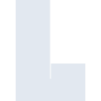

# lospec

[← Back to main README](../../README.md)





## 16 px

### black
```
https://georgegach.github.io/compatible-icons/simple-icons/lospec/16/black.png
```

### slate
```
https://georgegach.github.io/compatible-icons/simple-icons/lospec/16/slate.png
```

### white
```
https://georgegach.github.io/compatible-icons/simple-icons/lospec/16/white.png
```

## 64 px

### black
```
https://georgegach.github.io/compatible-icons/simple-icons/lospec/64/black.png
```

### slate
```
https://georgegach.github.io/compatible-icons/simple-icons/lospec/64/slate.png
```

### white
```
https://georgegach.github.io/compatible-icons/simple-icons/lospec/64/white.png
```

## 128 px

### black
```
https://georgegach.github.io/compatible-icons/simple-icons/lospec/128/black.png
```

### slate
```
https://georgegach.github.io/compatible-icons/simple-icons/lospec/128/slate.png
```

### white
```
https://georgegach.github.io/compatible-icons/simple-icons/lospec/128/white.png
```

## 512 px

### black
```
https://georgegach.github.io/compatible-icons/simple-icons/lospec/512/black.png
```

### slate
```
https://georgegach.github.io/compatible-icons/simple-icons/lospec/512/slate.png
```

### white
```
https://georgegach.github.io/compatible-icons/simple-icons/lospec/512/white.png
```

## 1024 px

### black
```
https://georgegach.github.io/compatible-icons/simple-icons/lospec/1024/black.png
```

### slate
```
https://georgegach.github.io/compatible-icons/simple-icons/lospec/1024/slate.png
```

### white
```
https://georgegach.github.io/compatible-icons/simple-icons/lospec/1024/white.png
```

## 16 px in base64

### black
```
data:image/png;base64,iVBORw0KGgoAAAANSUhEUgAAABAAAAAQCAYAAAAf8/9hAAAABmJLR0QA/wD/AP+gvaeTAAAATElEQVQ4jWNgQICZDAwM/9HwMwYCgImA/HdKDSAIRg0YFgawEKHmHgMkVSLrWc7AwFBBrAH/GRgYlNDEBIl1ARch0wkZIEHIgIGPBQAbKArtrHZZJQAAAABJRU5ErkJggg==
```

### slate
```
data:image/png;base64,iVBORw0KGgoAAAANSUhEUgAAABAAAAAQCAYAAAAf8/9hAAAABmJLR0QA/wD/AP+gvaeTAAAAbklEQVQ4je2RMQ5AUBAFZ+VXGlREQuFwzuAqTuBWCgp0OuVqCNVfnURM9/I2k5escDDOa6tQc0dkKtMox0PgK0E3f28KbH7BJwTOOhiWtQf0zKI4hK5I4+aRAFCU6gogSvJsgRJadmtBZgne/8IOoykUbxG6aB4AAAAASUVORK5CYII=
```

### white
```
data:image/png;base64,iVBORw0KGgoAAAANSUhEUgAAABAAAAAQCAYAAAAf8/9hAAAABmJLR0QA/wD/AP+gvaeTAAAATklEQVQ4jWNggIL////P/I8JnjEQAEwE5L9TagBBMGrAsDCAhZCC////32NgYPiPpmc5IyNjBVEGQDUroYkJEusCLkKmEzJAgpABAx8LALuNH9tZzZu0AAAAAElFTkSuQmCC
```

