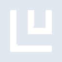

# ludwig

[← Back to main README](../../README.md)

<table><tr>
  <td></td>
  <td></td>
  <td></td>
</tr></table>

## 16 px

### black
```
https://georgegach.github.io/compatible-icons/simple-icons/compat/ludwig/16/black.png
```

### slate
```
https://georgegach.github.io/compatible-icons/simple-icons/compat/ludwig/16/slate.png
```

### white
```
https://georgegach.github.io/compatible-icons/simple-icons/compat/ludwig/16/white.png
```

## 64 px

### black
```
https://georgegach.github.io/compatible-icons/simple-icons/compat/ludwig/64/black.png
```

### slate
```
https://georgegach.github.io/compatible-icons/simple-icons/compat/ludwig/64/slate.png
```

### white
```
https://georgegach.github.io/compatible-icons/simple-icons/compat/ludwig/64/white.png
```

## 128 px

### black
```
https://georgegach.github.io/compatible-icons/simple-icons/compat/ludwig/128/black.png
```

### slate
```
https://georgegach.github.io/compatible-icons/simple-icons/compat/ludwig/128/slate.png
```

### white
```
https://georgegach.github.io/compatible-icons/simple-icons/compat/ludwig/128/white.png
```

## 512 px

### black
```
https://georgegach.github.io/compatible-icons/simple-icons/compat/ludwig/512/black.png
```

### slate
```
https://georgegach.github.io/compatible-icons/simple-icons/compat/ludwig/512/slate.png
```

### white
```
https://georgegach.github.io/compatible-icons/simple-icons/compat/ludwig/512/white.png
```

## 1024 px

### black
```
https://georgegach.github.io/compatible-icons/simple-icons/compat/ludwig/1024/black.png
```

### slate
```
https://georgegach.github.io/compatible-icons/simple-icons/compat/ludwig/1024/slate.png
```

### white
```
https://georgegach.github.io/compatible-icons/simple-icons/compat/ludwig/1024/white.png
```

## 16 px in base64

### black
```
data:image/png;base64,iVBORw0KGgoAAAANSUhEUgAAABAAAAAQCAYAAAAf8/9hAAAABmJLR0QA/wD/AP+gvaeTAAAArUlEQVQ4jcXTPYoCQRCG4Wd0NpFFQcR8QzNhA2/gCb2KgbGRiYlHMLTZQIzVwNp1GBRbZsWCgv7q56Wa7ipw0sBaTZrrgIQ5dqH3WIbvI7aLmlSFnMIXodehE8bhKWLrqFn89v3rFV4G6KDAD9r1ZJkB2GIa58OzE4wwrOhPfKObM0EPszu5jxxAif6DCW8CNjg+6PuqwusfKcf+PlLhukwJq0zABAMu7/vebTwD34gktkCf3TYAAAAASUVORK5CYII=
```

### slate
```
data:image/png;base64,iVBORw0KGgoAAAANSUhEUgAAABAAAAAQCAYAAAAf8/9hAAAABmJLR0QA/wD/AP+gvaeTAAAA9UlEQVQ4jbXTPU4CQRjG8f8zwzbGSDTGYEGMpbWFN6DiDt6A03gVCmsqGxpPIBJDwsYgsWOdx2JdIy5IEH2r+Xp/eSaZ0WgyMztU2KV5CTDOhfpC03LOHGuANTDMAYSmQn3jvAaIMGy3ml3kMYDMIsTUCzH1ZBblIY/brWZXhOHfX+HfgMJxDxDm+c2O3/cbm4CsWDwWih2ALMXXrRKkFC4KxZPPNEr7D0+zS8HBxgQSTds30goYZ9XyWsDQQBytxL+Ma0BKvldQWgd/RDiv8Bpwdnp4/WMzMJq83II7AKo+k3EeCHebmssA6UroeAn4be38Et8BI3BWqtVanYMAAAAASUVORK5CYII=
```

### white
```
data:image/png;base64,iVBORw0KGgoAAAANSUhEUgAAABAAAAAQCAYAAAAf8/9hAAAABmJLR0QA/wD/AP+gvaeTAAAArklEQVQ4jbWTMQoCMRBFX3RtRBRE7C3tBAtv4Am9isXWVjbbeATLDRaLtd9mXENQNhodGMifyX9MYOIkiYzo5ZhjgAf2QG26AQ6WjdVqu+Nbl55Rmq5Me0krS2+1yu6UD9NPn/A3wBBwwAXox80iAXAGtna+fjrBEpgHeiRpDYxTJpgAuze9QQqgAKYdE74EnIBbh2/RwuNFSolwkVzwmTxwTGRsgBlACPgqsjfxDhe0bG7MtsLeAAAAAElFTkSuQmCC
```

