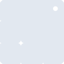
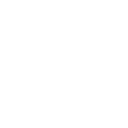

# lvgl

[← Back to main README](../../README.md)





## 16 px

### black
```
https://georgegach.github.io/compatible-icons/simple-icons/lvgl/16/black.png
```

### slate
```
https://georgegach.github.io/compatible-icons/simple-icons/lvgl/16/slate.png
```

### white
```
https://georgegach.github.io/compatible-icons/simple-icons/lvgl/16/white.png
```

## 64 px

### black
```
https://georgegach.github.io/compatible-icons/simple-icons/lvgl/64/black.png
```

### slate
```
https://georgegach.github.io/compatible-icons/simple-icons/lvgl/64/slate.png
```

### white
```
https://georgegach.github.io/compatible-icons/simple-icons/lvgl/64/white.png
```

## 128 px

### black
```
https://georgegach.github.io/compatible-icons/simple-icons/lvgl/128/black.png
```

### slate
```
https://georgegach.github.io/compatible-icons/simple-icons/lvgl/128/slate.png
```

### white
```
https://georgegach.github.io/compatible-icons/simple-icons/lvgl/128/white.png
```

## 512 px

### black
```
https://georgegach.github.io/compatible-icons/simple-icons/lvgl/512/black.png
```

### slate
```
https://georgegach.github.io/compatible-icons/simple-icons/lvgl/512/slate.png
```

### white
```
https://georgegach.github.io/compatible-icons/simple-icons/lvgl/512/white.png
```

## 1024 px

### black
```
https://georgegach.github.io/compatible-icons/simple-icons/lvgl/1024/black.png
```

### slate
```
https://georgegach.github.io/compatible-icons/simple-icons/lvgl/1024/slate.png
```

### white
```
https://georgegach.github.io/compatible-icons/simple-icons/lvgl/1024/white.png
```

## 16 px in base64

### black
```
data:image/png;base64,iVBORw0KGgoAAAANSUhEUgAAABAAAAAQCAYAAAAf8/9hAAAABmJLR0QA/wD/AP+gvaeTAAAAvklEQVQ4ja3SwWrDMBAE0CfXrQsJFHLKIR+Yn+uHhOYY8LX30JQW52JwnYPl1AgX7KQDQmKkGVazC3tUaGeuCm8hHhbm4YAXrLIbxA12+MQixHLmosEDBHzgeXCZ42mqU46vhCtwwnqKQcBP3HtUqLGaYpAl4tnI7hH3Brd04Yoc77qh6HHEK7bJ29pIsEGXeDHgzpHb+M2nr/JR0uKxQfqrC6coXg7JfwnxfIe+ylAmJrVuOodfa/Ed765ilBd/CDSenyXtIAAAAABJRU5ErkJggg==
```

### slate
```
data:image/png;base64,iVBORw0KGgoAAAANSUhEUgAAABAAAAAQCAYAAAAf8/9hAAAABmJLR0QA/wD/AP+gvaeTAAAA60lEQVQ4ja2SwUoDQRBEX02GrJBDVBA8etTv8Sf8OT9E8CjsVb0oCGsiyWXBLg+yu84SNBvs01A99eipHj29rO4lLoEFE0qwDVPnQ8zgB8MScZWmm/kkdBfwLrTQ8+vKEwHfEJgBZFADcTT0UgbP/wDMukNGXhPqO5IrQwOc7zNKxlwgeoLNRmK+77sSDOZemVATr+8GlNPGWPi9MuKRYNkJgjcHt4ib4qZo2RFsBo6Rq04wOnXiWnbFkI+FKqN2vOKMOSlyFJHMmdH4hzbIxhSAfwlxe6hZsEk2dQEJtRZrymXY8IHV/jQb1V90u1CNMVSQQAAAAABJRU5ErkJggg==
```

### white
```
data:image/png;base64,iVBORw0KGgoAAAANSUhEUgAAABAAAAAQCAYAAAAf8/9hAAAABmJLR0QA/wD/AP+gvaeTAAAAxklEQVQ4ja3STUrEUBAE4O9l4g+MIMzKhQfwaF7OgwguhWzdCxEl2QS0XSQZH48RJxlr2d1VdFd1iogn3GFrGXo0KSK6FeRnXGNXrSB/4hFv2KaIiIUCs8gGarS4zJo1zv8Q2OTD70XzYhK9OWaVFBFfSFmtw4DdMQJVQV6M6hTyLLAmhT1qvBifYsYrHnBfzA4OGJsiojU6P6M3pnDrx595yzNFxIce6bcU2ol8lRf/xcT+BH5XoSlEBuN35qcFPqbenozmG29ROeyf3oxrAAAAAElFTkSuQmCC
```

