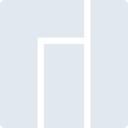
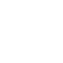

# manjaro

[← Back to main README](../../README.md)

<table><tr>
  <td></td>
  <td></td>
  <td></td>
</tr></table>

## 16 px

### black
```
https://georgegach.github.io/compatible-icons/simple-icons/compat/manjaro/16/black.png
```

### slate
```
https://georgegach.github.io/compatible-icons/simple-icons/compat/manjaro/16/slate.png
```

### white
```
https://georgegach.github.io/compatible-icons/simple-icons/compat/manjaro/16/white.png
```

## 64 px

### black
```
https://georgegach.github.io/compatible-icons/simple-icons/compat/manjaro/64/black.png
```

### slate
```
https://georgegach.github.io/compatible-icons/simple-icons/compat/manjaro/64/slate.png
```

### white
```
https://georgegach.github.io/compatible-icons/simple-icons/compat/manjaro/64/white.png
```

## 128 px

### black
```
https://georgegach.github.io/compatible-icons/simple-icons/compat/manjaro/128/black.png
```

### slate
```
https://georgegach.github.io/compatible-icons/simple-icons/compat/manjaro/128/slate.png
```

### white
```
https://georgegach.github.io/compatible-icons/simple-icons/compat/manjaro/128/white.png
```

## 512 px

### black
```
https://georgegach.github.io/compatible-icons/simple-icons/compat/manjaro/512/black.png
```

### slate
```
https://georgegach.github.io/compatible-icons/simple-icons/compat/manjaro/512/slate.png
```

### white
```
https://georgegach.github.io/compatible-icons/simple-icons/compat/manjaro/512/white.png
```

## 1024 px

### black
```
https://georgegach.github.io/compatible-icons/simple-icons/compat/manjaro/1024/black.png
```

### slate
```
https://georgegach.github.io/compatible-icons/simple-icons/compat/manjaro/1024/slate.png
```

### white
```
https://georgegach.github.io/compatible-icons/simple-icons/compat/manjaro/1024/white.png
```

## 16 px in base64

### black
```
data:image/png;base64,iVBORw0KGgoAAAANSUhEUgAAABAAAAAQCAYAAAAf8/9hAAAABmJLR0QA/wD/AP+gvaeTAAAAfklEQVQ4je3QMQpCMRAE0EfiNfQI3sTqH8DjeAdPJPZip/At7SzlR21DCBpJY+HAwu7szjAsnDHh+aG22GfzhFPAHFEbHlkfsQhfiGuIoUMMZhXuhkOF32HZYnDEBkPBX1sTwArrgrvXDrt/8Df4FYPUoU8Bl8LkXap8lzC+AEvWHTWeGuYdAAAAAElFTkSuQmCC
```

### slate
```
data:image/png;base64,iVBORw0KGgoAAAANSUhEUgAAABAAAAAQCAYAAAAf8/9hAAAABmJLR0QA/wD/AP+gvaeTAAAAnUlEQVQ4je2QsQ3CQBAEZ+/dBpSASCiDiAIohyJoiAaQQwsTEBAgESL9HwkWhjdgmYSATe9mtHfaHU6VSSOHwJs4aS3CFHwGIIgOtfWBm0iku5AgGFtfuLsVwYbCTYrc6meTbbNNFRvcJx8FJiuTx5Vciwex/Cjl12aCW+ZIy6dul67Fr3/wF/yEQBCHwoJoyX3flri/btWeCWKC+gqM4zDHysUDuQAAAABJRU5ErkJggg==
```

### white
```
data:image/png;base64,iVBORw0KGgoAAAANSUhEUgAAABAAAAAQCAYAAAAf8/9hAAAABmJLR0QA/wD/AP+gvaeTAAAAgUlEQVQ4je3QMQ4BYRDF8V++dQ2O4CYqB3Acd3Ai0YuOhFKnFOtpN5svrGyj8KqZN/P+mYwkpySPfNYmya7TP5IcC6ZoDNOzUzeYlS/CNTVlRBhMKt4N+4q/xXwI4IA1lj3/OvQCWGDV8+61xdE/+AN+BdCOyLcFlx7k3VXdWYvzC5naTQXFscxjAAAAAElFTkSuQmCC
```

