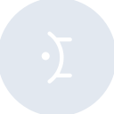

# mantine

[← Back to main README](../../README.md)





## 16 px

### black
```
https://georgegach.github.io/compatible-icons/simple-icons/mantine/16/black.png
```

### slate
```
https://georgegach.github.io/compatible-icons/simple-icons/mantine/16/slate.png
```

### white
```
https://georgegach.github.io/compatible-icons/simple-icons/mantine/16/white.png
```

## 64 px

### black
```
https://georgegach.github.io/compatible-icons/simple-icons/mantine/64/black.png
```

### slate
```
https://georgegach.github.io/compatible-icons/simple-icons/mantine/64/slate.png
```

### white
```
https://georgegach.github.io/compatible-icons/simple-icons/mantine/64/white.png
```

## 128 px

### black
```
https://georgegach.github.io/compatible-icons/simple-icons/mantine/128/black.png
```

### slate
```
https://georgegach.github.io/compatible-icons/simple-icons/mantine/128/slate.png
```

### white
```
https://georgegach.github.io/compatible-icons/simple-icons/mantine/128/white.png
```

## 512 px

### black
```
https://georgegach.github.io/compatible-icons/simple-icons/mantine/512/black.png
```

### slate
```
https://georgegach.github.io/compatible-icons/simple-icons/mantine/512/slate.png
```

### white
```
https://georgegach.github.io/compatible-icons/simple-icons/mantine/512/white.png
```

## 1024 px

### black
```
https://georgegach.github.io/compatible-icons/simple-icons/mantine/1024/black.png
```

### slate
```
https://georgegach.github.io/compatible-icons/simple-icons/mantine/1024/slate.png
```

### white
```
https://georgegach.github.io/compatible-icons/simple-icons/mantine/1024/white.png
```

## 16 px in base64

### black
```
data:image/png;base64,iVBORw0KGgoAAAANSUhEUgAAABAAAAAQCAYAAAAf8/9hAAAABmJLR0QA/wD/AP+gvaeTAAABCklEQVQ4jZ3TQUoDQRAF0JcxogsNMUZdCeIFvIESXLr3Dt7AleARBDeKHsEriAdJZBSVJOIiBkHEqIvpQDLpkeiHD93V/auqP9WMo4ZLtNDFe2A3xC6wpAC7uMMA3wUcIEUjJm7/IsyzPZqkFipPKx4yRXUGp9hGKddVikcs4BOzufMK6qVgzmbEk2echHZXcYD13J0WmcNFbT7gED1xczsJFiPV73GEOj7whiRyrxILwhz2wjoJ1aIoo4/5XHwt8Elm7kqBvp+EBDH0cIVbHMv8yOO1jBtsmHzjC7awH/bLufMvXJPNduqfgzTM1vD3Ud7Jv6cRsk7zmSbEQ1RxjiY6xr9zE2ejbcMPSPV/7rA8aJsAAAAASUVORK5CYII=
```

### slate
```
data:image/png;base64,iVBORw0KGgoAAAANSUhEUgAAABAAAAAQCAYAAAAf8/9hAAAABmJLR0QA/wD/AP+gvaeTAAABk0lEQVQ4jZWRMW4TURiEv3le5CC0wQsYyyJh7ROQI0ShpAelQilzAAQVEm24AqKj5AhgOEFuACyOIlwgO7ZSYOE3FLHBWXYlmOpJ88+8mf8XaxgOz274SnwJYRc7BTYBEFPQDOLAP/Qkz1vjlUarR3Eyua/Er0XYMg5UIxqGtg963Wzw2+BCzBugUyO8BMPI9n6vmw20jH0Muvsv4j8mLmKTneSis7YqZr4Ynwv1wQJdXSeFtpM5RwloF6jqfM0krwKLbxHdln2ItL3GB1t7AUhrUrYbWhxGaAueoXCnPCBIA640+Brt547ckjwHnVNxGdubNedSM0gPEEQUBK5JSYKYARsl7w7QAZ0SrSi3l5HLmAVgVu3tMxPfNgKfBC9kn/yVU5om4A+gHqVLGH2XfM/WQzCSbvoSTxR+r6KYZDQ5FuR1PSvz2UXcYCfkeWts+8Aw+g/9KCbJ436WTQJAr5sNbO8bCiDW/grRuFg0Go/67fQjlBb7eTxuJXMdYe0BabSvL4emSFPhdz+bftrPsslK8wslBqlRnjb6BAAAAABJRU5ErkJggg==
```

### white
```
data:image/png;base64,iVBORw0KGgoAAAANSUhEUgAAABAAAAAQCAYAAAAf8/9hAAAABmJLR0QA/wD/AP+gvaeTAAABG0lEQVQ4jZWTTUoDQRBGX4aAbpTE35UgXsAjhODSvXfwBq4Ej+DSoEfwCuIhXCaaSJBJxEUMERHG5yI9wYw9wjxo6K6uqv66uwp+oW6oN2pPHaufYYyD7VptEkM9UgdqZjmZ2lfbseD0n8Ai6SJJkD2oEJzTVxs4v3NM9pP6oM7Uj8h+pnZqag84iDzLK3AJpMAOcArsFXx6OH/hMobqmTopUTlKgLXI6c/AObAFfAEzIIn4rceMACvAcZgngCV+1IEpsFqw74bxAtSA7ZL4aRISxJgAt8AjcAEMIz7vdeAe2OfvHd+AQ+AkrDcL+9/AHWozFEVV5oUEoLatXsqtJT0hSb/kv3PyZmoRQ22oHbWrjlxu5656tZAd+AHDCyRu1SESBwAAAABJRU5ErkJggg==
```

