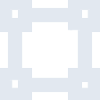
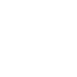

# materialdesignicons

[← Back to main README](../../README.md)

<table><tr>
  <td></td>
  <td></td>
  <td></td>
</tr></table>

## 16 px

### black
```
https://georgegach.github.io/compatible-icons/simple-icons/compat/materialdesignicons/16/black.png
```

### slate
```
https://georgegach.github.io/compatible-icons/simple-icons/compat/materialdesignicons/16/slate.png
```

### white
```
https://georgegach.github.io/compatible-icons/simple-icons/compat/materialdesignicons/16/white.png
```

## 64 px

### black
```
https://georgegach.github.io/compatible-icons/simple-icons/compat/materialdesignicons/64/black.png
```

### slate
```
https://georgegach.github.io/compatible-icons/simple-icons/compat/materialdesignicons/64/slate.png
```

### white
```
https://georgegach.github.io/compatible-icons/simple-icons/compat/materialdesignicons/64/white.png
```

## 128 px

### black
```
https://georgegach.github.io/compatible-icons/simple-icons/compat/materialdesignicons/128/black.png
```

### slate
```
https://georgegach.github.io/compatible-icons/simple-icons/compat/materialdesignicons/128/slate.png
```

### white
```
https://georgegach.github.io/compatible-icons/simple-icons/compat/materialdesignicons/128/white.png
```

## 512 px

### black
```
https://georgegach.github.io/compatible-icons/simple-icons/compat/materialdesignicons/512/black.png
```

### slate
```
https://georgegach.github.io/compatible-icons/simple-icons/compat/materialdesignicons/512/slate.png
```

### white
```
https://georgegach.github.io/compatible-icons/simple-icons/compat/materialdesignicons/512/white.png
```

## 1024 px

### black
```
https://georgegach.github.io/compatible-icons/simple-icons/compat/materialdesignicons/1024/black.png
```

### slate
```
https://georgegach.github.io/compatible-icons/simple-icons/compat/materialdesignicons/1024/slate.png
```

### white
```
https://georgegach.github.io/compatible-icons/simple-icons/compat/materialdesignicons/1024/white.png
```

## 16 px in base64

### black
```
data:image/png;base64,iVBORw0KGgoAAAANSUhEUgAAABAAAAAQCAYAAAAf8/9hAAAABmJLR0QA/wD/AP+gvaeTAAAA5klEQVQ4jc3TvUoDQRQF4C+aVAYRxEpE2Mq3UPAFfEQfwMIXEOytUotLxCZgZINEmyCxyAmsm0Q2Vh4Y5v6cuTNzf2DeWBUKqyji+8HvRHjBHa7QwTNmjQA9nIZ/i0uciKHEOUZrXtRco3DL+gum+MBB5PvsdfRxkX2CvciqGOYY43VDDo7xgMdwJzmrwCDGm+jdNQGWuA53gKKbvywTNo3eBjOUOy3JG/E/AhQWTcKiLJuS2I2vH70XvXUZi/jGamVcNlKFIc7wactGmuMpN/y5ld/wjiN8+X2YdvOVfRyyesNW4/wNo1pq02ccNdoAAAAASUVORK5CYII=
```

### slate
```
data:image/png;base64,iVBORw0KGgoAAAANSUhEUgAAABAAAAAQCAYAAAAf8/9hAAAABmJLR0QA/wD/AP+gvaeTAAABbElEQVQ4jc2TwWoTYRSFv/N3sjI0A60ORdKBwYUrN0G6VHDVnWChj9c+Ql+g0I2CC18hOFOEDDbkr0Q3qf/pIkaSQVqlG8/ycjjce865aibRrEOKxqOyyMfr47qNldAn7HyD3kyisS8J4Rz8FpCgNiw2iNAzlIBBZ6T0BmmYAVi6CSmdWjoECsMLOlhbs5XTaZJe6fcGeA76DsqF58lcCM83BdQP4rVRHxzBj0B9Ne31DCzMQDA12OKg68Hl1dVTL7IzBXKbZ4hrkIPxSFADJHNhcbD/ZNB0Txju7n7Z38tfOvn9L09q41Eoi3y8Mkx4Xhb5WNJNV+APnizKIh+H+4j34T8QWDaMHiyjqttY2c66RNtZ3cZqGeOyWHUbq7+OsW5jJfNRIMPOKkY1k2jbsxD02ea54Me/FCkDUNAswZHgg6GQeAfaOEGs6uxW9nGSTgR9NZNowTTBN+HHSD/vfCZ7y+hrgG3Djh76zreSwNSp9twkugAAAABJRU5ErkJggg==
```

### white
```
data:image/png;base64,iVBORw0KGgoAAAANSUhEUgAAABAAAAAQCAYAAAAf8/9hAAAABmJLR0QA/wD/AP+gvaeTAAAA+UlEQVQ4jc2TsUrEQBRFz2hSGUQQKxEhlX+h4A/4iX6AhT8g2FttLQ6KzcKuJMhqs8ixeYEYN2KsvM3Me3Pnzps7b/A7GrVmALWOtS9IqsAzcANcAAl4AtYDjRI4BgSugXPgiBDK6qk631DREPPg5n4FK+AN2Iv5bYx9VMBZjC2wA1TEvdpQX6qLEQ8O1Tv1Prit2nTmzCJ5FXExFOgJXQZ3ptZFSimrnWGrlFIe2zzAOqWUt35JHsU/EAjHy4irMRPVIrhVpEq1nvKMdawt+8/YNVIDPAInwDsTG0n1IU74cyu/AK/AAfDBz59pG1gAu8A+G06Y9J0/ATsNmLxNJvKMAAAAAElFTkSuQmCC
```

