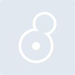
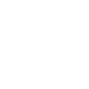

# max

[← Back to main README](../../README.md)

<table><tr>
  <td></td>
  <td></td>
  <td></td>
</tr></table>

## 16 px

### black
```
https://georgegach.github.io/compatible-icons/simple-icons/compat/max/16/black.png
```

### slate
```
https://georgegach.github.io/compatible-icons/simple-icons/compat/max/16/slate.png
```

### white
```
https://georgegach.github.io/compatible-icons/simple-icons/compat/max/16/white.png
```

## 64 px

### black
```
https://georgegach.github.io/compatible-icons/simple-icons/compat/max/64/black.png
```

### slate
```
https://georgegach.github.io/compatible-icons/simple-icons/compat/max/64/slate.png
```

### white
```
https://georgegach.github.io/compatible-icons/simple-icons/compat/max/64/white.png
```

## 128 px

### black
```
https://georgegach.github.io/compatible-icons/simple-icons/compat/max/128/black.png
```

### slate
```
https://georgegach.github.io/compatible-icons/simple-icons/compat/max/128/slate.png
```

### white
```
https://georgegach.github.io/compatible-icons/simple-icons/compat/max/128/white.png
```

## 512 px

### black
```
https://georgegach.github.io/compatible-icons/simple-icons/compat/max/512/black.png
```

### slate
```
https://georgegach.github.io/compatible-icons/simple-icons/compat/max/512/slate.png
```

### white
```
https://georgegach.github.io/compatible-icons/simple-icons/compat/max/512/white.png
```

## 1024 px

### black
```
https://georgegach.github.io/compatible-icons/simple-icons/compat/max/1024/black.png
```

### slate
```
https://georgegach.github.io/compatible-icons/simple-icons/compat/max/1024/slate.png
```

### white
```
https://georgegach.github.io/compatible-icons/simple-icons/compat/max/1024/white.png
```

## 16 px in base64

### black
```
data:image/png;base64,iVBORw0KGgoAAAANSUhEUgAAABAAAAAQCAYAAAAf8/9hAAAABmJLR0QA/wD/AP+gvaeTAAABC0lEQVQ4jaXTvy4EYRQF8N/+IZHQEQpUGgmVh/AEaiEqFY+xhUdQqJVKT6AgEYVVaJAl2RURbMRiFd8Nu7OzW6yTfMnckztnzpx7P6ihPeSpFfCNguHQLoRSP7zgBpdYxDwmOhsGCbRwiBEs4yK4teD+bPQ5d9hFM+omdoL/7SsOsD+KIspRl/Mcl/WihSoOpAwawV1jFpPZF7LWz1CRxvuFZ5xgFfWc/q7iEVt4wCdu8RTP+7jKCmQzeMUUpqXxLeEYJaxIAXYhK1CKf/7AGLZDBN4w3pNYxtI79qTF6eTrWA9XAzNoR3ibOAqhU2zgXFr7rv5+m9iIr1UxgwXMybkz/75MRWlkw+L+ByxMeO8ap2NSAAAAAElFTkSuQmCC
```

### slate
```
data:image/png;base64,iVBORw0KGgoAAAANSUhEUgAAABAAAAAQCAYAAAAf8/9hAAAABmJLR0QA/wD/AP+gvaeTAAABW0lEQVQ4jZ2Tu0pcARCGv3/OQQ0knZcVNJWFwna+ho2NYGVvqW3qgH1IYRfwDbbcR0jKYLbR4iC6yCKKl8KTnd8mxerGo+x0c/t+ZphR1b85By8ygRlfBLg1STOAUKsE1KBwK6KS8o8dayY/C30aZUQDvpbUsfMYR9vOY0kdRD1a9joAXzL0r5A2jFdD2vDQPzGX7wNkTEVRREIJkFAqkGyPlpX/mbsW9DL8w0PdEh5gaqSTUCwlzIJfB4Ti9990N9C+wgugO6An6SDtI2CmaYQr7O8hdgTzmHNDItZxbklcjQm+8O8S5gQLyFU9ne0QXaCQtI7jrBkgCmBg9Ij5UD7Gbibtf8l7yI+NAFuzhbQKPgVagq8Sa8AgU4eGsZN/tkTh6bS2TXwJvAlesXgg45s03AMtvQSo6l97LAgDSxV2T44WyhWLZTx+9qr610nDP7xhDuP+hM2ALp4AIOGY6f1cngkAAAAASUVORK5CYII=
```

### white
```
data:image/png;base64,iVBORw0KGgoAAAANSUhEUgAAABAAAAAQCAYAAAAf8/9hAAAABmJLR0QA/wD/AP+gvaeTAAABIElEQVQ4jaWTPy+DURTGf2/7kkjYCBJMBhImH8JiNQsx+SYGH8FgNhp9AvEnEUNrsJS0jVZEkIjSn6GX6H21TV5nufc+55znnvPccxO1CkyTz2qJ2gaSnASmA5KfgQpQAhaBOWDslz9JVHskt4BDYAhYBq4Cth4wAAp9br8HzoA1YCGspwH/sX4Ew8GfhvN3u10Vp2StBZSBAzoaNAN2A8wA413RZu1C3VWr6qf6pJ6oq2ojDo4JHtRtta5+qLfqY9jvq9cxQazBCzABTNJ5viXgGCgCK8Bd3G9MUAw9vwMjwE4gAXgFRjOKRRW9qXtqKcIb6oZaGaSBQbwt9SgQnaub6qXajoN7TWIzaFAGpoB5YJY/xv7fn6kA1HMmA9S+ANj3LgDgG/UWAAAAAElFTkSuQmCC
```

