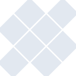
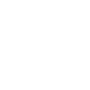

# mingww64

[← Back to main README](../../README.md)





## 16 px

### black
```
https://georgegach.github.io/compatible-icons/simple-icons/mingww64/16/black.png
```

### slate
```
https://georgegach.github.io/compatible-icons/simple-icons/mingww64/16/slate.png
```

### white
```
https://georgegach.github.io/compatible-icons/simple-icons/mingww64/16/white.png
```

## 64 px

### black
```
https://georgegach.github.io/compatible-icons/simple-icons/mingww64/64/black.png
```

### slate
```
https://georgegach.github.io/compatible-icons/simple-icons/mingww64/64/slate.png
```

### white
```
https://georgegach.github.io/compatible-icons/simple-icons/mingww64/64/white.png
```

## 128 px

### black
```
https://georgegach.github.io/compatible-icons/simple-icons/mingww64/128/black.png
```

### slate
```
https://georgegach.github.io/compatible-icons/simple-icons/mingww64/128/slate.png
```

### white
```
https://georgegach.github.io/compatible-icons/simple-icons/mingww64/128/white.png
```

## 512 px

### black
```
https://georgegach.github.io/compatible-icons/simple-icons/mingww64/512/black.png
```

### slate
```
https://georgegach.github.io/compatible-icons/simple-icons/mingww64/512/slate.png
```

### white
```
https://georgegach.github.io/compatible-icons/simple-icons/mingww64/512/white.png
```

## 1024 px

### black
```
https://georgegach.github.io/compatible-icons/simple-icons/mingww64/1024/black.png
```

### slate
```
https://georgegach.github.io/compatible-icons/simple-icons/mingww64/1024/slate.png
```

### white
```
https://georgegach.github.io/compatible-icons/simple-icons/mingww64/1024/white.png
```

## 16 px in base64

### black
```
data:image/png;base64,iVBORw0KGgoAAAANSUhEUgAAABAAAAAQCAYAAAAf8/9hAAAABmJLR0QA/wD/AP+gvaeTAAABRUlEQVQ4jW3SzS5DURQF4C+kEYkpj+EFBAMmwiPxEN6B+HmGkhBBotTfVDCgWhGG2qoa3H04vbWTk5vcddY6a++1Ga4K9tHEcgkbxxFeMP8PVwV7+EQfjUxkDIfoBPaMxbJAFe24kE4TMzjNyOk0RrKXq3jDeyb4jRbW8YiPDOviPrfdjt42wnoP1ziLlxvYDUddHMdMBnruh8gOblGPy7+WAztJZKGY99UL8ipeS1gXtZjJby3hKSPf4CLIWzHtRK5HW0MRL4W9RE7TbmI7vnVc4ctwxIStWqnnfjhZi7Z6Jaw5GuRxbOIBk5iI/13cYToEpjKsjXMGN6wVQs9BvsBl2M4j7ihWeowiz3zDWoqoajGT3HaKuKrYH0Ix76ujWNsZwxG3gzxQs/5iHNgwLPiL8RMHyXa55sJJTk61Ek72ctupfgAyd56W7YS+VgAAAABJRU5ErkJggg==
```

### slate
```
data:image/png;base64,iVBORw0KGgoAAAANSUhEUgAAABAAAAAQCAYAAAAf8/9hAAAABmJLR0QA/wD/AP+gvaeTAAACPUlEQVQ4jV2Tz0uUURiFn3MnHYxIyxwLmixcpVIQEoFU9AMiatWioEW0aN+mf6NF/QHtglbtgihNkpIg21kbqfz6oPlmLPt0iLCRe1roN469y3vuufe893kv/FdzdleS5a+SWl5frC1f6dTSNO1JspU3SZZn6VLzLID+Nw/WV54bTYDLhsyOdw4f2PtsYcHl8u7VlzieAnUh10ro1rYDkiyfBE4Luos1oUaUrsnr9wnhBJGuQrPJQkfsScFPoV/tDTjasSHiAwgJkbx9m9RCfC1txea00KBhUqiC2SnxEWnN4rigIocZyQMSZZu50GpeUJrlU0XPm0fXwa9Bo8atgMaMd2wkIhPMCA7Rap6vVqt/QjRjW2bAHgCNAk9kDhZmgID3IYajwr1qtfoHIBjdBn8vegZ/suNf7LtIk0i1zcdcj2ie6G4cnxaIBbBYW7kcxCPwD9stgsZkugwNYDqgcxF/lx0sjQpKQBYd77QxJvXVCREfyBw3tGNjfhD0EHMD+ygidGBslIoJU+h+DCwaBgS7ClTGn4WOgeeRKhQaWgviQ2lhweXSTl4AJwUHgCnwPqEe2/OSAjACqrQRQxn8fq3Zd0lJls9KGscuJmwJmEYMY8rGI0KhE7Ghf2mw9/K41AqYIx1mCPRBHDLhrlBlywzGewz9Q/v7Lo5LLYCgUrhub2AUWndkTq3f54YGd78Vvolc6+j53d9m77YfCsCXRvPMtyyvJVk+m6ZpT6eWZMtXk1peT7N8aq4z6Wb9A8HeL6uK/smXAAAAAElFTkSuQmCC
```

### white
```
data:image/png;base64,iVBORw0KGgoAAAANSUhEUgAAABAAAAAQCAYAAAAf8/9hAAAABmJLR0QA/wD/AP+gvaeTAAABa0lEQVQ4jWWSu05UYRSFv4FMJpPYEXwBOwoqu4lSQEP0kfQheAeJwjNwCYSgiZcRpDVCocOBECiZOY6fxdkH9/zu5hTrrPWvtfeCYtSuuqdW6osC66tH6qW6UnJb8q56bzOjVkTtqYfqJLBf6lopsKOOnZ1KHagfErmd0Vx6eQe4AW6T5h/gCtgALoC7hNXAj2x7HNnehPWpeqp+jJdH6nY4qtVjtU+R2RDZUs/UYfz8YDmw92q/zV0VuaZBfqVeF1itflIHeXHr6s9E/qZ+CfLb2HZLHkas2ROHyCiR221X6rv4DtUT9XeKMyMyCHs5s+HkdcSaFlg13zYM2ATOgUXgUTrVd2AZOAMeJ2wMfC4bdqVuRu464nwN2/nEE5tK9zrqMfAU6IbyNbAPPAF6wBIwF1gFHAALwHqn06kJxTwTm9oO/P/EY5vGzvT/WTrjv4Y12Go64716oPYoR30eTh7ICXsZTnbVbsn9C3mBo26AqaGXAAAAAElFTkSuQmCC
```

